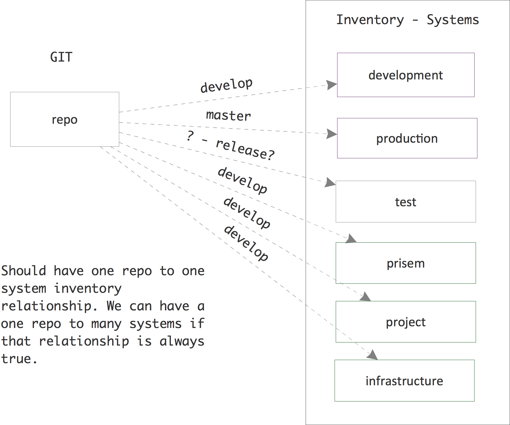
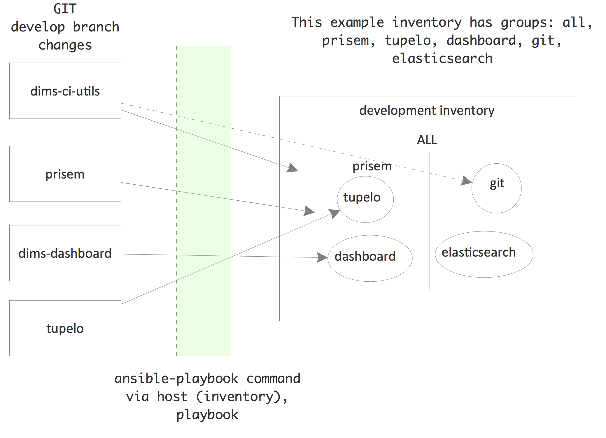
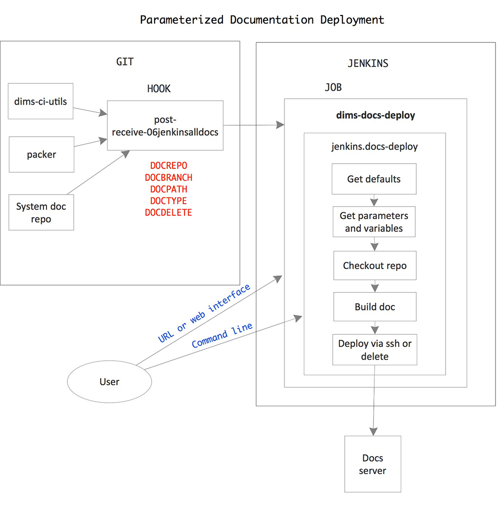

.. _continuousintegration:

Continuous Integration
======================

Continuous Integration
----------------------

`Continuous Integration`_ is a software engineering process where multiple
developers merge their working code into a coherent system on a regular basis,
allowing for easier testing of code changes and integration of disparate parts
of the system. Using a combination of a build system (Jenkins, in this case)
and triggers invoked by the source code management system (Git, in this case),
a change to source code results in that code being compiled, bundled, and
installed (as necessary) onto the hosts where it needs to run to serve its
function within the system as a whole.

Continuous Integration works well in a software engineering environment
using `Agile/Scrum`_.

.. todo::

        .. note:

            Not finished...

        ..

..

.. _Agile/Scrum: http://www.perforce.com/company/newsletter/2013/04/beyond-scrum-continuous-integration-build-and-test-automation
.. _Continuous Integration: http://en.wikipedia.org/wiki/Continuous_integration

.. _sourcechangepropagation:

How source changes are propagated
---------------------------------

This section summarizes how changes in source repos are propagated using Jenkins
and Ansible. You can find more information in the documentation for the
``ansible-inventory`` and ``ansible-playbooks`` repositories.

Git repos containing DIMS software under development contain "post-receive"
hooks which notify the Jenkins server when changes are pushed to a repository.
We are currently using two kinds of hooks: 1) A general hook which notifies
Jenkins that a push has occured, and 2) A hook which calls a parameterized
Jenkins job when a push has occured.

For the general hook, Jenkins jobs essentially "listen" for the notifications.
A Jenkins job specifies the repository and branch it wishes to be notified
about, as well as optionally specifying particular directory locations it is
monitoring. When a notification is received that matches, the job will
determine if any actually source changes occurred. If so, the job is run.

The "parameterized" hook is used to call a parameterized Jenkins documentation
job when a push is received in a system documentation repository. The Jenkins
job builds the documentation in the repo and deploys it (using Ansible) to any
documentation servers in the system inventory that correspond to the branch
that was updated.

.. attention::

    In general, each repository with DIMS software under development will have
    a Jenkins job "listening" for each branch of the repository that we want to
    build and deploy continuously. Note that Jenkins jobs can be triggered by
    changes to more than one branch, but we found it is unreliable. When using
    hubflow to do releases, for example, a job that was supposed to be
    triggered by changes in both the ``master`` and ``develop`` branch only
    built the ``develop`` branch even though changes had been pushed to both
    the ``master`` and ``develop`` branches. Since we can programmatically
    create jobs via the Jenkins Job DSL plugin, it is trivial to create (and
    modify) jobs for both the ``master`` and ``develop`` branches (and other
    branches as needed - release branches for testing, for example).

..

A Jenkins job that builds and deploys updated software from a Git repository
uses Ansible to do the deployment.

.. note::

    We are currently using flat files to define the inventory for a deployment
    (a "host" file), although we hope to move to using dynamic inventories.
    Either way, we need to define the hosts in a system and group them in ways
    that make deployments easy and scalable. (More on this subject can be found
    in the :ref:`ansibleinventory:ansibleinventory` documentation.)

..

Ideally, software in a "develop" branch would be deployed in one or more
development and/or test systems, each defined by a single host file
(inventory). Software in the "master" branch would be deployed to one or more
production or operational systems. One could set up a workflow where release
branches were automatically deployed to a release-test system - where the
software could be tested before final release. (When the code in the release
branch was fully tested and accepted, it would be merged into master
according to the hubflow workflow, which would cause it to be automatically
deployed to production/operational systems).

Figure :ref:`repostoinventories` illustrates this. At the current time, however, we
essentially only have one "system" - a "development" system that has grown
ad hoc and was not created from scratch using our proposed workflows. The
figure shows how we have develop branches of (some) repos also installed in
what we've named "prisem", "project", and "infrastructure" inventories.
Ideally we would want to consolidate machines under the "development" inventory
if we truly wish to install "develop" branch software automatically on all
these machines. This would make defining jobs in the Jenkins DSL simpler
as well. See the :ref:`ansibleinventory:ansibleinventory` documentation for a
description of our current inventory.

.. _repostoinventories:

   How software in repositories flows to machines in inventories

We define "groups" for machines in inventories. The groups are used by
Ansible to determine whether or not plays should be run on machines in an
inventory. The following figure illustrates this. Machines can be found in
more than one group. The group "all" contains all machines in the inventory.
A playbook that specifies a host of "all" will run on all machines in the
inventory (unless further limited by other means, such as flags passed to
the ``ansible-playbook`` command or conditional expressions in a role task). The
``dims-ci-utils`` code, for example, is to be installed on all machines in the
inventory. However, the role that deploys ``dims-ci-utils`` restricts a couple
tasks to specific groups of machines. One of those groups is the "git" group.

   Machines belong to different groups in an inventory

.. _continuousdocdeployment:

Continuous deployment of documentation
--------------------------------------

For our documentation, we currently deploy all docs from all repository
branches to a single VM to make retrieval efficient and to aid in development
of the documentation. Ansible is not used for deployment. We simply use
``rsync`` over SSH to deploy the docs.

The following figure shows the flows involved in documentation deployment.

   Diagram of documentation deployment flow.

The workflow runs something like this:

   #. Push to remote repository runs a post-receive hook.
   #. Post-receive hook calls the parameterized Jenkins job dims-docs-deploy
      if either a branch is deleted or if a branch is updated in a repo that
      contains documentation. The job is called twice - once to build html and
      once to build PDF.
   #. Jenkins job dims-deploy-docs runs the script jenkins.docs-deploy
   #. Script jenkins.docs-deploy clones and checks out the documentation,
      builds the documentation, and rsyncs the documentation to the target server.

Documentation is deployed on the target documentation server with the following
directory structure: ::

   /opt/dims/docs/$BRANCH/html/$REPONAME
   /opt/dims/docs/$BRANCH/pdf/$REPONAME

.. note::

    ``$BRANCH`` only includes the last part of a branch name with the ``/``
    delimiter.  Therefore, since we use the hubflow branching model, branch
    ``feature/dims-313`` is deployed to ``/opt/dims/docs/dims-313/html/$REPONAME``
    and ``/opt/dims/docs/dims-313/pdf/$REPONAME``

..

To view the documentation, you go to https://$HOST:$PORT/docs/$BRANCH/$TYPE/$REPONAME
or go to https://$HOST:$PORT/docs/ and browse the directory tree.

Currently the Jenkins job defaults to deploying the documentation on
   https://u12-dev-svr-1.prisem.washington.edu:8443/docs

The following paragraphs describe this workflow in more detail.

.. _postreceivehook:

Post-receive hook
~~~~~~~~~~~~~~~~~

The post-receive hook, ``post-receive-jenkins06alldocs``, calls a parameterized
Jenkins job, ``dims-docs-deploy``, when the repository receives a push.  The
hook code follows:

.. literalinclude:: ../../../dims-ci-utils/git/post-receive-06jenkinsalldocs
    :linenos:
    :language: bash

The hook determines if the repo contains documentation based upon the existence
of the file ``$REPO/docs/source/conf.py``.  This determines the value of
``DOCPATH``, which is the path in the repository to the ``Makefile`` that will
build the docs.

.. attention::

    *All* DIMS source repositories *must* have their documentation in a subdirectory
    named ``docs/`` in order to simplify the logic of finding and processing
    Sphinx documentation.

..

Once the ``DOCPATH`` is determined, two ``curl`` commands are sent to Jenkins server
to call the job ``dims-docs-deploy`` - once for HTML, and once for PDF.

The hook source is located in ``dims-ci-utils/git/`` and is deployed by the
``dims-ci-utils-deploy-$BRANCH`` jobs.

.. note::

    Currently, we do not have an automated way to add the symlink to the
    appropriate repos. The command to do that is:

    .. code-block:: bash

        $ ln -s /opt/git/bin/post-receive-06jenkinsalldocs /opt/git/${REPO}.git/hooks/post-receive-06jenkinsalldocs

    ..

..

.. _jenkinsparameterizedjob:

Jenkins parameterized job dims-docs-deploy
~~~~~~~~~~~~~~~~~~~~~~~~~~~~~~~~~~~~~~~~~~

The parameterized job dims-docs-deploy accepts the following parameters, with the
defaults shown. All parameters are string parameters.

=========    ==================================================== ===========
NAME         Default Value                                        Description
=========    ==================================================== ===========
REPO                                                              Repository to build
BRANCH                                                            Branch to build
DOCPATH      .                                                    Path to Makefile
DOCTYPE      html                                                 Type of doc to build, html or pdf
DOCDELETE    false                                                True to delete docs for this branch
DOCHOST      u12-dev-svr-1.prisem.washington.edu                  Host to receive the docs
DOCDEST      /opt/dims/docs                                       Root path on host to receive the docs
DOCURL       http://u12-dev-svr-1.prisem.washington.edu:8443/docs URL of docs index
=========    ==================================================== ===========

Defaults are given to make it easier to run the job via curl or via the Jenkins
web interface - you don't need to include all of the parameters unless they
are different than the defaults shown. The post-receive hooks sends the
parameters ``REPO``, ``BRANCH``, ``DOCPATH``, ``DOCTYPE``, and ``DOCDELETE``
when it calls the job.

The ``dims-docs-deploy`` job is created via Jenkins DSL, so it is easy to modify if
needed. The Jenkins DSL is located in the file ``jenkins/DSL/jenkins-dsl.groovy``, in
the ``dims-ci-utils`` repo. It is automatically run by the Jenkins seed
job ``dims-seed-job`` whenever a change is pushed to the
``jenkins/DSL`` directory. In this way, the jobs are always up-to-date.

.. todo::

    .. note::

        (More on how we create Jenkins jobs via DSL can be found in TBD.)

    ..

..

The portion of ``jenkins-dsl.groovy`` that builds the parameterized documentation job
is shown below:

.. code-block:: groovy

   // Parameterized job to build and deploy DIMS documentation
   job {
       name 'dims-docs-deploy'
       description ('Job to build and deploy DIMS documenation')
       logRotator(-1, 15, -1, -5)
       parameters {
           stringParam('REPO', '', 'Repository to build')
           stringParam('BRANCH', '', 'Branch of the repo to use')
           stringParam('DOCPATH', '.', 'Path to the doc Makefile from repo root')
           stringParam('DOCTYPE', 'html', 'Type of document to build - html or pdf')
           stringParam('DOCDELETE', 'false', 'True if the documentation is to be deleted')
           stringParam('DOCHOST', docHost, 'Host to receive the docs')
           stringParam('DOCDEST', docDest, 'Root destination on host to deploy the docs')
           stringParam('DOCURL', docUrl, 'URL to documentation root directory')
       }
       wrappers {
           preBuildCleanup()
       }
       // This job runs a script
       steps {
           shell ( "jenkins.dims-docs-deploy")
       }
       publishers {
         downstreamParameterized postNotify
       }
   }

..

The post-receive hook calls ``dims-deploy-docs`` via ``curl``. You can also do
this manually. For example:

.. code-block:: bash

   $ curl --data-urlencode "REPO=${REPONAME}" --data-urlencode "BRANCH=${BRANCH}" --data-urlencode "DOCPATH=${DOCPATH}" --data-urlencode "DOCTYPE=${DOCTYPE}" $JENKINSURL/job/$JOB/buildWithParameters

..

where you have defined the variables shown and
``JOB="dims-docs-deploy"`` and ``JENKINSURL="http://jenkins.prisem.washington.edu"``

You can also run the job via the Jenkins UI. Go to
http://jenkins.prisem.washington.edu/view/Current/job/dims-docs-deploy/
and click the ``Build with Parameters`` link on the left.

.. _docdeploymentscript:

Deployment script jenkins.dims-docs-deploy
~~~~~~~~~~~~~~~~~~~~~~~~~~~~~~~~~~~~~~~~~~

As you can see in the previous section, the build step of the
``dims-docs-deploy`` job calls the ``jenkins.dims-docs-deploy`` script. The
script has access to the job's parameters as environment variables, so they
don't need to be passed explicitly when the script is called from the Jenkins
job. The script, ``jenkins.dims-docs-deploy``, along with other scripts used to
build and deploy software by Jenkins, has its source located in
``dims-ci-utils/jenkins/job-scripts``. It is deployed on Jenkins in the
``/opt/dims/bin`` directory.

The ``jenkins.dims-docs-deploy`` script follows the pattern used by other deploy job scripts:

   #. Get default variables
   #. Get parameters and massage as needed
   #. Checkout the docs repo and branch as specified by parameters
   #. Build the docs
   #. Deploy the docs

Since we are deploying all documentation to one server irrespective of branch, we do not
use the Ansible infrastructure for final deployment. Instead we simply use ssh to make
the modifications on the target machine as necessary. A variable, ``REMOTEUSER``, is used
for the user making the SSH calls. On Jenkins, this user is ``ansible``. If you are running the
script manually (while testing, for example), you can provide a different user
by calling the script with ``REMOTEUSER``, as in:

.. code-block:: bash

   $ REPO=dims-sr BRANCH=develop DOCPATH=. DOCTYPE=html REMOTEUSER=$USER jenkins.dims-docs-deploy

..

Of course, ``$USER`` must be a DIMS user on the target machine (one of the default users
installed by Ansible when a DIMS machine is provisioned) and have the appropriate private
key.

For your reference, the ``jenkins.dims-docs-deploy`` source follows:

.. literalinclude:: ../../../dims-ci-utils/jenkins/job-scripts/jenkins.dims-docs-deploy
    :linenos:
    :language: bash

