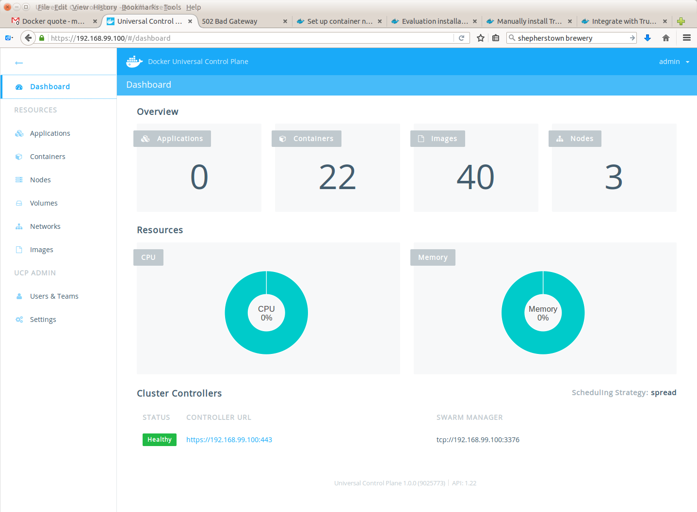
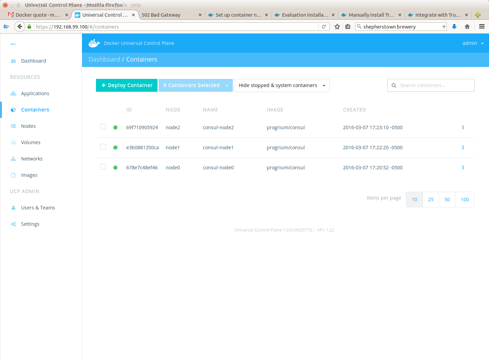

.. _dockerdatacenter:

Docker Datacenter
=================

This chapter documents a walk thru for running a development instance of
`Docker Universal Control Plane`_, part of `Docker Datacenter`_.  

Watch a `UCP demo`_.

.. _Docker Universal Control Plane: https://www.docker.com/products/docker-universal-control-plane
.. _Docker Datacenter: https://www.docker.com/products/docker-datacenter
.. _UCP demo: https://www.docker.com/products/docker-universal-control-plane#/demo

.. datacenterwalkthru:

Datacenter Walk-thru
--------------------

The following output walks thru these items:

* starting 3 VMs with `Docker Machine`_
* installing UCP on one node as a controller; joining 2 other nodes
* setting up `container networking`_ on each node
* creating one `overlay network`_
* starting a `Consul`_ container on each node

.. literalinclude:: ucpstartupdirs.txt

Once you've completed the steps outlined, you should be able to go to
https://<controller-ip>:443, log in with "admin" and the password you
gave during the prompt, submit the license, and see the following:

.. _Docker Machine: https://docs.docker.com/machine/
.. _container networking: http://docs-stage.docker.com.s3-website-us-east-1.amazonaws.com/ucp/networking/
.. _overlay network: https://docs.docker.com/engine/userguide/networking/dockernetworks/
.. _Consul: https://www.consul.io/

.. _furtherinformation:

Further Information
-------------------

As more is learned about Docker Datacenter, particularly admin-related 
information, it will be documented here.

