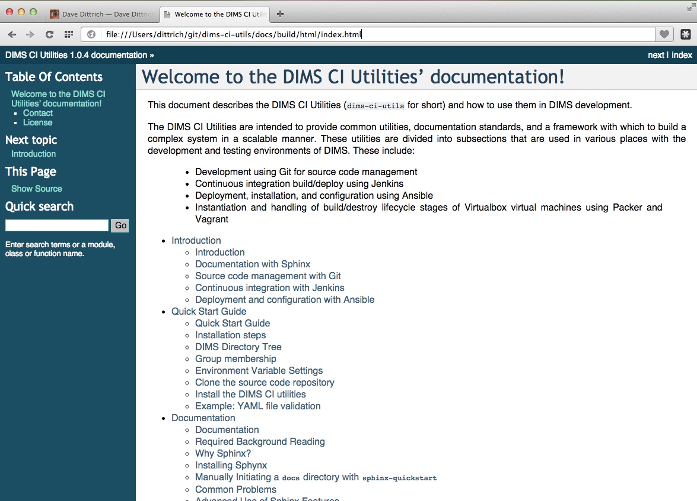

.. _documentation:

Documenting DIMS Components
===========================

This chapter covers `Sphinx`_ and `ReStructured Text (reST)`_,
and how they are used with `ReadTheDocs`_ (a hosted documentation
site) and `GitHub`_ (a hosted Git source repository site) to
document open source project repositories. It includes specifics
of how Sphinx is used for documentation within the DIMS project.

Required Background Reading
---------------------------

Before trying to use Sphinx, it is important to understand how it works and
what basic things you can do with it to produce organized and structured
documentation that includes things like headings, tables, figures, images,
links, cross-references to labelled items, and callout notes.

Start by taking less than five minutes and reading **all** of the *very short*
`Sphinx Style Guide`_.  It will give you some insight into high-level concepts
of Sphinx and reST.

Next, spend another 10-15 minutes and read through **all** of the slightly
longer `Documenting Your Project Using Sphinx`_ document to see the full range
of markup and directives supported by reST.

A short tutorial that includes an example is IBM's
`Easy and beautiful documentation with Sphinx`_.

A much longer (2+hours when delivered live) `Sphinx Tutorial v0.1`_ by Brandon
Rhodes from PyCon 2013 walks through the full range of tasks necessary to
document a Python code project.

Lastly, read `Problems with StructuredText`_ to learn about limitations in reST
and some ways to deal with them.

Why Sphinx?
-----------

Just to illustrate how widely Sphinx is used in the open source
community, here is a list of project repos in Dave Dittrich's $GIT
directory that use Sphinx (by virtue of their containing a Sphinx
configuration file ``conf.py`` under a documentation directory):

.. code-block:: bash

        [dittrich@localhost git]$ find . -name conf.py
        ./ansible/docsite/conf.py
        ./celery/docs/conf.py
        ./crits/documentation/src/conf.py
        ./cuckoo/docs/book/src/conf.py
        ./CybOXProject/python-cybox/docs/conf.py
        ./elasticsearch-dsl-py/docs/conf.py
        ./MAECProject/python-maec/docs/conf.py
        ./MozDef/docs/source/conf.py
        ./pika/docs/conf.py
        ./pyxb/doc/conf.py
        ./redis-py/docs/conf.py
        ./robotframework/doc/api/conf.py
        ./sphinx_rtd_theme/demo_docs/source/conf.py
        ./STIXProject/python-stix/docs/conf.py
        ./TAXIIProject/libtaxii/docs/conf.py
        ./thug/doc/source/conf.py

..

Sphinx, since it is a Python project, is effectively programmable
and highly configurable and flexible. You can do parameterized
creation of documents to make them unique to a site using an
open source software product, can exercise tests in code,
can produce HTML and LaTeX-derived PDF, all from the same source
documentation files. That is just the start. Sphinx also
produces search indexes, dynamic tables of contents, forward
and back buttons in HTML pages, and many other helpful
features for documenting a project. Because it effectively
compiles the documentation, things like unit tests, functional
tests, software version descriptions, insertion of `Graphviz`_
directed and undirected graphs to illustrate relationships
between system components... The list goes on.

Manually Initiating a ``docs`` directory with ``sphinx-quickstart``
-------------------------------------------------------------------

The program ``sphinx-quickstart`` can be used to initiate a Sphinx
document directory. It is important to understand the ramifications
of the first three questions in the context of how other Sphinx
tools (e.g., ``sphinx-autobuild``) work. Use of ``sphinx-autobuild``
is covered later. Here are the first two questions you are faced
with after running ``sphinx-quickstart`` and what results from
the choice.

.. code-block:: bash

    [dittrich@localhost tmp]$ sphinx-quickstart
    Welcome to the Sphinx 1.2.3 quickstart utility.
    
    Please enter values for the following settings (just press Enter to
    accept a default value, if one is given in brackets).
    
    Enter the root path for documentation.
    > Root path for the documentation [.]:
    
    You have two options for placing the build directory for Sphinx output.
    Either, you use a directory "_build" within the root path, or you separate
    "source" and "build" directories within the root path.
    > Separate source and build directories (y/n) [n]: y

..

Separated source and build directories
~~~~~~~~~~~~~~~~~~~~~~~~~~~~~~~~~~~~~~

Answering **y** to the second question (as shown above) results a having
separate ``source`` and ``build`` directories, with the following
structure: ::

    .
    ├── Makefile
    ├── build
    └── source
        ├── _static
        ├── _templates
        ├── conf.py
        └── index.rst
    
    4 directories, 3 files

..

When you initiate a build with ``make html``, here is what the resulting
directory contents will include: ::

    .
    ├── Makefile
    ├── build
    │   ├── doctrees
    │   │   ├── environment.pickle
    │   │   └── index.doctree
    │   └── html
    │       ├── _sources
    │       │   └── index.txt
    │       ├── _static
    │       │   ├── ajax-loader.gif
    │       │   ├── basic.css
    │       │   ├── comment-bright.png
    │       │   ├── comment-close.png
    │       │   ├── comment.png
    │       │   ├── default.css
    │       │   ├── doctools.js
    │       │   ├── down-pressed.png
    │       │   ├── down.png
    │       │   ├── file.png
    │       │   ├── jquery.js
    │       │   ├── minus.png
    │       │   ├── plus.png
    │       │   ├── pygments.css
    │       │   ├── searchtools.js
    │       │   ├── sidebar.js
    │       │   ├── underscore.js
    │       │   ├── up-pressed.png
    │       │   ├── up.png
    │       │   └── websupport.js
    │       ├── genindex.html
    │       ├── index.html
    │       ├── objects.inv
    │       ├── search.html
    │       └── searchindex.js
    └── source
        ├── _static
        ├── _templates
        ├── conf.py
        └── index.rst
    
    8 directories, 31 files

..

.. note::

   Notice how the ``build/`` directory now contains subdirectories ``html/``
   and ``doctrees/`` directories. There were no files created or changed in
   ``source/`` directory by the make operation.

.. warning::

   You should answer **y** to the second question. DIMS project repositories
   should have **separated** ``source/`` and ``build/`` directories.

..

Mixed source and build
~~~~~~~~~~~~~~~~~~~~~~

Had the second and third questions above been answered with a **n**,
this is what the resulting directory structure would look like: ::

    .
    |── Makefile
    |── _build
    |── _static
    |── _templates
    |── conf.py
    +── index.rst

    3 directories, 3 files

..

Notice the ``conf.py`` and ``index.rst`` files are located in the same
directory root as ``_build``. When you build this document with ``make html``,
the resulting directory structure now looks like this: ::

    .
    ├── Makefile
    ├── _build
    │   ├── doctrees
    │   │   ├── environment.pickle
    │   │   └── index.doctree
    │   └── html
    │       ├── _sources
    │       │   └── index.txt
    │       ├── _static
    │       │   ├── ajax-loader.gif
    │       │   ├── basic.css
    │       │   ├── comment-bright.png
    │       │   ├── comment-close.png
    │       │   ├── comment.png
    │       │   ├── default.css
    │       │   ├── doctools.js
    │       │   ├── down-pressed.png
    │       │   ├── down.png
    │       │   ├── file.png
    │       │   ├── jquery.js
    │       │   ├── minus.png
    │       │   ├── plus.png
    │       │   ├── pygments.css
    │       │   ├── searchtools.js
    │       │   ├── sidebar.js
    │       │   ├── underscore.js
    │       │   ├── up-pressed.png
    │       │   ├── up.png
    │       │   └── websupport.js
    │       ├── genindex.html
    │       ├── index.html
    │       ├── objects.inv
    │       ├── search.html
    │       └── searchindex.js
    ├── _static
    ├── _templates
    ├── conf.py
    └── index.rst
    
    7 directories, 31 files

..

.. note::

   In this second example, the source files ``index.rst`` and the ``conf.py``
   file are at the same directory level as the ``_build/`` directory
   (and all of its contents). Doing a ``make html`` or ``make latexpdf``
   both cause the source directory ``.`` to change, because new files
   and directores were created within the ``.`` directory.

..

The ``sphinx-quickstart`` program gives you an option of separating the source
directory from other directories. When this option is chosen, the result is
a directory structure that has the ``Makefile`` at the top level with
a ``build`` and ``source`` directory at the same directory level, which
looks like this: ::

    .
    |── Makefile
    |── build
    +── source
        ├── README.rst
        ├── _static
        ├── _templates
        ├── conf.py
        ├── developing.rst
        ├── index.rst
        ├── intro.rst
        ├── license.rst
        └── quickstart.rst

    4 directories, 8 files

..

.. _buildingwithautobuild:

Building Sphinx Documentation
-----------------------------

You can build HTML manually with the ``Makefile``, build PDF output with the
``Makefile``, or automatically build HTML whenever files change on disk using
``sphinx-autobuild``.

When you are ready to try building your documentation, start with
manually building HTML output (which you can test locally with
a browser). Once you understand how building HTML works, and
know what to look for in terms of error messages and warnings,
you will find it is faster and easier to create Sphinx documents
using ``sphinx-autobuild`` and a browser in a second window.

Manually Building HTML
~~~~~~~~~~~~~~~~~~~~~~

The most simple way to render Sphinx documents is to use
the ``Makefile`` created by ``sphinx-quickstart`` using
``make`` as shown here:

.. code-block:: none

    [dittrich@localhost docs (dev)]$ make html
    sphinx-build -b html -d build/doctrees   source build/html
    Making output directory...
    Running Sphinx v1.2.3
    loading pickled environment... not yet created
    loading intersphinx inventory from http://docs.python.org/objects.inv...
    building [html]: targets for 8 source files that are out of date
    updating environment: 8 added, 0 changed, 0 removed
    reading sources... [ 12%] README
    reading sources... [ 25%] continuousintegration
    reading sources... [ 37%] deployconfigure
    reading sources... [ 50%] developing
    reading sources... [ 62%] documentation
    reading sources... [ 75%] index
    reading sources... [ 87%] introduction
    reading sources... [100%] quickstart

    looking for now-outdated files... none found
    pickling environment... done
    checking consistency... /Users/dittrich/git/dims-ci-utils/docs/source/README.rst:: WARNING: document isn't included in any toctree
    done
    preparing documents... done
    writing output... [ 12%] README
    writing output... [ 25%] continuousintegration
    writing output... [ 37%] deployconfigure
    writing output... [ 50%] developing
    writing output... [ 62%] documentation
    writing output... [ 75%] index
    writing output... [ 87%] introduction
    writing output... [100%] quickstart

    writing additional files... genindex search
    copying images... [100%] images/DD_home_page_small.jpg

    copying downloadable files... [100%] /Users/dittrich/git/dims-ci-utils/docs/source/images/DD_home_page.png

    copying static files... done
    copying extra files... done
    dumping search index... done
    dumping object inventory... done
    build succeeded, 1 warning.

    Build finished. The HTML pages are in build/html.

..

You can now load the page with a browser:

.. code-block:: bash

    [dittrich@localhost docs (dev)]$ open -a Opera.app build/html/index.html

..

   This documentation, rendered on a Mac using Opera.

..

.. _manuallybuildpdf:

Manually Building PDF using LaTeX
~~~~~~~~~~~~~~~~~~~~~~~~~~~~~~~~~

Now, render the same document as a PDF file using LaTeX:

.. code-block:: bash

    [dittrich@localhost docs (dev)]$ make latexpdf
    sphinx-build -b latex -d build/doctrees   source build/latex
    Making output directory...
    Running Sphinx v1.2.3
    loading pickled environment... done
    building [latex]: all documents
    updating environment: 0 added, 0 changed, 0 removed
    looking for now-outdated files... none found
    processing DIMSCIUtilities.tex... index introduction quickstart documentation developing continuousintegration deployconfigure
    resolving references...
    writing... done
    copying images... dims-ci-utils-doc.png DD_home_page_small.jpg
    copying TeX support files...
    done
    build succeeded.
    Running LaTeX files through pdflatex...
    /Applications/Xcode.app/Contents/Developer/usr/bin/make -C build/latex all-pdf
    pdflatex  'DIMSCIUtilities.tex'
    This is pdfTeX, Version 3.14159265-2.6-1.40.15 (TeX Live 2014/MacPorts 2014_4) (preloaded format=pdflatex)
     restricted \write18 enabled.
    entering extended mode
    (./DIMSCIUtilities.tex
    LaTeX2e <2014/05/01>
    Babel <3.9k> and hyphenation patterns for 43 languages loaded.
    (./sphinxmanual.cls
    Document Class: sphinxmanual 2009/06/02 Document class (Sphinx manual)
    (/opt/local/share/texmf-texlive/tex/latex/base/report.cls
    Document Class: report 2007/10/19 v1.4h Standard LaTeX document class
    (/opt/local/share/texmf-texlive/tex/latex/base/size10.clo)))
    (/opt/local/share/texmf-texlive/tex/latex/base/inputenc.sty

    [ ...pages of output removed... ]

    [25] [26]
    Chapter 6.
    [27] [28]
    Chapter 7.
    [29] [30]
    Chapter 8.
    (./DIMSCIUtilities.ind) [31] (./DIMSCIUtilities.aux) )
    (see the transcript file for additional information){/opt/local/share/texmf-tex
    live/fonts/enc/dvips/base/8r.enc}</opt/local/share/texmf-texlive/fonts/type1/ur
    w/courier/ucrb8a.pfb></opt/local/share/texmf-texlive/fonts/type1/urw/courier/uc
    rr8a.pfb></opt/local/share/texmf-texlive/fonts/type1/urw/courier/ucrro8a.pfb></
    opt/local/share/texmf-texlive/fonts/type1/urw/helvetic/uhvb8a.pfb></opt/local/s
    hare/texmf-texlive/fonts/type1/urw/helvetic/uhvbo8a.pfb></opt/local/share/texmf
    -texlive/fonts/type1/urw/times/utmb8a.pfb></opt/local/share/texmf-texlive/fonts
    /type1/urw/times/utmr8a.pfb></opt/local/share/texmf-texlive/fonts/type1/urw/tim
    es/utmri8a.pfb>
    Output written on DIMSCIUtilities.pdf (35 pages, 381656 bytes).
    Transcript written on DIMSCIUtilities.log.
    pdflatex finished; the PDF files are in build/latex.

..

Now open the PDF file (this example uses Mac OS X Preview.app, but you can
also use ``evince`` on some Linux systems):

.. code-block:: bash

    [dittrich@localhost docs (dev)]$ open build/latex/DIMSCIUtilities.pdf

..

   This documentation, rendered using LaTeX on a Mac,
   viewed with Preview.

..

Automatically building HTML
~~~~~~~~~~~~~~~~~~~~~~~~~~~

Sphinx has a program called ``sphinx-autobuild`` that can monitor a directory
for any file changes in that directory and below, re-building the document
immediately upong detecting changes.  When used to build HTML content, it makes
the pages available on a local TCP port using a simple HTTP service (just like
if the docs were put up on GitHub, readthedocs, etc.)

.. note::

    You may need to install ``sphinx-autobuild`` using ``pip`` separately.
    Refer to section :ref:`installingsphinx`.

..

Here is where the importance of splitting the ``source/`` directory
from ``build/`` directory becomes evident.

Invoke ``sphinx-autobuild`` from the command line in a separate terminal
window, so you can watch the output for error messages.  By default, ``sphinx-autobuild``
listens on 8000/tcp. (This can be changed with the ``-p`` flag on the command line).
After starting ``sphinx-autobuild`` you then enter the URL that is produced
(in this case, the URL is ``http://127.0.0.1:8000``).  Now edit files in
another terminal or editor application window.

.. code-block:: none

    [dittrich@localhost docs (dev)]$ sphinx-autobuild --ignore '*.swp' source build/html
    Serving on http://127.0.0.1:8000
    [I 150105 18:50:45 handlers:109] Browser Connected: http://127.0.0.1:8000/documentation.html
    [I 150105 18:50:45 handlers:118] Start watching changes
    [I 150105 18:50:48 handlers:74] Reload 1 waiters: None
    [I 150105 18:50:48 web:1811] 200 GET /documentation.html (127.0.0.1) 16.57ms
    [I 150105 18:50:48 web:1811] 304 GET /livereload.js (127.0.0.1) 1.08ms
    [I 150105 18:50:48 web:1811] 200 GET /_static/pygments.css (127.0.0.1) 0.83ms
    [I 150105 18:50:48 web:1811] 200 GET /_static/default.css (127.0.0.1) 0.62ms
    [I 150105 18:50:48 web:1811] 200 GET /_static/jquery.js (127.0.0.1) 1.24ms
    [I 150105 18:50:48 web:1811] 200 GET /_static/underscore.js (127.0.0.1) 1.09ms
    [I 150105 18:50:48 web:1811] 200 GET /_static/doctools.js (127.0.0.1) 0.68ms
    [I 150105 18:50:48 web:1811] 200 GET /_images/DD_home_page_small.jpg (127.0.0.1) 0.86ms
    [I 150105 18:50:48 web:1811] 200 GET /_static/basic.css (127.0.0.1) 0.46ms
    [I 150105 18:50:48 web:1811] 200 GET /_images/dims-ci-utils-doc-html.png (127.0.0.1) 1.59ms
    [I 150105 18:50:48 web:1811] 200 GET /_images/dims-ci-utils-doc-pdf.png (127.0.0.1) 0.72ms
    [I 150105 18:50:48 handlers:109] Browser Connected: http://127.0.0.1:8000/documentation.html

    +--------- source/documentation.rst changed -------------------------------------
    | Running Sphinx v1.2.3
    | loading pickled environment... not yet created
    | No builder selected, using default: html
    | loading intersphinx inventory from http://docs.python.org/objects.inv...
    | building [html]: targets for 8 source files that are out of date
    | updating environment: 8 added, 0 changed, 0 removed
    | reading sources... [ 12%] README
    | reading sources... [ 25%] continuousintegration
    | reading sources... [ 37%] deployconfigure
    | reading sources... [ 50%] developing
    | reading sources... [ 62%] documentation
    | reading sources... [ 75%] index
    | reading sources... [ 87%] introduction
    | reading sources... [100%] quickstart
    /Users/dittrich/git/dims-ci-utils/docs/source/documentation.rst:281: WARNING: Literal block ends without a blank line; unexpected unindent.
    /Users/dittrich/git/dims-ci-utils/docs/source/documentation.rst:519: WARNING: Literal block ends without a blank line; unexpected unindent.
    |
    | looking for now-outdated files... none found
    | pickling environment... done
    /Users/dittrich/git/dims-ci-utils/docs/source/README.rst:: WARNING: document isn't included in any toctree
    | checking consistency... done
    | preparing documents... done
    | writing output... [ 12%] README
    | writing output... [ 25%] continuousintegration
    | writing output... [ 37%] deployconfigure
    | writing output... [ 50%] developing
    | writing output... [ 62%] documentation
    | writing output... [ 75%] index
    | writing output... [ 87%] introduction
    | writing output... [100%] quickstart
    |
    | writing additional files... genindex search
    | copying images... [ 33%] dims-ci-utils-doc-pdf.png
    | copying images... [ 66%] DD_home_page_small.jpg
    | copying images... [100%] dims-ci-utils-doc-html.png
    |
    | copying downloadable files... [100%] /Users/dittrich/git/dims-ci-utils/docs/source/images/DD_home_page.png
    |
    | copying static files... done
    | copying extra files... done
    | dumping search index... done
    | dumping object inventory... done
    | build succeeded, 3 warnings.
    +--------------------------------------------------------------------------------

    +--------- source/documentation.rst changed -------------------------------------
    | Running Sphinx v1.2.3
    | loading pickled environment... done
    | No builder selected, using default: html
    | building [html]: targets for 0 source files that are out of date
    | updating environment: 0 added, 0 changed, 0 removed
    | looking for now-outdated files... none found
    | no targets are out of date.
    +--------------------------------------------------------------------------------

    [I 150105 18:51:17 handlers:74] Reload 1 waiters: None
    [I 150105 18:51:17 web:1811] 200 GET /documentation.html (127.0.0.1) 1.70ms
    [I 150105 18:51:17 web:1811] 200 GET /_static/default.css (127.0.0.1) 0.70ms
    [I 150105 18:51:17 web:1811] 200 GET /_static/doctools.js (127.0.0.1) 0.76ms
    [I 150105 18:51:17 web:1811] 200 GET /_static/underscore.js (127.0.0.1) 0.88ms
    [I 150105 18:51:17 web:1811] 200 GET /_static/jquery.js (127.0.0.1) 1.26ms
    [I 150105 18:51:17 web:1811] 200 GET /_static/pygments.css (127.0.0.1) 0.71ms
    [I 150105 18:51:17 web:1811] 304 GET /livereload.js (127.0.0.1) 0.83ms
    [I 150105 18:51:17 web:1811] 200 GET /_images/DD_home_page_small.jpg (127.0.0.1) 1.04ms
    [I 150105 18:51:17 web:1811] 200 GET /_static/basic.css (127.0.0.1) 0.54ms
    [I 150105 18:51:17 web:1811] 200 GET /_images/dims-ci-utils-doc-html.png (127.0.0.1) 1.86ms
    [I 150105 18:51:17 web:1811] 200 GET /_images/dims-ci-utils-doc-pdf.png (127.0.0.1) 0.96ms
    [I 150105 18:51:17 handlers:109] Browser Connected: http://127.0.0.1:8000/documentation.html

..

Every time you change a file, ``sphinx-autobuild`` will rebuild it and your
brower will be informed that it needs to reload the page so you can immediately
see the results.  This helps in developing Sphinx documentation quickly, as all
you need to do is edit files and watch for error messages in the ``sphinx-autobuild``
window and see if the browser page shows what you want it to show.

.. warning::

    The above example uses ``--ignore '*.swp'`` to avoid temporary swap
    files created by the ``vim`` editor. If you use an editor that creates
    temporary files using a different file extension, you should use that
    name instead.  Otherwise, every time you open a file with the editor
    it will appear to ``sphinx-autobuild`` as though a source file changed
    and it will regenerate the document.

..

.. warning::

    If you restart the ``sphinx-autobuild`` process, you will need to reconnect
    the browser to the ``sphinx-autobuild`` listening port, otherwise the browser
    will stop updating the page automatically at the end of each automatic build.
    Refreshing the page can fix this.

    If you start the browser and attempt to re-open a previously used URL *before*
    you start ``sphinx-autobuild``, you may experience a similar problem. Try to
    use ``touch`` to update a file, or edit a file and force a write operation.
    Either of these will trigger a rebuild and refresh of the browser, which
    should then keep it in sync.

..

The example above produces **a lot** of output in the ``sphinx-autobuild`` terminal
output, which in practice makes it a little harder to see the error messages.
To decrease the amount of output, you may want to add the ``-q`` flag (see also
``sphinx-build -h`` for how to control the underlying build process, and
``sphinx-autobuild --help`` for more autobuild options).

.. code-block:: bash

    [dittrich@localhost docs (dev)]$ sphinx-autobuild -q --ignore '*.swp' source build/html

..

.. warning::

   By default, ``sphinx-autobuild`` will attempt to bind to port 8000/tcp. If
   that port is in use by another instance of ``sphinx-autobuild``, you will
   get an error message. Use the ``-p`` flag to change the listening port
   number to something else (e.g., ``-p 8001``).

..

.. _fixingerrors:

Fixing errors
-------------

If there are any problems, Sphinx will call them out with warnings.
Pay attention to the build output.

.. code-block:: none

    rm -rf build/*
    sphinx-build -b html -d build/doctrees   source build/html
    Making output directory...
    Running Sphinx v1.2.3
    loading pickled environment... not yet created
    loading intersphinx inventory from http://docs.python.org/objects.inv...
    building [html]: targets for 7 source files that are out of date
    updating environment: 7 added, 0 changed, 0 removed
    reading sources... [ 14%] README
    reading sources... [ 28%] advanced
    reading sources... [ 42%] developing
    reading sources... [ 57%] index
    reading sources... [ 71%] intro
    reading sources... [ 85%] license
    reading sources... [100%] quickstart

    /Users/dittrich/git/dims-ci-utils/docs/source/intro.rst:26: WARNING: Inline literal start-string without end-string.
    /Users/dittrich/git/dims-ci-utils/docs/source/intro.rst:95: WARNING: Literal block ends without a blank line; unexpected unindent.
    looking for now-outdated files... none found
    pickling environment... done
    checking consistency...
    /Users/dittrich/git/dims-ci-utils/docs/source/README.rst:: WARNING: document isn't included in any toctree
    /Users/dittrich/git/dims-ci-utils/docs/source/advanced.rst:: WARNING: document isn't included in any toctree
    /Users/dittrich/git/dims-ci-utils/docs/source/license.rst:: WARNING: document isn't included in any toctree
    done
    preparing documents... done
    writing output... [ 14%] README
    writing output... [ 28%] advanced
    writing output... [ 42%] developing
    writing output... [ 57%] index
    writing output... [ 71%] intro
    writing output... [ 85%] license
    writing output... [100%] quickstart

    writing additional files... genindex search
    copying static files... done
    copying extra files... done
    dumping search index... done
    dumping object inventory... done
    build succeeded, 23 warnings.

    Build finished. The HTML pages are in build/html.

..

.. _typographicerrors:

Typographic errors
~~~~~~~~~~~~~~~~~~

Both of the errors seen in this first example above are simple typographical
errors in the ``intro.rst`` file.

The first one, as it says, involves an improper literal on
line 25:

.. code-block:: text
   :emphasize-lines: 1

   25   A much longer (2+hours when delivered live) ``Sphinx Tutorial v0.1`_ by Brandon
   26   Rhodes from PyCon 2013 walks through the full range of tasks necessary to
   27   document a Python code project.

Here is the context for the second error message, regarding line 95:

.. code-block:: text
   :emphasize-lines: 22,23

   73   Manually Initiating a ``docs`` directory with ``sphinx-quickstart``
   74   -------------------------------------------------------------------
   75
   76   The ``sphinx-quickstart`` program gives you an option of separating the soruce
   77   directory from other directories. The result is a directory structure that
   78   looks like this: ::
   79
   80       .
   81       ├── Makefile
   82       ├── build
   83       └── source
   84           ├── README.rst
   85           ├── _static
   86           ├── _templates
   87           ├── conf.py
   88           ├── developing.rst
   89           ├── index.rst
   90           ├── intro.rst
   91           ├── license.rst
   92           └── quickstart.rst
   93
   94       4 directories, 8 files
   95   ..
   96

..

As you can see, there is no blank line before the end of the literal block that
ends on line 94 and before the reST comment tag (``..``) on line 25 (the one
identified in the error message).

This is a simple error, but it happens quite frequently when inserting literal
text examples.  If need be, go back and re-read `Sphinx Style Guide`_ and
`Documenting Your Project Using Sphinx`_ every now and then when you are
starting out to get a refresher, and also have a browser window up with the
`The reStructuredText_ Cheat Sheet: Syntax Reminders`_ or `Quick
reStructuredText`_ quick reference guide to help while writing reST documents.

.. _linkerrors:

Link errors
~~~~~~~~~~~

A more subtle problem that comes up frequently when creating
links to reference material in Sphinx documents is this
error:

.. code-block:: text

    /Users/dittrich/git/dims-ci-utils/docs/source/intro.rst:274: ERROR: Unknown
    target name: "the restructuredtext_ cheat sheet: syntax reminders".

..

See if you can spot the reason why by looking very closely at lines
274 and 323 before reading the explanation that follows:

.. code-block:: text
   :emphasize-lines: 3,8

   ...
   273    are starting out to get a refresher, and also have a browser window
   274    up with the `The reStructuredText_ Cheat Sheet: Syntax Reminders`_ or
   275    `Quick reStructuredText`_ quick reference guide to help while
   276    writing reST documents.
   ...
   321   .. _Sphinx Tutorial v0.1: http://brandons-sphinx-tutorial.readthedocs.org/en/v0.1/
   323   .. _The reStructuredText_ Cheat Sheet: Syntax Reminders: http://docutils.sourceforge.net/docs/user/rst/cheatsheet.txt
   324   .. _Quick reStructuredText: http://docutils.sourceforge.net/docs/user/rst/quickref.html

..

Unlike the links on lines 321 and 324, the target string specified on
line 323 has *two* colons in it. This causes Sphinx to parse the line
incorrectly (which in turn causes the ``Unknown target name`` error
to be triggered). The error is not really on line 274, but is
actually on line 323! It just presents itself as a missing target
error on line 274.  The solution is to make sure that all colons in
targets for links are escaped, **except** the one before
the URL, like this:

.. code-block:: text

   323   .. _The reStructuredText_ Cheat Sheet\: Syntax Reminders: http://docutils.sourceforge.net/docs/user/rst/cheatsheet.txt

..

.. _lateximageerrors:

LaTeX image errors
~~~~~~~~~~~~~~~~~~

You may get errors rendering LaTeX PDF documents that include
image files. Such an error may look like this:

.. code-block:: bash

   [dittrich@localhost docs (feature/docs)]$ make latexpdf
   sphinx-build -b latex -d build/doctrees   source build/latex
   Running Sphinx v1.2.3

   ...

   Running LaTeX files through pdflatex...
   /Applications/Xcode.app/Contents/Developer/usr/bin/make -C build/latex all-pdf
   pdflatex  'DIMSCIUtilities.tex'
   This is pdfTeX, Version 3.14159265-2.6-1.40.15 (TeX Live 2014/MacPorts 2014_4) (preloaded format=pdflatex)

   ...

   Chapter 1.
   [3] [4] (/opt/local/share/texmf-texlive/tex/latex/psnfss/ts1pcr.fd) [5]

   pdfTeX warning: pdflatex: arithmetic: number too big
   ! Dimension too large.
   <argument> \ht \@tempboxa

   l.348 ...=0.800\linewidth]{images/DD_home_page_small.png}

   ? q
   OK, entering \batchmodemake[1]: *** [DIMSCIUtilities.pdf] Error 1
   make: *** [latexpdf] Error 2

..

The `solution to this`_ is to use ``mogrify -density 90 DD_home_page_small.png``
to fix the image resolution metadata in the PNG file.

.. _latexunicodeerrors:

LaTeX Unicode rendering errors
~~~~~~~~~~~~~~~~~~~~~~~~~~~~~~

Another error message that could occur when rendering the kind of
text in the ``code-block`` seen in Section :ref:`typographicerrors` relates to
the Unicode characters produced by the ``tree`` program to show the indentation
levels.

Here is an error message (with the specific lines highlighted) that can show up
in a Jenkins build process FAILURE message:

.. code-block:: bash
    :linenos:
    :emphasize-lines: 16,22,28

    Running LaTeX files through pdflatex...
    make -C build/latex all-pdf
    make[1]: Entering directory `/var/lib/jenkins/jobs/dims-docs-deploy/workspace/ansible-playbooks/docs/build/latex'
    pdflatex  'AnsiblePlaybooksRepository.tex'
    This is pdfTeX, Version 3.1415926-1.40.10 (TeX Live 2009/Debian)
    entering extended mode
    (./AnsiblePlaybooksRepository.tex
    
    ...
    
    Underfull \hbox (badness 10000) in paragraph at lines 819--822
    []\T1/ptm/m/n/10 While it is not re-quired to in-stall dims-ci-utils, you prob-
    a-bly will want to run the play-book
    [11] [12] [13]
    
    ! Package inputenc Error: Unicode char \u8:├ not set up for use with LaTeX.
    
    See the inputenc package documentation for explanation.
    Type  H <return>  for immediate help.
     ...                                              
                                                      
    l.1040 ├-- defaults
                         
    ? 
    ! Emergency stop.
     ...                                              
                                                      
    l.1040 ├-- defaults
                         
    !  ==> Fatal error occurred, no output PDF file produced!
    Transcript written on AnsiblePlaybooksRepository.log.
    make[1]: *** [AnsiblePlaybooksRepository.pdf] Error 1
    make[1]: Leaving directory `/var/lib/jenkins/jobs/dims-docs-deploy/workspace/ansible-playbooks/docs/build/latex'
    make: *** [latexpdf] Error 2
    Build step 'Custom Python Builder' marked build as failure
    Warning: you have no plugins providing access control for builds, so falling back to legacy behavior of permitting any downstream builds to be triggered
    Finished: FAILURE

..

Here is the specific block of text that triggered the rendering
error message:

.. code-block:: rest
   :emphasize-lines: 3

    .. code-block:: bash
    
        ── defaults
            ── main.yml
        ── files
            ── base-requirements.txt
            ── debian-virtualenv-prereqs.sh
            ── dimsenv-requirements.txt
            ── macos-virtualenv-prereqs.sh
        ── meta
            ── main.yml
        ── tasks
            ── main.yml
            ── post_tasks.yml -> ../../../dims/post_tasks.yml
            ── pre_tasks.yml -> ../../../dims/pre_tasks.yml
        ── templates
            ── bashrc.dims.virtualenv.j2
            ── builddimsenvmod.sh.j2

    ..

..

The problem is that the long-dash character is not defined to
LaTeX. This is done in the Sphinx ``conf.py`` file, and all DIMS
documents should include these definitions because we frequently
embed output of ``tree``, which uses Unicode characters for line
drawing.  (Not all do, which causes random failures when adding text to
Sphinx documents.)

.. code-block:: none
   :emphasize-lines: 10

    latex_elements = {
     ...
    # Additional stuff for the LaTeX preamble.
    #
    # The following comes from
    # https://github.com/rtfd/readthedocs.org/issues/416
    #
    'preamble': "".join((
        '\DeclareUnicodeCharacter{00A0}{ }',     # NO-BREAK SPACE
        '\DeclareUnicodeCharacter{2014}{\dash}', # LONG DASH
        '\DeclareUnicodeCharacter{251C}{+}',     # BOX DRAWINGS LIGHT VERTICAL AND RIGHT
        '\DeclareUnicodeCharacter{2514}{+}',     # BOX DRAWINGS LIGHT UP AND RIGHT
    )),
    }

..

.. note::

   See http://tex.stackexchange.com/questions/34604/entering-unicode-characters-in-latex

..

.. _latexnottty:

"LaTeX is not a TTY" errors
~~~~~~~~~~~~~~~~~~~~~~~~~~~

Another variation of errors during LaTeX rendering presents itself similarly
to the previous error, but the problem is due to inability to map a Unicode
character to a LaTeX macro: the problem is due to directly (or indirectly)
sending output saved from Unix command line programs that do fancy things
like coloring characters, etc, using ANSI escape sequences. While a terminal
program that uses the Unix TTY subsystem may handle the ANSI escape
sequences, and HTML renderers may know how to handle the ANSI escape
sequences, LaTeX does not. Here is an example of this problem, excerpted
from a Jenkins build job email message:

.. code-block:: none
   :linenos:
   :emphasize-lines: 3,28,34,38

    Started by user anonymous
    [EnvInject] - Loading node environment variables.
    Building in workspace /var/lib/jenkins/jobs/dims-docs-deploy/workspace

    Deleting project workspace... done

    [workspace] $ /bin/bash -xe /tmp/shiningpanda5607640542889107840.sh
    + jenkins.logmon
    [workspace] $ /bin/bash -xe /tmp/shiningpanda5535708223044870299.sh
    + jenkins.dims-docs-deploy
    [+++] jenkins.dims-docs-deploy: Deploying documentation
    [+++] jenkins.dims-docs-deploy: Get global vars from jenkins.dims-defaults.
    [+++] jenkins.dims-defaults Default variables
    [+++]    PLAYBOOKSREPO=ansible-playbooks
    [+++]    INVENTORYREPO=ansible-inventory
    [+++]    GITURLPREFIX=git@git.prisem.washington.edu:/opt/git/
    [+++]    MASTERBRANCH=master
    [+++]    DEVBRANCH=develop
    [+++]    DEVHOSTS=development
    [+++]    MASTERHOSTS=production
    [+++]    DEFAULTHOSTFILE=development
    [+++]    DEFAULTANSIBLEBRANCH=develop
    [+++]    DEFAULTINVENTORYBRANCH=develop
    [+++]    DEFAULTREMOTEUSER=ansible

    ...
    ! Package inputenc Error: Keyboard character used is undefined
    (inputenc)                in inputencoding `utf8'.

    See the inputenc package documentation for explanation.
    Type  H <return>  for immediate help.
     ...

    l.5790 ...dl{}GIT/dims\PYGZhy{}dockerfiles/configu

    !  ==> Fatal error occurred, no output PDF file produced!
    Transcript written on UsingDockerinDIMS.log.
    make[1]: *** [UsingDockerinDIMS.pdf] Error 1
    make[1]: Leaving directory `/var/lib/jenkins/jobs/dims-docs-deploy/workspace/dims-dockerfiles/docs/build/latex'
    make: *** [latexpdf] Error 2
    Build step 'Custom Python Builder' marked build as failure
    Warning: you have no plugins providing access control for builds, so falling back to legacy behavior of permitting any downstream builds to be triggered
    Finished: FAILURE

..

To find the line in question (5790, in this case, called out in output
line 34 above), manually trigger a LaTeX PDF build from the Sphinx
document and then look for the LaTeX source file that corresponds with the
PDF file name (seen in output line 38 above) in the ``build/latex`` subdirectory
(in this case, it would be
``$GIT/dims-dockerfiles/docs/build/latex/UsingDockerinDIMS.tex``) to
find the character that causes the error:

.. code-block:: none
   :linenos:
   :emphasize-lines: 14-19,32

    [dimsenv] ~/dims/git/dims-dockerfiles/docs (develop) $ make latexpdf

     ...

    ! Package inputenc Error: Keyboard character used is undefined
    (inputenc)                in inputencoding `utf8'.

    See the inputenc package documentation for explanation.
    Type  H <return>  for immediate help.
     ...

    l.5789 ...dl{}GIT/dims\PYGZhy{}dockerfiles/configu

    ? ^Cmake[1]: *** Deleting file `UsingDockerinDIMS.pdf'
    ^Z
    [1]+  Stopped                 make latexpdf
    [dimsenv] ~/dims/git/dims-dockerfiles/docs (develop) $ kill -9 %1
    [1]+  Killed: 9               make latexpdf
    [dimsenv] ~/dims/git/dims-dockerfiles/docs (develop) $ pr -n build/latex/UsingDockerinDIMS.tex | less

      ...

     5780    * VPN \PYGZsq{}01\PYGZus{}uwapl\PYGZus{}dimsdev2\PYGZsq{} is running
     5781    * VPN \PYGZsq{}02\PYGZus{}prsm\PYGZus{}dimsdev2\PYGZsq{} is running
     5782   [+++] Sourcing /opt/dims/etc/bashrc.dims.d/bashrc.dims.virtualenv ...
     5783   [+++] Activating DIMS virtual environment (dimsenv) [ansible\PYGZhy{}playbooks v1.2.93]
     5784   [+++] (Create file /home/mboggess/.DIMS\PYGZus{}NO\PYGZus{}DIMSENV\PYGZus{}ACTIVATE to disable)
     5785   [+++] Virtual environment \PYGZsq{}dimsenv\PYGZsq{} activated [ansible\PYGZhy{}playbooks v1.2.93]
     5786   [+++] /opt/dims/bin/dims.install.dimscommands: won\PYGZsq{}t try to install scripts in /opt/dims
     5787   [+++] Sourcing /opt/dims/etc/bashrc.dims.d/git\PYGZhy{}prompt.sh ...
     5788   [+++] Sourcing /opt/dims/etc/bashrc.dims.d/hub.bash\PYGZus{}completion.sh ...
     5789   ESC[1;34m[dimsenv]ESC[0m ESC[1;33mmboggess@dimsdev2:\PYGZti{}/core\PYGZhy{}localESC[0m () \PYGZdl{} bash \PYGZdl{}GIT/dims\PYGZhy{}dockerfiles/configu
     5790   rations/elasticsearch/setup\PYGZus{}cluster.sh
     5791
     5792   elasticsearch@.service                          0\PYGZpc{}    0     0.0KB/s   \PYGZhy{}\PYGZhy{}:\PYGZhy{}\PYGZhy{} ETA
     5793   elasticsearch@.service                        100\PYGZpc{} 1680     1.6KB/s   00:00
     5794
     5795   start\PYGZus{}elasticsearch\PYGZus{}cluster.sh                  0\PYGZpc{}    0     0.0KB/s   \PYGZhy{}\PYGZhy{}:\PYGZhy{}\PYGZhy{} ETA
     5796   start\PYGZus{}elasticsearch\PYGZus{}cluster.sh                100\PYGZpc{}   75     0.1KB/s   00:00
     5797   ESC[1;34m[dimsenv]ESC[0m ESC[1;33mmboggess@dimsdev2:\PYGZti{}/core\PYGZhy{}localESC[0m () \PYGZdl{} vagrant ssh core\PYGZhy{}01 \PYGZhy{}\PYGZhy{} \PYGZhy{}A
     5798   VM name: core\PYGZhy{}01 \PYGZhy{} IP: 172.17.8.101
     5799   Last login: Wed Sep  9 13:50:22 2015 from 10.0.2.2
     5800
     5801   CoreESC[38;5;206mOESC[38;5;45mSESC[39m alpha (794.0.0)
     5802   ESC]0;core@core\PYGZhy{}01:\PYGZti{}^GESC[?1034hESC[01;32mcore@core\PYGZhy{}01ESC[01;34m \PYGZti{} \PYGZdl{}ESC[00m ls
     5803   ESC[0mESC[01;34minstancesESC[0m  start\PYGZus{}elasticsearch\PYGZus{}cluster.sh  ESC[01;34mstaticESC[0m  ESC[01;34mtemplatesESC[0m
     5804   ESC]0;core@core\PYGZhy{}01:\PYGZti{}^GESC[01;32mcore@core\PYGZhy{}01ESC[01;34m \PYGZti{} \PYGZdl{}ESC[00m bash start\PYGZus{}elasticsearch\PYGZus{}cluster.sh
     5805   ESC]0;core@core\PYGZhy{}01:\PYGZti{}^GESC[01;32mcore@core\PYGZhy{}01ESC[01;34m \PYGZti{} \PYGZdl{}ESC[00m ESC[Ketcdctl cluster\PYGZhy{}hea
      ...

..

.. note::

    Pay close attention to the commands used to reproduce the error that Jenkins
    encountered from the command line. LaTeX, which is being invoked by Sphinx
    (a Python program that invokes ``pdflatex`` as a subprocess) has some
    problems getting the **CTRL-C** character (see line 14). To work around this,
    do the following:

    #. Suspend the process with **CTRL-Z** (see line 15).

    #. Identify the suspended job's number found within the square brackets on
       line 16: (``[1]+  Stopped ...``, in this case, job ``1``).

    #. Use the ``kill`` command (see ``man kill`` and ``man signal``) to send
       the ``-9`` (non-maskable interrupt) signal to the suspended job
       (see line 17).

    #. Use ``pr -n`` to add line numbers to the file and pass the output
       to a pager like ``less`` to find the line number called out by
       LaTeX (see lines 19 and 32).

..

As can be seen in line 32 above, the escape sequence **ESC[1;34m** (set
foreground color 'Blue': see `Bash Prompt HOWTO: Chapter 6. ANSI Escape
Sequences: Colours and Cursor Movement`_) is causing LaTeX to fail.

The moral of the story is, only send properly mapped Unicode and/or UTF-8/ASCII
text to Sphinx, so that when it does not fail when it invokes LaTeX.

.. _Bash Prompt HOWTO\: Chapter 6. ANSI Escape Sequences\: Colours and Cursor Movement: http://www.tldp.org/HOWTO/Bash-Prompt-HOWTO/x329.html

.. note::

    You can strip ANSI escape sequences in many ways. Google "strip ANSI
    escape sequences" to find some. Another way to handle this is to
    disable colorizing, or cut/paste command output as simple text
    rather than capturing terminal output with programs like
    ``script``.

..

.. commontasks:

Common Tasks
------------

Creating figures with thumbnails with links to larger images
~~~~~~~~~~~~~~~~~~~~~~~~~~~~~~~~~~~~~~~~~~~~~~~~~~~~~~~~~~~~

`Dave Dittrich's home page`_ has a section with images, which
uses low-resolution version for the main page and keeps the
high-resolution image in a separate ``_download`` directory
to be used as targets in the captions of those thumbnails.
Here is a partial directory listing:
::

    [dittrich@localhost sphinx (master)]$ tree
    .
    ├── Makefile
    ├── _build
    ├── _download
    ├── . . .
    ├── images
    │   ├── Black_Mamba_Vienna-small.jpg
    │   ├── Black_Mamba_Vienna.jpg
    │   ├── Climbing_Gym_Manchester-small.jpg
    │   ├── Climbing_Gym_Manchester.jpg
    │   ├── DCA_Sunset-small.jpg
    │   ├── DCA_Sunset.jpg
    │   ├── QR-code-security-QR-code.gif
    │   ├── QR-code-security-QR-code.png
    │   ├── Sagrada_Familia_Barcelona-small.jpg
    │   ├── Sagrada_Familia_Barcelona.jpg
    │   ├── Screen-Shot-2014-12-31-at-1.15.34-PM.png
    │   ├── Seattle_Sunset_1-small.jpg
    │   ├── Seattle_Sunset_1.jpg
    │   ├── Seattle_Sunset_2-small.jpg
    │   ├── Seattle_Sunset_2.jpg
    │   ├── T-Rex-Chicago-small.jpg
    │   ├── T-Rex-Chicago.jpg
    │   ├── UW-Memorial-Way-Northbound-small.jpg
    │   ├── UW-Memorial-Way-Northbound.jpg
    │   ├── WA_OR_Volcanoes-small.jpg
    │   ├── WA_OR_Volcanoes.jpg
    │   ├── . . .
    │   └── weber_guy.png
    ├── images.rst
    ├── . . .
    └── www.rst

..

Here is how the figure with link works: ::

    .. figure:: images/DD_home_page_small.jpg
       :alt: Dave Dittrich's home page
       :width: 80%
       :align: center

       A screen shot of Dave Dittrich's home page.
       :download:`Full size image <images/DD_home_page.png>

   A screen shot of Dave Dittrich's home page.
   :download:`Full size image <images/DD_home_page.png>`

..

.. note::

   Mouse over the image and right click and you will get the small
   image. Mouse over the words **Full size image** in the caption
   and right click and you get the... well, yes... full size image.

..

.. NOTE::
    The small version of an image can be created using ImageMagick's
    ``convert`` program like this:

    .. code-block:: bash

        $ convert DD_home_page.png -resize 50% DD_home_page_small.jpg

    ..

..

Section numbering
~~~~~~~~~~~~~~~~~

Sphinx does not render HTML documents with section numbers by default, but
it will render LaTeX PDF documents with section numbers. To make these both
consistent, add the ``:numbered:`` option to the ``toctree`` directive: ::

    Contents:

    .. toctree::
       :numbered:
       :maxdepth: 2

..

See http://sphinx-doc.org/markup/toctree.html and http://stackoverflow.com/questions/20061577/sphinx-section-numbering-for-more-than-level-3-headings-sectnum

.. _convertinghtml:

Converting HTML content to Sphinx reST files
~~~~~~~~~~~~~~~~~~~~~~~~~~~~~~~~~~~~~~~~~~~~

Many of the DIMS project documents are created using templates described in `A
forgotten military standard that saves weeks of work (by providing free project
management templates)`_, by Kristof Kovacs. Kovacs' web site has HTML versions
of each of these templates in a ZIP archive. Download the archive and
unpack it. Using the program ``html2rest``, you can convert these documents
to a reST format document.

.. warning::

    The format of these HTML files is not parsed properly by ``html2rest``,
    at least not without some pre-processing. Strip out the HTML break
    tags using the following commands:

    .. code-block:: bash

        $ sed 's| ||g' ~/MIL-STD-498-templates-html-master/SRS.html > SRS.html
        $ html2rest SRS.html > SRS.rst-orig

    ..

..

Once converted, you can now split the file ``SRS.rst-orig`` into separate
sections, enable section numbering with the ``:numbered:`` option to the
``toctree`` directive and strip off the hard-coded numbers from sections,
and add labels for sections (for cross-referencing).  Here is an example of
before and after for one such section from ``SRS.html``:

Section 5 from the original HTML: ::

    <h1>5.  Requirements traceability.</h1>
    
This paragraph shall contain:
    <ol type="a">
            <li>Traceability from each CSCI requirement in this specification to the system (or subsystem, if applicable) requirements it addresses.  (Alternatively, this traceability may be provided by annotating each requirement in Section 3.)
    
        Note:  Each level of system refinement may result in requirements not directly traceable to higher-level requirements.  For example, a system architectural design that creates multiple CSCIs may result in requirements about how the CSCIs will interface, even though these interfaces are not covered in system requirements.  Such requirements may be traced to a general requirement such as "system implementation" or to the system design decisions that resulted in their generation. </li>
        <li>Traceability from each system (or subsystem, if applicable) requirement allocated to this CSCI to the CSCI requirements that address it.  All system (subsystem) requirements allocated to this CSCI shall be accounted for.  Those that trace to CSCI requirements contained in IRSs shall reference those IRSs.</li>
    </ol>
    

..

Section 5 from ``SRS.rst-orig`` after conversion with ``html2rest``:

.. code-block:: none

    5. Requirements traceability.
    =============================
    
    This paragraph shall contain:
    
    #. Traceability from each CSCI requirement in this specification to
       the system (or subsystem, if applicable) requirements it addresses.
       (Alternatively, this traceability may be provided by annotating each
       requirement in Section 3.) Note: Each level of system refinement may
       result in requirements not directly traceable to higher-level
       requirements. For example, a system architectural design that creates
       multiple CSCIs may result in requirements about how the CSCIs will
       interface, even though these interfaces are not covered in system
       requirements. Such requirements may be traced to a general requirement
       such as "system implementation" or to the system design decisions that
       resulted in their generation.
    #. Traceability from each system (or subsystem, if applicable)
       requirement allocated to this CSCI to the CSCI requirements that
       address it. All system (subsystem) requirements allocated to this CSCI
       shall be accounted for. Those that trace to CSCI requirements
       contained in IRSs shall reference those IRSs.

..

Section 5 in a separate file ``traceability.rst``: 

.. code-block:: none

    .. _traceability:
    
    Requirements traceability
    =========================
    
    This paragraph shall contain:
    
    #. Traceability from each CSCI requirement in this specification to
       the system (or subsystem, if applicable) requirements it addresses.
       (Alternatively, this traceability may be provided by annotating each
       requirement in Section :ref:`requirements`.)
    
       .. note::
    
           Each level of system refinement may result in requirements not directly
           traceable to higher-level requirements. For example, a system
           architectural design that creates multiple CSCIs may result in
           requirements about how the CSCIs will interface, even though these
           interfaces are not covered in system requirements. Such requirements may
           be traced to a general requirement such as "system implementation" or to
           the system design decisions that resulted in their generation.
    
    #. Traceability from each system (or subsystem, if applicable)
       requirement allocated to this CSCI to the CSCI requirements that
       address it. All system (subsystem) requirements allocated to this CSCI
       shall be accounted for. Those that trace to CSCI requirements
       contained in IRSs shall reference those IRSs.

..

The rendered HTML for section 5 can be seen in the
figure :ref:`noteinlistcorrect`.

.. _referencinglabels:

Referencing subsections or figures
~~~~~~~~~~~~~~~~~~~~~~~~~~~~~~~~~~

In the last example covered in section :ref:`convertinghtml`, note the label
definition ``.. _traceability:`` right before the section heading *Requirements
traceability*.  A reference to this label will result in the section heading
being used as the text for the hyperlink.  This section itself is preceded by
the label ``referencinglabels``, which is rendered on reference as
:ref:`referencinglabels`.  This is the way to reference a sub-section (or figure,
table, etc.) of a document.

..

.. note::

    The section :ref:`intersphinxlinking` builds on this concept of linking
    to arbitrary locations in a file by label.

..

.. _commonproblems:

Common Problems
---------------

Improperly referencing links to external documents
~~~~~~~~~~~~~~~~~~~~~~~~~~~~~~~~~~~~~~~~~~~~~~~~~~

Sphinx documents are used to produce HTML, but reST itself
is not like HTML in terms of links to external references. An HTML
document may have many ``HREF`` elements that all have the same
text to represent the hyperlink, but links in reST documents
produce targets that can be cross-referenced from multiple places
and need to be unique.

Here is output of ``sphinx-autobuild`` showing this problem:

.. code-block:: none

    +--------- source/.vmprovisioning.rst.swp changed -------------------------------
    /Users/dittrich/git/dims-ci-utils/docs/source/vmprovisioning.rst:3: WARNING: Duplicate explicit target name: "here".
    /Users/dittrich/git/dims-ci-utils/docs/source/vmprovisioning.rst:3: WARNING: Duplicate explicit target name: "here".

..

This message reports that the target name *help* has been duplicated twice
within the text (meaning it occurs three times in definitions).

.. note::

    The line number reported is not accurate for some reason. It is not actually on line 3 in ``vmprovisioning.rst``.

..

Here are the three occurrances of the target *help* in the file:

.. code-block:: rest
   :emphasize-lines: 8,17,19

    [...]

    When a new VM is created from base.ovf via import, it will of course
    inherit the complete hard drive contents from the OVF.  If the import
    is done without the ``keepnatmacs`` option, the new VM will have a new
    MAC address, which will then *not* match the details in the udev file,
    at which point the VM's network configuration will appear broken.
    This issue is a known one, see e.g. `here
    <http://kb.vmware.com/selfservice/microsites/search.do?language=en_US&cmd=displayKC&externalId=1032790>`_
    or simply Google **ubuntu udev vm**.

    [...]

    Again ``packer`` is used to build the ``base-keyed`` OVF from the base OVF.
    We also perform an extra step (see ``base-keyed/base-keyed.json``) in
    converting the OVF to a Vagrant box file.  Further, we use the merged
    ``Vagrantfile`` idiom (Packer instructions `here
    <https://www.packer.io/docs/post-processors/vagrant.html>`_ and
    Vagrant description `here
    <https://docs.vagrantup.com/v2/vagrantfile/>`_) to embed SSH
    credentials into the box file itself.  These are then available to
    every Vagrant-managed VM created from that box file.  This eliminates
    the need to manage (via manual or automated edits) SSH user name and
    private key name in each/every ``Vagrantfile`` spawned from this box.

    [...]

..

These three links can all be made unique like this:

.. code-block:: rest
   :emphasize-lines: 9,18,19,27-29

    [...]

    When a new VM is created from base.ovf via import, it will of course
    inherit the complete hard drive contents from the OVF.  If the import
    is done without the ``keepnatmacs`` option, the new VM will have a new
    MAC address, which will then *not* match the details in the udev file,
    at which point the VM's network configuration will appear broken.
    This issue is a known one, as seen in the VMWare Knowledge base article
    `Networking fails after cloning an Ubuntu virtual machine (1032790)`_
    or simply Google **ubuntu udev vm**.

    [...]

    Again ``packer`` is used to build the ``base-keyed`` OVF from the base OVF.
    We also perform an extra step (see ``base-keyed/base-keyed.json``) in
    converting the OVF to a Vagrant box file.  Further, we use the merged
    ``Vagrantfile`` idiom to embed SSH credentials into the box file itself.
    (See the Packer documentation on the `Vagrant Post-Processor`_ and
    Vagrant documentation on the `Vagrantfile`_.)
    These are then available to
    every Vagrant-managed VM created from that box file.  This eliminates
    the need to manage (via manual or automated edits) SSH user name and
    private key name in each/every ``Vagrantfile`` spawned from this box.

    [...]

    .. _Networking fails after cloning an Ubuntu virtual machine (1032790): http://kb.vmware.com/selfservice/microsites/search.do?language=en_US&cmd=displayKC&externalId=1032790
    .. _Vagrant Post-Processor: https://www.packer.io/docs/post-processors/vagrant.html
    .. _Vagrantfile: https://docs.vagrantup.com/v2/vagrantfile/

..

Not having the proper white space around literal blocks
~~~~~~~~~~~~~~~~~~~~~~~~~~~~~~~~~~~~~~~~~~~~~~~~~~~~~~~

We saw this example, and how to fix it, in Section :ref:`fixingerrors`.

Using inconsistent indentation in literal blocks and directives
~~~~~~~~~~~~~~~~~~~~~~~~~~~~~~~~~~~~~~~~~~~~~~~~~~~~~~~~~~~~~~~

Say you are trying to create a list, and you want to include
notes or warnings in one of the list items.  Here are examples of
the wrong and right way to do this.

Source code (incorrect indentation within list): ::

    .. _traceability:

    Requirements traceability
    =========================

    This paragraph shall contain:

    #. Traceability from each CSCI requirement in this specification to
       the system (or subsystem, if applicable) requirements it addresses.
       (Alternatively, this traceability may be provided by annotating each
       requirement in Section :ref:`requirements`.)

    .. note::

       Each level of system refinement may result in requirements not directly
       traceable to higher-level requirements. For example, a system
       architectural design that creates multiple CSCIs may result in
       requirements about how the CSCIs will interface, even though these
       interfaces are not covered in system requirements. Such requirements may
       be traced to a general requirement such as "system implementation" or to
       the system design decisions that resulted in their generation.

    #. Traceability from each system (or subsystem, if applicable)
       requirement allocated to this CSCI to the CSCI requirements that
       address it. All system (subsystem) requirements allocated to this CSCI
       shall be accounted for. Those that trace to CSCI requirements
       contained in IRSs shall reference those IRSs.

..

.. _noteinlistincorrect:

   Incorrect rendering of note within list

..

Source code (correct indentation within list): ::

    .. _traceability:

    Requirements traceability
    =========================

    This paragraph shall contain:

    #. Traceability from each CSCI requirement in this specification to
       the system (or subsystem, if applicable) requirements it addresses.
       (Alternatively, this traceability may be provided by annotating each
       requirement in Section :ref:`requirements`.)

       .. note::

           Each level of system refinement may result in requirements not directly
           traceable to higher-level requirements. For example, a system
           architectural design that creates multiple CSCIs may result in
           requirements about how the CSCIs will interface, even though these
           interfaces are not covered in system requirements. Such requirements may
           be traced to a general requirement such as "system implementation" or to
           the system design decisions that resulted in their generation.

    #. Traceability from each system (or subsystem, if applicable)
       requirement allocated to this CSCI to the CSCI requirements that
       address it. All system (subsystem) requirements allocated to this CSCI
       shall be accounted for. Those that trace to CSCI requirements
       contained in IRSs shall reference those IRSs.

..

.. _noteinlistcorrect:

   Correct rendering of note within list

..

Having multiple colons in link target labels
~~~~~~~~~~~~~~~~~~~~~~~~~~~~~~~~~~~~~~~~~~~~

It is easy to get used to using directives like ``.. figure::``
or ``.. note::`` and placing the double-colon after them.
Labels look similar, but are not directives. They also have
the underscore in front of them and should look like:

.. code-block:: none

    .. _label:

    This is a reference to :ref:`label`.

..

Advanced Use of Sphinx Features
-------------------------------

This section discusses more advanced features of Sphinx to accomplish
particular tasks.

To illustrate two cases, consider the following:

* During DIMS development, there will be (1) a DIMS instance for
  developers to use, (2) another DIMS instance for test and
  evaluation prior to release, and (3) yet another instance
  for user acceptance and functional testing that will be used
  by the PRISEM user base.

* In production, there will be an instance of DIMS deployed for
  different groups in multiple parts of the country, each with
  their own name, organizational structure and policies, etc.

In order to produce documentation that provides a sufficient level of precise
detail so as to be immediately useful, documents for DIMS will need to be build
by doing parameterized construction of documentation based on case-specific
parameters.

Put yourself in a DIMS user's shoes. Which of the following two examples
would be more useful to you?

.. note::

    To access the DIMS front end, connect your browser to:
    ``https://dims.example.com:12345/dimsapi/``

..

.. note::

    To access the DIMS front end, connect your browser to
    the specific host and port configured for the
    login portal server, followed by the string "/dimsapi/". Ask
    your site administrator for the details.

..

Every instantiation of the full DIMS system (comprised of many separate service
components) will be unique in several run-time aspects. Each will have its own
IP address block, its own top level Domain Name System name, its own
organizational name, its own policies and its own membership. That is just a
start.  One set of documentation cannot possibly be generalized in a way that
it can be used by everyone, without reading like the second example above. Each
instantiation needs its own uniquely produced documentation, which means
**documenation must be configured** just like the system itself is configured.
If the documentation must be hand-edited for each user, that places a huge
burden on those wanting to implement DIMS and the system will not be used
widely enough to have the intended impact.

.. _intersphinxlinking:

Cross-referencing between documents with the ``sphinx.ext.intersphinx`` extension
~~~~~~~~~~~~~~~~~~~~~~~~~~~~~~~~~~~~~~~~~~~~~~~~~~~~~~~~~~~~~~~~~~~~~~~~~~~~~~~~~

ReST supports `Cross-referencing arbitrary locations`_ within a document using
``:ref:``. To reference arbitrary locations (by their label) in other documents
requires the Sphinx extension ``sphinx.ext.intersphinx``.
(See the documentation for `sphinx.ext.intersphinx`_ and Section
:ref:`referencinglabels` for more on labels.)
 
.. _Cross-referencing arbitrary locations: http://sphinx-doc.org/markup/inline.html?highlight=ref#role-ref
.. _sphinx.ext.intersphinx: http://sphinx-doc.org/ext/intersphinx.html

Intersphinx links allow, for example, cross referencing a test in the Test Plan
document to a requirement or user story in the Requirements document to provide
requirements traceability in testing.

Mapping URLs to documents
^^^^^^^^^^^^^^^^^^^^^^^^^

The first step is to enable the extension by making sure it
is included in the ``conf.py`` file:

.. code-block:: rest
   :emphasize-lines: 8

    # Add any Sphinx extension module names here, as strings. They can be
    # extensions coming with Sphinx (named 'sphinx.ext.*') or your custom
    # ones.
    extensions = [
        'sphinx.ext.autodoc',
        'sphinx.ext.doctest',
        'sphinx.ext.todo',
        'sphinx.ext.intersphinx',
        'sphinx.ext.graphviz',
        'sphinx.ext.ifconfig',
    ]

..

When you build HTML output, any labels that are defined in your reST files e
recorded in an `inventory` file. By default, the inventory is named
``objects.inv``.

To cross-reference the ``objects.inv`` files from other documents
requires a mapping of these inventories to symbolic name to
define a label namespace for use in ``:ref:`` directives.

.. note::

   You may use multiple targets for each inventory file, which is necessary
   when you are building multiple documents locally before they have been
   published in their final internet-accessible web site (e.g, the Read the
   Docs site). Obviously, if the remote inventory does not exist, it cannot be
   used (but when it does exist, you may want to use it instead of a local
   copy). Documents built automatically for publication with Jenkins
   would not have local copies, so they automatically would link with remote
   versions.

   .. warning::

      Because of the *chicken/egg* problem just described, document sets
      that are to be cross-linked would need to be rendered *twice* in
      order to first generate the inventory file that is used by
      other documents that reference it, and to get those inventories
      from the other documents in order to reference them. This is similar
      to how LaTeX works, where the recommendation is to run ``pdflatex``
      twice, then run ``bibtex`` for bibliographies, then run ``pdflatex``
      one last time to get cross-references and citations set up
      properly.
   ..

   In the example below, both *local* and *remote* locations are specified.

..

.. warning::

   You cannot use '-' in the symbol that maps the inventory files, so
   the following examples simply remove that character from the Git
   repo names.

..

.. code-block:: rest

    intersphinx_cache_limit = -1   # days to keep the cached inventories (0 == forever)
    intersphinx_mapping = {
            'dimsocd': ('http://u12-dev-svr-1.prisem.washington.edu:8080/docs/develop/html/dims-ocd',
                        ('../../dims-ocd/build/html/objects.inv',None)),
            'dimsad': ('http://u12-dev-svr-1.prisem.washington.edu:8080/docs/develop/html/dims-ad',
                        ('../../dims-ad/build/html/objects.inv',None)),
            'dimstp': ('http://u12-dev-svr-1.prisem.washington.edu:8080/docs/develop/html/dims-tp',
                        ('../../dims-tp/build/html/objects.inv',None))
    }

..

Linking to the label
^^^^^^^^^^^^^^^^^^^^

In the reST document (in this case, the ``referenceddocs.rst`` file), 
normal ``:ref:`` directives are used, but the target of the ``:ref:``
includes the name of the inventory prepended to the label so as
to map to the proper URL. The first reference in this example
maps to the Operational Concept Description document:

.. code-block:: rest
   :emphasize-lines: 9

    .. _referenceddocs:
    
    Referenced Documents
    ====================
    
    The following documents describe the DIMS project and provide background
    material related to tasking.
    
    #. :ref:`dimsocd:dimsoperationalconceptdescription`
    
    #. :ref:`dimsad:dimsarchitecturedesign`
    
    #. :ref:`dimstp:dimstestplan`
    
    #. HSHQDC-13-C-B0013, "From Local to Gobal Awareness: A Distributed Incident Management System," Draft contract, Section C - Statement of Work (marked up version)
    
    #. MIL-STD-498, Military Standard Software Development and Documentation,
       AMSC No. N7069, Dec. 1994.

..

The label ``dimsoperationalconceptdescription`` occurs in the ``index.rst``
file on line 3, immediately preceding the title on line 6 (which has the release number
inserted into it).

.. code-block:: rest
   :linenos:
   :emphasize-lines: 3,6

    .. DIMS Operational Concept Description documentation master file.
    
    .. _dimsoperationalconceptdescription:
    
    ================================================
    DIMS Operational Concept Description v |release|
    ================================================
    
    .. topic:: Executive Summary
    
        Since HSPD-7 was released in 2003, the Department of Homeland Security has
        had a core mission of working to protect the nation’s critical
        infrastructure. In 2008, the *National Response Framework* was released, and
        ...

..

The final rendered `DIMS System Requirements` document has links to
the related `DIMS Operational Concept Description`, `DIMS Architecture
Design`, and `DIMS Test Plan` documents, all with their current
release number visible for precise cross-referencing.

.. note::

   Documents released from the ``master`` branch, all at once, will
   be easier to trace back to the code base for which they apply.

..

   Rendered intersphinx links

..

When you build the document, you will see the ``objects.inv`` files
being loaded:

.. code-block:: none
   :emphasize-lines: 7,8,9

   (dimsenv)[dittrich@localhost dims-sr (develop)]$ make html
   Makefile:27: warning: overriding commands for target `help'
   /opt/dims/etc/Makefile.dims.global:48: warning: ignoring old commands for target `help'
   sphinx-build -b html -d build/doctrees   source build/html
   Running Sphinx v1.3.1+
   loading pickled environment... done
   loading intersphinx inventory from http://u12-dev-svr-1.prisem.washington.edu:8080/docs/develop/html/dims-ocd/objects.inv...
   loading intersphinx inventory from http://u12-dev-svr-1.prisem.washington.edu:8080/docs/develop/html/dims-ad/objects.inv...
   loading intersphinx inventory from http://u12-dev-svr-1.prisem.washington.edu:8080/docs/develop/html/dims-tp/objects.inv...
   building [mo]: targets for 0 po files that are out of date
   building [html]: targets for 0 source files that are out of date
   updating environment: [config changed] 8 added, 0 changed, 0 removed
   reading sources... [ 12%] appendices
   reading sources... [ 25%] index
   ...

..

.. _textsubstitution:

Insertion of text using direct substitution
~~~~~~~~~~~~~~~~~~~~~~~~~~~~~~~~~~~~~~~~~~~

Sphinx has ways of producing customized output when documents are built
using direct textual substitution, and through execution of programs from
within Sphinx. The simplest method is direct substitution.

Say you want a copyright symbol in a document. You start by
selecting or creating a file that maps strings surrounded by
pipe characters to some other string. There is a file called
``isonum.txt`` that does this for many Unicode characters,
like the copyright symbol.  The first 20 lines of this file
look like this:

.. code-block:: rest
   :emphasize-lines: 16
   :linenos:

    .. This data file has been placed in the public domain.
    .. Derived from the Unicode character mappings available from
       <http://www.w3.org/2003/entities/xml/>.
       Processed by unicode2rstsubs.py, part of Docutils:
       <http://docutils.sourceforge.net>.

    .. |amp|    unicode:: U+00026 .. AMPERSAND
    .. |apos|   unicode:: U+00027 .. APOSTROPHE
    .. |ast|    unicode:: U+0002A .. ASTERISK
    .. |brvbar| unicode:: U+000A6 .. BROKEN BAR
    .. |bsol|   unicode:: U+0005C .. REVERSE SOLIDUS
    .. |cent|   unicode:: U+000A2 .. CENT SIGN
    .. |colon|  unicode:: U+0003A .. COLON
    .. |comma|  unicode:: U+0002C .. COMMA
    .. |commat| unicode:: U+00040 .. COMMERCIAL AT
    .. |copy|   unicode:: U+000A9 .. COPYRIGHT SIGN
    .. |curren| unicode:: U+000A4 .. CURRENCY SIGN
    .. |darr|   unicode:: U+02193 .. DOWNWARDS ARROW
    .. |deg|    unicode:: U+000B0 .. DEGREE SIGN
    .. |divide| unicode:: U+000F7 .. DIVISION SIGN
..

.. note::

    This is how to visually parse line 16: The ``..``
    at the start to indicate a reST directive is
    being used, ``|copy|`` as the string to match,
    ``unicode:: U+000A9`` as a reST directive for a Unicode
    character, and ``.. COPYRIGHT SIGN`` as a comment that
    explains this is the copyright sign. The comment is
    unecessary, but helps explain what is being mapped.

You must first include the map before any substitutions will be recognized,
then wherever the string ``|copy|`` occurs, the Unicode character ``U+000A9``
will be inserted. Here is a simple example of how to do this: ::

    .. include:: <isonum.txt>

    Copyright |copy| 2015 University of Washington. All rights reserved.

..

This code renders as follows:

.. include:: <isonum.txt>

Copyright |copy| 2015 University of Washington. All rights reserved.

Insertion of text programmatically
~~~~~~~~~~~~~~~~~~~~~~~~~~~~~~~~~~

A more complicated way of text substitution is by using the fact
that Sphinx is a Python program, which can include and execute
Python code at run time.

Let's start by creating a minimial Sphinx doc set using
``sphinx-quickstart``.

We then modify the ``conf.py`` file by uncommenting the
path modification line as follows: ::

        # add these directories to sys.path here. If the directory is relative to the
        # documentation root, use os.path.abspath to make it absolute, like shown here.
        sys.path.insert(0, '/opt/dims/etc')

..

Next, put this line at the very end of the file:

.. code-block:: python

        from rst_prolog import *

..

Create the file ``/opt/dims/etc/rst_prolog.py`` and insert
an ``rst_prolog`` string that is used by Sphinx before generating
any output files:

.. code-block:: python

        rst_prolog = """
        .. |dims_ftw|    replace:: for the win
        """

..

Here is a minimal Sphinx file that includes the variable
that we will substitute at compile-time:

.. code-block:: rest

    .. Sphinx Demo repository documentation master file, created by
       sphinx-quickstart on Tue Dec 30 12:43:11 2014.
       You can adapt this file completely to your liking, but it should at least
       contain the root `toctree` directive.

    Welcome to Sphinx Demo repository's documentation!
    ==================================================

    .. toctree::
       :maxdepth: 2

    .. include: <rst_prolog>

    This is |dims_ftw|!!!

    Indices and tables
    ==================

    * :ref:`genindex`
    * :ref:`modindex`
    * :ref:`search`

..

When you render this file with ``make html`` and then load it
with a browser (in this case, ``lynx``), you get the following:

.. code-block:: text

        #Welcome to Sphinx Demo repository's documentation! -- Sphinx.. (p1 of 2)
           #Sphinx Demo Repository 1.0 documentation

        Navigation

             * index
             * Sphinx Demo Repository 1.0 documentation

        Welcome to Sphinx Demo repository's documentation!

        This is for the win!!!

        Indices and tables

             * Index
             * Module Index
             * Search Page

        Table Of Contents
        -- press space for next page --
          Arrow keys: Up and Down to move.  Right to follow a link; Left to go back.
         H)elp O)ptions P)rint G)o M)ain screen Q)uit /=search [delete]=history list

..

.. warning::

   When you render this document, Python includes the ``rst_prolog.py`` file
   (which is actually Python code) and will produce a ``.pyc`` file. You may
   need to delete it, if and when you remove the associated ``.py`` file.

   .. code-block:: bash
   
       [dittrich@localhost docs (dev)]$ ls -l /opt/dims/etc/
       total 24
       -rw-r--r--  1 dims      dims  3046 Dec 30 10:11 Makefile.dims.global
       -rw-r--r--  1 dittrich  dims    58 Dec 30 15:13 rst_prolog.py
       -rw-r--r--  1 dittrich  dims   177 Dec 30 15:14 rst_prolog.pyc

   ..
..

Inserting a graph using Graphviz
~~~~~~~~~~~~~~~~~~~~~~~~~~~~~~~~

Sphinx uses `Graphviz`_ to render directed and undirected graphs inline in a
document. To insert a graph, create a `DOT`_ language file to describe
the graph, then reference the file using the ``graphviz::`` directive.

.. graphviz:: tools.dot
   :caption: Relationships between tools and processes in DIMS

THe `DOT`_ file for the graph above looks like this:

.. literalinclude:: tools.dot

.. note::

    You can find a `Gallery`_ of example `DOT`_ files at the
    `Graphviz web site`_ that shows how to do more advanced
    things, such as `labelled edges`_.

..

.. _Graphviz: https://en.wikipedia.org/wiki/Graphviz
.. _DOT: https://en.wikipedia.org/wiki/DOT_(graph_description_language)
.. _Graphviz web site: http://ftp.graphviz.org/Documentation.php
.. _Gallery: http://ftp.graphviz.org/Gallery.php
.. _labelled edges: http://ftp.graphviz.org/content/fsm

.. _Sphinx: http://sphinx-doc.org
.. _Restructured Text (reST): http://thomas-cokelaer.info/tutorials/sphinx/rest_syntax.html
.. _ReadTheDocs: https://readthedocs.org/
.. _GitHub: https://github.com
.. _Dave Dittrich's home page: https://staff.washington.edu/dittrich/
.. _Sphinx Style Guide: http://documentation-style-guide-sphinx.readthedocs.org/en/latest/style-guide.html
.. _Documenting Your Project Using Sphinx: https://pythonhosted.org/an_example_pypi_project/sphinx.html
.. _Easy and beautiful documentation with Sphinx: http://www.ibm.com/developerworks/library/os-sphinx-documentation/
.. _Sphinx Autodoc Tutorial for Dummies: https://codeandchaos.wordpress.com/2012/07/30/sphinx-autodoc-tutorial-for-dummies/
.. _Sphinx Tutorial v0.1: http://brandons-sphinx-tutorial.readthedocs.org/en/v0.1/
.. _The reStructuredText_ Cheat Sheet\: Syntax Reminders: http://docutils.sourceforge.net/docs/user/rst/cheatsheet.txt
.. _Quick reStructuredText: http://docutils.sourceforge.net/docs/user/rst/quickref.html
.. _solution to this: http://tex.stackexchange.com/questions/51164/dimension-too-large-on-a-png-figure-under-xelatex-and-beamer
.. _Problems with StructuredText: http://docutils.sourceforge.net/docs/dev/rst/problems.html
.. _A forgotten military standard that saves weeks of work (by providing free project management templates): http://kkovacs.eu/free-project-management-template-mil-std-498

