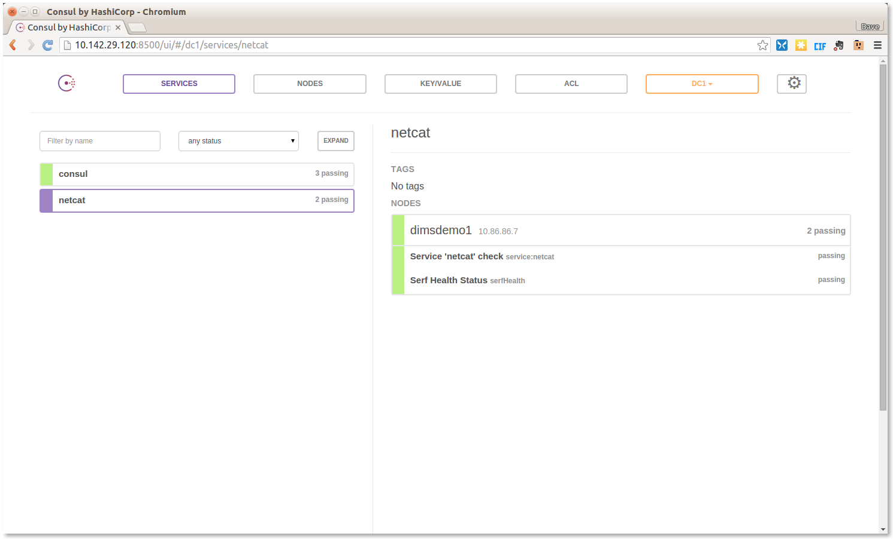
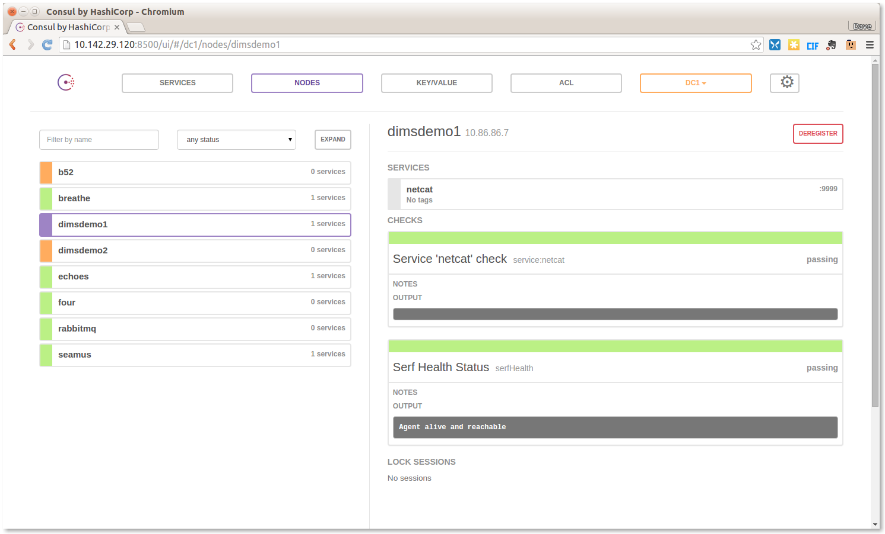

.. _servicediscovery:

Service Discovery Using Consul
------------------------------

Consul provides many services that are used by DIMS components, including
a key/value store and DNS service. DIMS takes advantage of the DNS
service by having ``dnsmasq`` on each host direct certain queries to
the Consul cluster for resolution, which can be used for service discovery (as
opposed to hard-coding IP addresses or specific host names and port numbers
in source code or configuration files.) The chapter :ref:`dimscli` discusses
some of the ways Consul is accessed by ``dimscli`` (e.g., see Section
:ref:`addingnewcolumns`)

A program named ``ianitor`` (GitHub `ClearcodeHQ/ianitor`_) facilitates using
this Consul DNS capability by wrapping services so they are registered in
Consul's DNS and monitored by Consul's health checking features.  This
would allow a monitoring application to notify someone when a DIMS service
component (such as something in the backend data store) becomes unavailable.

.. _ClearcodeHQ/ianitor: https://github.com/ClearcodeHQ/ianitor

.. note::

    The ``ianitor`` package from PyPi is installed in the DIMS Python Virtual
    Environment, so it should be available on all DIMS components that would
    need it.

..

This registration and service discovery process be illustrated using the
``netcat`` (``nc``) program to create a listening process that will demonstrate
how this works.

First, we start ``nc`` on a specific listening port

.. code-block:: guess

    [dimsenv] dittrich@dimsdemo1:~ () $ ianitor --port 9999 netcat -- nc -l 9999

..

There is no output at this point, since ``nc`` is now running in the
foreground (under the watch of ``ianitor``, also running in the foreground)
patiently listening on port ``9999`` for something to connect to it.  You can
prove to yourself that it is running by looking in the process tree:

.. code-block:: guess
   :name: processTree
   :emphasize-lines: 7

    init(1)-+-ModemManager(1000)-+-{ModemManager}(1032)
            |                    `-{ModemManager}(1036)
            | ...
            |-lightdm(1662)-+-Xorg(1673)
            |               |-lightdm(1738)-+-init(2060)-+-GoogleTalkPlugi(3880)-+-{GoogleTalkPlugi}(3881)
            |               |               |            | ...
            |               |               |            |-tmux(3066)-+-bash(4512)---ianitor(680)---nc(683)
            |               |               |            | ...
            | ...

..

Now that the service is running, we can validate that ``iainitor`` has
registered it in Consul. Figure :ref:`consulIanitorService` shows Consul's
view of **Services** showing ``service:netcat`` has been registered and
is alive and healthy.

.. _consulIanitorService:

   Consul Service Listing

..

Using ``dig``, the host on which this service was registered
can be obtained by a simple **A** record lookup for
``netcat.service.consul``, as seen here:

.. ``netcat.service.consul``, as seen in Figure :ref:`digARecord`.

.. code-block:: guess
   :name: digARecord

    [dimsenv] dittrich@dimsdemo1:~ () $ dig netcat.service.consul
    
    ; <<>> DiG 9.9.5-3ubuntu0.7-Ubuntu <<>> netcat.service.consul
    ;; global options: +cmd
    ;; Got answer:
    ;; ->>HEADER<<- opcode: QUERY, status: NOERROR, id: 16448
    ;; flags: qr aa rd ra; QUERY: 1, ANSWER: 1, AUTHORITY: 0, ADDITIONAL: 0
    
    ;; QUESTION SECTION:
    ;netcat.service.consul.         IN      A
    
    ;; ANSWER SECTION:
    netcat.service.consul.  0       IN      A       10.86.86.7
    
    ;; Query time: 26 msec
    ;; SERVER: 127.0.0.1#53(127.0.0.1)
    ;; WHEN: Sun Jan 24 12:19:58 PST 2016
    ;; MSG SIZE  rcvd: 76

..

Now switch to Consul's **Nodes** tab.  Figure :ref:`consulIanitorNode` shows
that node ``dimsdemo1`` is running the service ``netcat``, and this time the
service port is also shown to the right ("``:9999``"):

.. _consulIanitorNode:

   Consul service registration for netcat

..

The service's port number can also be obtained from Consul
via ``dnsmasq`` by asking for the DNS **SRV** record for
``netcat.service.consul``:

.. code-block:: guess
   :name: netcatDNS
   :emphasize-lines: 13

    [dimsenv] dittrich@dimsdemo1:~ () $ dig netcat.service.consul SRV

    ; <<>> DiG 9.9.5-3ubuntu0.7-Ubuntu <<>> netcat.service.consul SRV
    ;; global options: +cmd
    ;; Got answer:
    ;; ->>HEADER<<- opcode: QUERY, status: NOERROR, id: 8464
    ;; flags: qr aa rd ra; QUERY: 1, ANSWER: 1, AUTHORITY: 0, ADDITIONAL: 1

    ;; QUESTION SECTION:
    ;netcat.service.consul.         IN      SRV

    ;; ANSWER SECTION:
    netcat.service.consul.  0       IN      SRV     1 1 9999 dimsdemo1.node.dc1.consul.

    ;; ADDITIONAL SECTION:
    dimsdemo1.node.dc1.consul. 0    IN      A       10.86.86.7

    ;; Query time: 13 msec
    ;; SERVER: 127.0.0.1#53(127.0.0.1)
    ;; WHEN: Sun Jan 24 12:48:44 PST 2016
    ;; MSG SIZE  rcvd: 146

..

Now we can test connecting to the ``netcat`` listener (which will show anything
that gets sent to it after the TCP connection is established.)

.. attention::

    When attempting to duplicate this example, keep in mind that
    you must have already enabled ``iptables`` access to the port
    on which ``nc`` is listening, otherwise any connection
    attempt will be blocked and this won't work as shown here.
    **Always** keep ``iptables`` in mind when trying to expose
    network services and test them.

..

The first test will be using ``curl`` from the command line:

.. code-block:: guess
   :name: curlcommand

    [dimsenv] dittrich@dimsdemo1:~ () $ curl --data Hello http://dimsdemo1.node.dc1.consul:9999/areyouthere

..

Going back to the window where we ran ``ianitor``, the result is the following:

.. code-block:: guess
   :name: netcatCurl

    [dimsenv] dittrich@dimsdemo1:~ () $ ianitor --port 9999 netcat -- netcat -l 9999
    POST /areyouthere HTTP/1.1
    User-Agent: curl/7.35.0
    Host: dimsdemo1.node.dc1.consul:9999
    Accept: */*
    Content-Length: 5
    Content-Type: application/x-www-form-urlencoded
     
    Hello

..

.. note::

   Because ``netcat`` simply listens on a port and then prints out what
   it receives (never sending anything back), both windows will hang. Just
   **CTRL-C** to kill them.  This is just a proof-of-concept, not a real
   service.  If you kill the ``ianitor``/``nc`` command first, the
   ``curl`` response will make this very clear with this message:

   .. code-block:: guess

       curl: (52) Empty reply from server

   ..

..

If you connect directly using ``http://dimsdemo1.node.dc1.consul:9999`` from a
browser, you would get a slightly different result.

.. code-block:: guess
   :name: netcatMozilla

    [dimsenv] dittrich@dimsdemo1:~ () $ ianitor --port 9999 netcat -- netcat -l 9999
    GET / HTTP/1.1
    Host: dimsdemo1.node.dc1.consul:9999
    User-Agent: Mozilla/5.0 (X11; Ubuntu; Linux x86_64; rv:43.0) Gecko/20100101 Firefox/43.0
    Accept: text/html,application/xhtml+xml,application/xml;q=0.9,*/*;q=0.8
    Accept-Language: en-US,en;q=0.5
    Accept-Encoding: gzip, deflate
    Connection: keep-alive
    

..

In practice, ``ianitor`` would be used to wrap a service that is being
started by some process manager, such as ``supervisord``. See the
`Example supervisord config`_ on the ``ianitor`` GitHub page.

.. _Example supervisord config: https://github.com/ClearcodeHQ/ianitor#example-supervisord-config

