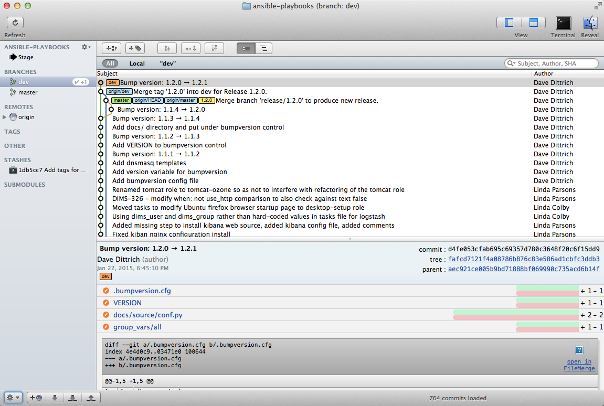

.. _sourcemanagement:

Source Code Management with Git
===============================

Daily development work on DIMS source code is done using a local server
accessed via SSH to ``git.prisem.washington.edu``.  The public release of DIMS
software will be from `github.com/uw-dims`_ with public
documentation  delivered on `ReadTheDocs`_. (DIMS documentation is covered in
Section :ref:`documentation`.)

.. note::

    At this point `github.com/uw-dims`_ primarily contains forked
    repositories of the software described in Section :ref:`installingtools`.

..

Team members need to have familiarity with a few general task sets,
which are covered in the sections below. These tasks include things like:

+ Cloning repositories and initializing them for use of the
  ``hub-flow`` Git addon scripts.

+ On a daily basis, updating repositories, creating feature
  or hotfix branches to work on projects, and finishing those branches after
  testing is complete to merge them back into the ``develop`` branch.

+ Creating new repositories, setting triggers for post-commit actions,
  and monitoring continuous integration results.

+ Keeping up to date with new repositories (or starting fresh with a new
  development system by cloning all DIMS repositories a new.)

.. attention::

    Every now and then, you may do something with Git and immediately
    think, "Oh, snap! I did *not* want to do *that*..." :(

    There are resource on Dave Dittrich's home page in the
    :ref:`dittrich:usinggit` section.  Two good resources for learning how things
    work with Git (and how to undo them) are:

    + `How to undo (almost) anything with Git`_, GitHub blog post by jaw6, June 8, 2015
    + `Undo Almost Anything with Git webinar`_, YouTube video by Peter Bell and Michael Smith, February 11, 2014

..

.. _How to undo (almost) anything with Git: https://github.com/blog/2019-how-to-undo-almost-anything-with-git
.. _Undo Almost Anything with Git webinar: https://youtu.be/oUzbaCRoeFA

.. _gitfoundation:

Foundational Git Resources
--------------------------

+ `Yan Pritzker's Git Workflows book`_
+ `The Thing About Git`_
+ `Commit Often, Perfect Later, Publish Once: Git Best Practices`_
+ `Git Tips`_
+ `git-flow`_ utilities to follow Vincent Dreisen branching workflow
+ `HubFlow`_ (GitFlow for GitHub)

.. _Yan Pritzker's Git Workflows book: http://documentup.com/skwp/git-workflows-book
.. _The Thing About Git: http://tomayko.com/writings/the-thing-about-git
.. _Commit Often, Perfect Later, Publish Once\: Git Best Practices: http://sethrobertson.github.io/GitBestPractices/
.. _Git Tips: http://mislav.uniqpath.com/2010/07/git-tips/
.. _git-flow: http://danielkummer.github.io/git-flow-cheatsheet/
.. _HubFlow: http://datasift.github.io/gitflow/

The need for policy and discipline
----------------------------------

Git is a great tool for source management, but can be a little tricky to use
when there is a team of programmers all using Git in slightly different ways.
Bad habits are easy to form, like the short-cut of working on the ``develop``
branch in a multi-branch workflow.

Figure :ref:`vincentdriessenbranching` comes from Vincent Driessen's "`A
successful Git branching model`_".  The DIMS project is following this model as
best we can to maintain consistency in how we create and use branches. The
general policy is to derive branch names from Jira tickets, in order to keep
information about why the branch exists, who is responsible for working on it,
and what is supposed to be done on the branch, in a system that can track
progress and prioritization of activities within sprints.

.. _A successful Git branching model: http://nvie.com/posts/a-successful-git-branching-model/

.. _vincentdriessenbranching:

.. figure:: images/git-model@2x.png
   :alt: Vincent Driessen Git branching model
   :width: 80%
   :align: center

   Vincent Driessen Git branching model

..

Because public release of source code will be through GitHub,
the ``hubflow`` tool was chosen for use within the project.
Take a moment to read through the following Gist (original source:
`bevanhunt/hubflow_workflow`_), just to get an overview of ``hubflow``
concepts. This Gist provides an overview of ``hubflow`` branch concepts and
some other things about Git that are good to keep in mind, but this is *not*
the totality of information in this guide about using ``hubflow`` (keep reading
further down for more DIMS-specific examples of using ``hubflow`` commands).

.. code-block:: none

    Git Hubflow Workflow:

    Sync Branch:
    git hf update - this will update master and develop and sync remote branches withlocal ones (be sure not to put commits into develop or master as it will push these up)
    git hf push - this will push your commits in your local branch to the matching remote branch
    git hf pull - this will pull the remote commits into your local branch (don't use if the remote branch has been rebased - use git pull origin "your-branch" instead)

    Feature Branch:
    gif hf feature start "my-feature" - this will create a feature branch on origin and local will be based off the latest develop branch (make sure to git hf update before or you will get an error if local develop and remote develop have divereged)
    git hf feature finish "my-feature" - this will delete the local and remote branches (only do this after a PR has been merged)
    git hf feature cancel -f "my-feature" - this will delete the local and remote branches (only do this if the feature branch was created in error)
    git hf feature checkout "my-feature" - this will checkout the feature branch

    Hotfix Branch:
    git hf hotfix start "release-version" - this will create a hotfix branch on origin and local will be based off the latest develop branch (make sure to git hf update before or you get an error if local develop and remote devleop have divereged)
    git hf hotfix finish "release-version" - this will delete the local and remote branches and merge the commits of the hotfix branch into master and develop branches - it will also create a release tag that matches the release version on master
    git hf hotfix cancel -f "release-version" - this will delete the remote and local branch (only do this if the hotfix was created in error)
    git checkout hotfix/"release-version" - this will checkout the hotfix branch (make sure to git hf update first)

    Release Branch:
    git hf release start "release-version" - this will create a release branch on origin and local will be based off the latest develop branch (make sure to git hf update before or you get an error if local develop and remote devleop have divereged)
    git hf release finish "release-version" - this will delete the local and remote branches and merge the commits of the release branch both into develop and master - it will also create a release tag that matches the release version on master
    git hf release cancel -f "release-version" - this will delete the local and remote branch (only do this if the release was created in error)
    git checkout release/"release-version" - this will checkout the release branch (make sure to git hf update first)

    Preparing a PR:
    - put the Aha! Ticket # in PR title with a description
    - assign to the proper reviewer
    - don't squash the commits until after reviewed
    - after review - squash the commits

    Squashing Commits:
    - checkout the branch you want to squash
    - git merge-base "my-branch" develop (returns merge-base-hash)
    - git rebase -i "merge-base-hash"
    - change all commit types to "squash" from "pick" in the text file (except first) & save file
    - if you get a no-op message in the text file and still have multiple commits then use the command git rebase -i (without the hash)
    - fix any merge conflicts
    - you should have one commit
    - force update your remote branch: git push origin "my-branch" -f

    Resolving merge conflicts with the develop branch that are not squashing related (generally on PRs - auto-merge will show as disabled):
    - git hf update
    - git rebase develop (while in your branch)
    - resolve any merge conflicts

    Rules to remember:
    - don't ever git merge branches together manually (should never run command - git merge)
    - squash only after review and before merging PR into develop

..

..

.. _bevanhunt/hubflow_workflow: https://gist.github.com/bevanhunt/903740bf7306d806f943

.. note::

    There is a large body of references on Git that are constantly being
    updated in the `Software Development>Git`_ section of Dave Dittrich's web
    page.

..

.. _Software Development>Git: https://staff.washington.edu/dittrich/home/swdev.html#git

.. caution::

    Mac OS X (by default) uses an HFS file system *with case sensitivity*.
    Unlike Ubuntu and other Linux/Unix distributions using case-sensitive
    file systems like ``ext2``, ``reiserfs``, etc., the default OS X file
    system does not care if you name a file ``THISFILE`` or ``ThisFile``
    or ``thisfile``. All of those are the same file name. This can cause
    problems when you use Git to share a source repository between computers
    running OS X, Windows, and/or Linux.  See `Git on Mac OS X: Don't ignore case!`_
    and `How do I commit case-sensitive only filename changes in Git?`_. A solution
    for Mac OS X, posted in `Case sensitivity in Git`_, is documented in
    Section :ref:`macosxcasesensitive`.

..

.. _Git on Mac OS X\: Don't ignore case!: http://tapestryjava.blogspot.com/2010/07/git-on-mac-os-x-dont-ignore-case.html
.. _How do I commit case-sensitive only filename changes in Git?: http://stackoverflow.com/questions/17683458/how-do-i-commit-case-sensitive-only-filename-changes-in-git
.. _Case sensitivity in Git: http://stackoverflow.com/questions/8904327/case-sensitivity-in-git

.. _gitconfiguration:

Global Git Configuration
------------------------

As we learn about best practices, the following set of global configuration
settings will be updated. Refer back to this page, or look in the ``dims-git``
repo, for the latest configuration examples.

The following are user-specific settings that you should alter for your own account and preferences of editor/merge method:

.. code-block:: none

    $ git config --global user.name "Dave Dittrich"
    $ git config --global user.email "dittrich@u.washington.edu"
    $ git config --global merge.tool vimdiff
    $ git config --global core.editor vim

..

.. todo::

    .. caution::

        There is a side-effect of the way we set up common Git configuration
        for users with Ansible.  Whenever the ``dims-users-create`` role is
        played, a fresh copy of the user's global Git configuration file
        (``~/.gitconfig``) is over-written.  That file contains the four
        settings listed above, which means they will be wiped out whenever that
        role is run and you will need to reset them. (See the file
        ``$GIT/ansible-playbooks/dims-users-create/templates/gitconfig.j2``).
        That is a bug in that it is not `idempotent`_.

        One quick hack that restores these values is to add those commands to
        your ``$HOME/.bash_aliases`` file, which is run every time a new
        interactive Bash shell is started.

        A better long-term solution, which we are working towards, is to
        have the ``user.name`` and ``user.email`` configuration settings come
        from the ops-trust portal user attributes table, so they can be
        set by the user and stored in one central location, which can then be
        retreived from the ops-trust user database and applied consistently
        by Ansible when it sets up user accounts.

    ..

..

.. _idempotent: http://docs.ansible.com/ansible/glossary.html#idempotency

The following are general and can be applied to anyone's configuration
(included here without a prompt so you can cut/paste to a command
line):

.. code-block:: bash

    git config --global push.default tracking
    git config --global core.excludesfile ~/.gitignore_global
    git config --global core.autocrlf false
    git config --global color.diff auto
    git config --global color.status auto
    git config --global color.branch auto
    git config --global color.interactive auto
    git config --global color.ui auto
    git config --global branch.autosetuprebase always

..

The following are convenience aliases that help with certain tasks:

.. code-block:: bash

    git config --global alias.find 'log --color -p -S'
    git config --global alias.stat 'status -s'
    git config --global alias.unstage "reset HEAD --"
    git config --global alias.uncommit "reset --soft HEAD^"
    git config --global alias.gr 'log --full-history --decorate=short --all --color --graph'
    git config --global alias.lg 'log --oneline --decorate=short --abbrev-commit --all --color --graph'
    git config --global alias.log1 'log --oneline --decorate=short'

..

.. todo::

    Work out which other convenience alises would be useful for
    DIMS development from these links:

    + `One weird trick for powerful Git aliases`_, by Nicola Paolucci, October 3, 2014
    + GitHubGist `mwhite/git-aliases.md`_ (The Ultimate Git Alias Setup)
    + `Must Have Git Aliases: Advanced Examples`_, by @durdn

    See Jira ticket `DIMS-470`_. (Remove this when completed.)

..

.. _DIMS-470: http://jira.prisem.washington.edu/browse/DIMS-470

.. _One weird trick for powerful Git aliases: http://blogs.atlassian.com/2014/10/advanced-git-aliases/
.. _mwhite/git-aliases.md: https://gist.github.com/mwhite/6887990
.. _Must Have Git Aliases\: Advanced Examples: http://durdn.com/blog/2012/11/22/must-have-git-aliases-advanced-examples/

.. _dailygittasks:

Daily tasks with Git
--------------------

This section covers regular tasks that are performed to
work with source code using Git. This section assumes you are
using the ``hub flow`` tool described in Section :ref:`installingtools`.

.. warning::

   These tools are being installed in the ``dimsenv`` Python virtual
   environment to make it easier for everyone on the team to access them and to
   stay up to date with instructions in this document. If you have `any`
   problems, file a `Jira
   <http://jira.prisem.washington.edu/secure/Dashboard.jspa>`_ ticket or talk
   to Dave immediately upon encountering a problem. Do not let yourself get
   blocked on something and block everyone else as a result!

..

.. _updatinglocalrepos:

Updating local repos
~~~~~~~~~~~~~~~~~~~~

The most common task you need to do is keep your local Git repos up to date
with the code that others have pushed to remote repositories for sharing.
With several dozen individual Git repos, keeping your system up to date
with all of these frequently changing repos using ``git`` commands alone
is difficult.

To make things easier, helper programs like the ``hubflow`` scripts
and ``mr`` can be used, but even those programs have their limits.

The preferred method of updating the larger set of DIMS Git repos
is to use ``dims.git.syncrepos``, which in turn calls ``hubflow`` via
``mr`` as part of its processing. This convenience script (described in
Section :ref:`dimsgitsyncrepos`) works on many repos at once, saving time and
effort.

You should still learn how ``hubflow`` and ``mr`` work, since you will
need to use them to update individual Git repos when you are working within
those repos, so we will start with those tools.

.. _updatingwithhubflow:

Updating using ``hubflow``
""""""""""""""""""""""""""

The following command ensures that a local repo you
are working on is up to date:

.. note::

   The list of actions that are performed is provided at the end of the command
   output. This will remind you of what all is happening under the hood of Hub
   Flow and is well worth taking a few seconds of your attention.

..

.. code-block:: none

    (dimsenv)[dittrich@localhost ansible-playbooks (develop)]$ git hf update
    Fetching origin
    remote: Counting objects: 187, done.
    remote: Compressing objects: 100% (143/143), done.
    remote: Total 165 (delta 56), reused 1 (delta 0)
    Receiving objects: 100% (165/165), 31.78 KiB | 0 bytes/s, done.
    Resolving deltas: 100% (56/56), completed with 13 local objects.
    From git.prisem.washington.edu:/opt/git/ansible-playbooks
       001ba47..0e12ec3  develop    -> origin/develop
     * [new branch]      feature/dims-334 -> origin/feature/dims-334
    Updating 001ba47..0e12ec3
    Fast-forward
     docs/source/conf.py                       | 2 +-
     roles/dims-ci-utils-deploy/tasks/main.yml | 5 +++++
     2 files changed, 6 insertions(+), 1 deletion(-)

    Summary of actions:
    - Any changes to branches at origin have been downloaded to your local repository
    - Any branches that have been deleted at origin have also been deleted from your local repository
    - Any changes from origin/master have been merged into branch 'master'
    - Any changes from origin/develop have been merged into branch 'develop'
    - Any resolved merge conflicts have been pushed back to origin
    - You are now on branch 'develop'

..

If a branch existed on the remote repo (e.g., the ``feature/eliot`` branch used
in testing), it would be deleted:

.. code-block:: none
   :emphasize-lines: 1,5,7,19

   [dittrich@localhost dims-asbuilt (develop)]$ git branch -a
   * develop
     master
     remotes/origin/develop
     remotes/origin/feature/eliot
     remotes/origin/master
   [dittrich@localhost dims-asbuilt (develop)]$ git hf update
   Fetching origin
   From git.prisem.washington.edu:/opt/git/dims-asbuilt
    x [deleted]         (none)     -> origin/feature/eliot

   Summary of actions:
   - Any changes to branches at origin have been downloaded to your local repository
   - Any branches that have been deleted at origin have also been deleted from your local repository
   - Any changes from origin/master have been merged into branch 'master'
   - Any changes from origin/develop have been merged into branch 'develop'
   - Any resolved merge conflicts have been pushed back to origin
   - You are now on branch 'develop'
   [dittrich@localhost dims-asbuilt (develop)]$ git branch -a
   * develop
     master
     remotes/origin/develop
     remotes/origin/master

..

While using ``git hf update && git hf pull`` seems like it is simple enough,
the DIMS project has several dozen repos, many of which are inter-related.
Keeping them all up to date is not simple, and because of this developers
often get far out of sync with the rest of the team.

.. _updatingwithmr:

Updating using the ``mr`` command
"""""""""""""""""""""""""""""""""

A useful tool for managing multiple Git repositories and keeping them in sync
with the master branches is to use the program `mr`_.

.. _mr: http://joeyh.name/code/mr/

``mr`` uses a configuration file that can be added to using ``mr register``
within a repo, or by editing/writing the ``.mrconfig`` file directly.

.. attention::

    These instructions assume the reader is *not already using* ``mr``
    on a regular basis. Additionally, all DIMS Git repos are assumed
    to be segrated into their own directory tree apart from any other
    Git repos that the developer may be using.

    This assumption allows for use of a ``.mrconfig`` file specifically for
    just DIMS source code that can be over-written entirely with DIMS-specific
    settings.

    .. todo::

       A script will be written to allow users to more easily do these
       steps. See Jira ticket `DIMS-350`.

    ..

..

.. _DIMS-350: http://jira.prisem.washington.edu/browse/DIMS-350

Cloning all of the DIMS source repos at once, or getting the contents of
what should be an up-to-date ``.mrconfig`` file, is covered in the Section
:ref:`cloningmultiplerepos`.

After all repos have been cloned, they can be kept up to date on a daily
basis. Start your work session with the following commands:

.. code-block:: none

    $ cd $GIT
    $ mr update

..

.. caution::

    If you do not update a repo before attempting to ``git hf push`` or
    ``git hf update`` with commited changes, Git will do a ``pull``
    and potentially you will end up with at best a ``merge``, and at
    worst a merge conflict that you must resolve before the ``push`` can
    complete. If you are not comfortable handling a merge conflict, talk
    to another team member to get help.

..

.. _dimsgitsyncrepos:

Updating with ``dims.git.syncrepos``
""""""""""""""""""""""""""""""""""""

A script that combines several of the above steps into one single command
is ``dims.git.synrepos``.

.. code-block:: none

    [dimsenv] dittrich@dimsdemo1:~ () $ dims.git.syncrepos --version
    dims.git.syncrepos version 1.6.97

..

In the example here, highlighted lines show
where repos are *dirty* (Repo[9], Repo[13], and Repo[33]), meaning they have
tracked files that are not committed yet and cannot be updated, *clean* and
requiring updates from the remote repo (Repo[12]), and new repositories from
the remote server (Repo[28] and Repo[30]) that are being cloned and initialized
for use with `hub-flow` tools. At the end, ``dims.git.syncrepos`` reports
how many repos were updated out of the available repos on the remote
server, how many new repos it added, and/or how many repos could not be
updated because they are dirty. Lastly, it reports how long it took (so
you can be aware of how long you have to go get coffee after
starting a sync.)

.. code-block:: none
   :linenos:
   :emphasize-lines: 1,11-15,19-32,33-34,50-73,75-98,101-103,118,125-127

    [dimsenv] dittrich@dimsdemo1:~ () $ dims.git.syncrepos
    [+++] Found 46 available repos at git@git.prisem.washington.edu
    [+++] Repo[1] "/home/dittrich/dims/git/ansible-inventory" clean:
    [+++] Repo[2] "/home/dittrich/dims/git/ansible-playbooks" clean:
    [+++] Repo[3] "/home/dittrich/dims/git/cif-client" clean:
    [+++] Repo[4] "/home/dittrich/dims/git/cif-java" clean:
    [+++] Repo[5] "/home/dittrich/dims/git/configs" clean:
    [+++] Repo[6] "/home/dittrich/dims/git/dims" clean:
    [+++] Repo[7] "/home/dittrich/dims/git/dims-ad" clean:
    [+++] Repo[8] "/home/dittrich/dims/git/dims-asbuilt" clean:
    [---] Repo[9] "/home/dittrich/dims/git/dims-ci-utils" is dirty:
    ?? dims/diffs.1
    ?? dims/manifest.dat
    ?? ubuntu-14.04.2/ubuntu-14.04.3-install.dd.bz2
    4bb5516 (feature/dims-406) Merge branch 'develop' into feature/dims-406

    [+++] Repo[10] "/home/dittrich/dims/git/dims-dashboard" clean:
    [+++] Repo[11] "/home/dittrich/dims/git/dims-db-recovery" clean:
    [+++] Repo[12] "/home/dittrich/dims/git/dims-devguide" clean:
    remote: Counting objects: 29, done.
    remote: Compressing objects: 100% (22/22), done.
    remote: Total 22 (delta 13), reused 0 (delta 0)
    Unpacking objects: 100% (22/22), done.
    From git.prisem.washington.edu:/opt/git/dims-devguide
       daffa68..4b2462b  develop    -> origin/develop
    Updating daffa68..4b2462b
    Fast-forward
     .bumpversion.cfg                |  2 +-
     docs/source/conf.py             |  4 ++--
     docs/source/deployconfigure.rst |  2 +-
     docs/source/referenceddocs.rst  | 13 +++++++++++++
     4 files changed, 17 insertions(+), 4 deletions(-)
    [---] Repo[13] "/home/dittrich/dims/git/dims-dockerfiles" is dirty:
    8a47fca (HEAD -> develop) Bump version: 1.1.11 → 1.1.12

    [+++] Repo[14] "/home/dittrich/dims/git/dims-dsdd" clean:
    [+++] Repo[15] "/home/dittrich/dims/git/dims-jds" clean:
    [+++] Repo[16] "/home/dittrich/dims/git/dims-keys" clean:
    [+++] Repo[17] "/home/dittrich/dims/git/dims-ocd" clean:
    [+++] Repo[18] "/home/dittrich/dims/git/dims-packer" clean:
    [+++] Repo[19] "/home/dittrich/dims/git/dims-sample-data" clean:
    [+++] Repo[20] "/home/dittrich/dims/git/dims-sr" clean:
    [+++] Repo[21] "/home/dittrich/dims/git/dims-supervisor" clean:
    [+++] Repo[22] "/home/dittrich/dims/git/dims-svd" clean:
    [+++] Repo[23] "/home/dittrich/dims/git/dimssysconfig" clean:
    [+++] Repo[24] "/home/dittrich/dims/git/dims-tp" clean:
    [+++] Repo[25] "/home/dittrich/dims/git/dims-tr" clean:
    [+++] Repo[26] "/home/dittrich/dims/git/dims-vagrant" clean:
    [+++] Repo[27] "/home/dittrich/dims/git/ELK" clean:
    [+++] Adding Repo[28] fuse4j to /home/dittrich/dims/.mrconfig and checking it out.
    mr checkout: /home/dittrich/dims/git/fuse4j
    Cloning into 'fuse4j'...
    remote: Counting objects: 523, done.
    remote: Compressing objects: 100% (240/240), done.
    remote: Total 523 (delta 186), reused 523 (delta 186)
    Receiving objects: 100% (523/523), 180.86 KiB | 0 bytes/s, done.
    Resolving deltas: 100% (186/186), done.
    Checking connectivity... done.
    Using default branch names.

    Which branch should be used for tracking production releases?
       - master
    Branch name for production releases: [master]
    Branch name for "next release" development: [develop]

    How to name your supporting branch prefixes?
    Feature branches? [feature/]
    Release branches? [release/]
    Hotfix branches? [hotfix/]
    Support branches? [support/]
    Version tag prefix? []

    mr checkout: finished (1 ok; 43 skipped)
    [+++] Repo[29] "/home/dittrich/dims/git/ipgrep" clean:
    [+++] Adding Repo[30] java-native-loader to /home/dittrich/dims/.mrconfig and checking it out.
    mr checkout: /home/dittrich/dims/git/java-native-loader
    Cloning into 'java-native-loader'...
    remote: Counting objects: 329, done.
    remote: Compressing objects: 100% (143/143), done.
    remote: Total 329 (delta 62), reused 329 (delta 62)
    Receiving objects: 100% (329/329), 178.36 KiB | 0 bytes/s, done.
    Resolving deltas: 100% (62/62), done.
    Checking connectivity... done.
    Using default branch names.

    Which branch should be used for tracking production releases?
       - master
    Branch name for production releases: [master]
    Branch name for "next release" development: [develop]

    How to name your supporting branch prefixes?
    Feature branches? [feature/]
    Release branches? [release/]
    Hotfix branches? [hotfix/]
    Support branches? [support/]
    Version tag prefix? []

    mr checkout: finished (1 ok; 44 skipped)
    [+++] Repo[31] "/home/dittrich/dims/git/java-stix-v1.1.1" clean:
    [+++] Repo[32] "/home/dittrich/dims/git/mal4s" clean:
    [---] Repo[33] "/home/dittrich/dims/git/MozDef" is dirty:
     M docker/Dockerfile
     M docker/Makefile

    [+++] Repo[34] "/home/dittrich/dims/git/ops-trust-openid" clean:
    [+++] Repo[35] "/home/dittrich/dims/git/ops-trust-portal" clean:
    [+++] Repo[36] "/home/dittrich/dims/git/poster-deck-2014-noflow" clean:
    [+++] Repo[37] "/home/dittrich/dims/git/prisem" clean:
    [+++] Repo[38] "/home/dittrich/dims/git/prisem-replacement" clean:
    [+++] Repo[39] "/home/dittrich/dims/git/pygraph" clean:
    [+++] Repo[40] "/home/dittrich/dims/git/rwfind" clean:
    [---] Repo[41] "/home/dittrich/dims/git/sphinx-autobuild" is clean:
    [+++] Repo[42] "/home/dittrich/dims/git/stix-java" clean:
    [+++] Repo[43] "/home/dittrich/dims/git/ticketing-redis" clean:
    [+++] Repo[44] "/home/dittrich/dims/git/tsk4j" clean:
    [+++] Repo[45] "/home/dittrich/dims/git/tupelo" clean:
    [+++] Repo[46] "/home/dittrich/dims/git/umich-botnets" clean:
    [+++] Updated 40 of 46 available repos.
    [+++] Summary of actions for repos that were updated:
    - Any changes to branches at origin have been downloaded to your local repository
    - Any branches that have been deleted at origin have also been deleted from your local repository
    - Any changes from origin/master have been merged into branch 'master'
    - Any changes from origin/develop have been merged into branch 'develop'
    - Any resolved merge conflicts have been pushed back to origin
    [+++] Added 3 new repos: fuse4j java-native-loader tsk4j
    [+++] Could not update 3 repos: dims-ci-utils dims-dockerfiles MozDef
    [+++] Updating repos took 00:04:12

..

.. _versionnumbers:

Managing Version Numbers
~~~~~~~~~~~~~~~~~~~~~~~~

The DIMS project uses the Python program `bumpversion`_ to
update version numbers in Git repositories, following
`PEP 440 -- Version Identification and Dependency Specification`_.
You can learn how `bumpversion`_ works from these resources:

   + `bumpversion screencast`_ showing bumpversion in action
   + `A Python Versioning Workflow With Bumpversion`_

.. note::

    You can find examples of using `bumpversion`_ (including its configuration file
    ``.bumpversion.cfg`` and how it is used to manage version numbers in files) in
    this document in Sections :ref:`creatingdocumentonlyrepo` and
    :ref:`cherrypickingcommits`.
..

The program ``bumpversion`` is included in the Python virtual environment
``dimsenv`` that is created for use in DIMS development.

.. todo::

    Add a cross reference to description of the ``dimsenv``
    Python Virtual Environment.

..

.. code-block:: none

    [dimsenv] dittrich@27b:~/git/homepage (develop*) $ which bumpversion
    /Users/dittrich/dims/envs/dimsenv/bin/bumpversion

..

.. caution::

    Because you must be in the same directory as the ``.bumpversion.cfg`` file
    when you invoke ``bumpversion``, it is sometimes problematic when using it
    to work in a sub-directory one or more levels below the configuration file.
    You may see example command lines like ``(cd ..; bumpversion patch)`` that
    use sub-shells to temporarily change to the right directory, do the
    ``bumpversion patch``, then exit leaving you in the same directory where you
    are editing files.  That is a little more work than is desirable, but
    doing a bunch of ``cd ..``, ``bumpersion patch``, ``cd backagain``
    is even more work.

..

To make it easier to increment version numbers, a helper
script ``dims.bumpversion`` is available as well:

.. code-block:: none

    [dimsenv] dittrich@27b:~/git/homepage (develop*) $ which dims.bumpversion
    /Users/dittrich/dims/envs/dimsenv/bin/dims.bumpversion
    [dimsenv] dittrich@27b:~/git/homepage (develop*) $ dims.bumpversion --help
    Usage:
    /Users/dittrich/dims/envs/dimsenv/bin/dims.bumpversion [options] [args]

    Use "/Users/dittrich/dims/envs/dimsenv/bin/dims.bumpversion --help" to see options.
    Use "/Users/dittrich/dims/envs/dimsenv/bin/dims.bumpversion --usage" to see help on "bumpversion" itself.

    /Users/dittrich/dims/envs/dimsenv/bin/dims.bumpversion -- [bumpversion_options] [bumpversion_args]

    Follow this second usage example and put -- before any bumpversion
    options and arguments to pass them on bumpversion (rather than
    process them as though they were /Users/dittrich/dims/envs/dimsenv/bin/dims.bumpversion arguments.) After
    all, /Users/dittrich/dims/envs/dimsenv/bin/dims.bumpversion is just a shell wrapping bumpversion.

    Options:
      -h, --help     show this help message and exit
      -d, --debug    Enable debugging
      -u, --usage    Print usage information.
      -v, --verbose  Be verbose (on stdout) about what is happening.

..

The default when you just invoke ``dims.bumpversion`` is to do ``bumpversion patch``,
the most frequent version increment. To use a different increment, just add it as
an argument on the command line (e.g., ``dims.bumpvesion minor``).

Here is an example of how this section edit was done, showing
the version number increment in the workflow:

.. code-block:: none
   :emphasize-lines: 7

    [dimsenv] dittrich@localhost:~/dims/git/dims-devguide/docs (develop*) $ git add source/sourcemanagement.rst
    [dimsenv] dittrich@localhost:~/dims/git/dims-devguide/docs (develop*) $ git stat
    M  docs/source/sourcemanagement.rst
    [dimsenv] dittrich@localhost:~/dims/git/dims-devguide/docs (develop*) $ git commit -m "Add subsection on version numbers and bumpversion/dims.bumpversion"
    [develop b433bae] Add subsection on version numbers and bumpversion/dims.bumpversion
     1 file changed, 92 insertions(+)
    [dimsenv] dittrich@localhost:~/dims/git/dims-devguide/docs (develop*) $ dims.bumpversion
    [dimsenv] dittrich@localhost:~/dims/git/dims-devguide/docs (develop*) $ git hf push
    Fetching origin
    Already up-to-date.
    Counting objects: 11, done.
    Delta compression using up to 8 threads.
    Compressing objects: 100% (11/11), done.
    Writing objects: 100% (11/11), 2.53 KiB | 0 bytes/s, done.
    Total 11 (delta 7), reused 0 (delta 0)
    remote: Running post-receive hook: Thu Oct 22 22:31:50 PDT 2015
    remote: [+++] post-receive-06jenkinsalldocs started
    remote: [+++] REPONAME=dims-devguide
    remote: [+++] BRANCH=develop
    remote: [+++] newrev=00727d53dbc8130cdbdbe35be80f1f4c2d2ee7fa
    remote: [+++] oldrev=e8e7d4db40dd852a044525fdfbada1fe80d81739
    remote: [+++] Branch was updated.
    remote: [+++] This repo has a documentation directory.
    remote:   % Total    % Received % Xferd  Average Speed   Time    Time     Time  Current
    remote:                                  Dload  Upload   Total   Spent    Left  Speed
    remote: 100    79    0     0  100    79      0   2613 --:--:-- --:--:-- --:--:--  3761
    remote:   % Total    % Received % Xferd  Average Speed   Time    Time     Time  Current
    remote:                                  Dload  Upload   Total   Spent    Left  Speed
    remote: 100    78    0     0  100    78      0   2524 --:--:-- --:--:-- --:--:--  3250
    remote: [+++] post-receive-06jenkinsalldocs finished
    To git@git.prisem.washington.edu:/opt/git/dims-devguide.git
       e8e7d4d..00727d5  develop -> develop

    Summary of actions:
    - The remote branch 'origin/develop' was updated with your changes

..

.. _bumpversion: https://github.com/peritus/bumpversion
.. _bumpversion screencast: https://asciinema.org/a/3828
.. _A Python Versioning Workflow With Bumpversion: http://kylepurdon.com/blog/2015/01/25/a-python-versioning-workflow-with-bumpversion/
.. _PEP 440 -- Version Identification and Dependency Specification: http://legacy.python.org/dev/peps/pep-0440/

.. _initializingforhubflow:

Initializing a repo for ``hub-flow``
~~~~~~~~~~~~~~~~~~~~~~~~~~~~~~~~~~~~

Every time you clone a new DIMS repo, it must be initialized with ``hub-flow``
so that ``hub-flow`` commands work properly.  Initialize your repo this way:

.. code-block:: none
   :emphasize-lines: 1,9,10

    (dimsenv)[dittrich@localhost git]$ git clone git@git.prisem.washington.edu:/opt/git/dims-ad.git
    Cloning into 'dims-ad'...
    remote: Counting objects: 236, done.
    remote: Compressing objects: 100% (155/155), done.
    remote: Total 236 (delta 117), reused 159 (delta 76)
    Receiving objects: 100% (236/236), 26.20 MiB | 5.89 MiB/s, done.
    Resolving deltas: 100% (117/117), done.
    Checking connectivity... done.
    (dimsenv)[dittrich@localhost git]$ cd dims-ad
    (dimsenv)[dittrich@localhost dims-ad (master)]$ git hf init
    Using default branch names.

    Which branch should be used for tracking production releases?
       - master
    Branch name for production releases: [master]
    Branch name for "next release" development: [develop]

    How to name your supporting branch prefixes?
    Feature branches? [feature/]
    Release branches? [release/]
    Hotfix branches? [hotfix/]
    Support branches? [support/]
    Version tag prefix? []

..

After initializing ``hub-flow``, there will be two new sections
in your ``.git/config`` file starting with ``hubflow``:

.. code-block:: none
   :emphasize-lines: 16-18, 23-28

   (dimsenv)[dittrich@localhost dims-ad (develop)]$ cat .git/config
   [core]
   	repositoryformatversion = 0
   	filemode = true
   	bare = false
   	logallrefupdates = true
   	ignorecase = true
   	precomposeunicode = true
   [remote "origin"]
   	url = git@git.prisem.washington.edu:/opt/git/dims-ad.git
   	fetch = +refs/heads/*:refs/remotes/origin/*
   [branch "master"]
   	remote = origin
   	merge = refs/heads/master
   	rebase = true
   [hubflow "branch"]
   	master = master
   	develop = develop
   [branch "develop"]
   	remote = origin
   	merge = refs/heads/develop
   	rebase = true
   [hubflow "prefix"]
   	feature = feature/
   	release = release/
   	hotfix = hotfix/
   	support = support/
   	versiontag =

..

.. note::

    A possible test for inclusion in the ``dims-ci-utils`` test suite would be
    to check for the existance of the ``hubflow "branch"`` and ``hubflow
    "prefix"`` sections.

    These are automatically created when repos are checked out using the
    ``dims.git.syncrepos`` script and/or methods involving ``mr`` described
    in the following sections.

..

.. _infrequentgittasks:

Infrequent tasks with Git
-------------------------

.. _cloningmultiplerepos:

Cloning multiple repos from ``git.prisem.washington.edu``
~~~~~~~~~~~~~~~~~~~~~~~~~~~~~~~~~~~~~~~~~~~~~~~~~~~~~~~~~

There are several dozen repositories on ``git.prisem.washington.edu``
that contain DIMS-generated code, configuration files, and/or documentation,
but also local copies of Git repositories from other sources (some with
DIMS-related customizations).

To get a list of all repositories on ``git.prisem.washington.edu``,
use the Git shell command ``list``:

.. code-block:: none
   :emphasize-lines: 1

    [dittrich@localhost ~]$ ssh git@git.prisem.washington.edu list
    prisem-replacement.git
    ELK.git
    cif-java.git
    cif-client.git
    dims-ad.git
    supervisor.git
    dims-tr.git
    lemonldap-ng.git
    pygraph.git
    parsons-docker.git
    configs.git
    poster-deck-2014-noflow.git
    dims-keys.git
    dims.git
    dims-tp.git
    ops-trust-portal.git
    dimssysconfig.git
    dims-dockerfiles.git
    stix-java.git
    ansible-playbooks.git
    dims-dashboard.git
    mal4s.git
    dims-ocd.git
    sphinx-autobuild.git
    dims-devguide.git
    dims-asbuilt.git
    ticketing-redis.git
    dims-sr.git
    prisem.git
    umich-botnets.git
    dims-dsdd.git
    dims-sample-data.git
    packer.git
    java-stix-v1.1.1.git
    vagrant.git
    dims-jds.git
    ansible-inventory.git
    ops-trust-openid.git
    dims-coreos-vagrant.git
    configstest.git
    poster-deck-2014.git
    rwfind.git
    dims-ci-utils.git
    ipgrep.git
    tupelo.git
    dims-opst-portal.git
    lemonldap-dims.git
    MozDef.git
    tsk4j.git
    dims-svd.git

..

To clone all of these repositories in a single step, there is
another Git shell command ``mrconfig`` that returns the contents
of a ``.mrconfig`` file (see ``man mr`` for more information).

.. caution::

   To use a ``.mrconfig`` file in a an arbitrary directory, you
   will need to add the directory path to this file to the ``~/.mrtrust``
   file. In this example, we will clone repos into ``~/dims/git`` by
   placing the ``.mrconfig`` file in the ``~/dims`` directory.

   .. code-block:: none

       [dittrich@localhost dims]$ cat ~/.mrtrust
       /Users/dittrich/dims/.mrconfig
       /Users/dittrich/git/.mrconfig

   ..

..

If you are building a documentation set (i.e., a limited set of documentation-only
repositories that are cross-linked using the ``intersphinx`` extension to Sphinx
as described in Section :ref:`intersphinxlinking`.

.. code-block:: none
   :emphasize-lines: 1,2,29,30,98

    [dittrich@localhost ~]$ cd ~/dims
    [dittrich@localhost dims]$ ssh git@git.prisem.washington.edu mrconfig dims-ad dims-sr dims-ocd
    [git/dims-ad]
    checkout = git clone 'git@git.prisem.washington.edu:/opt/git/dims-ad.git' 'dims-ad' &&
    	(cd dims-ad; git hf init)
    show = git remote show origin
    update = git hf update
    pull = git hf update &&
    	git hf pull
    stat = git status -s

    [git/dims-sr]
    checkout = git clone 'git@git.prisem.washington.edu:/opt/git/dims-sr.git' 'dims-sr' &&
    	(cd dims-sr; git hf init)
    show = git remote show origin
    update = git hf update
    pull = git hf update &&
    	git hf pull
    stat = git status -s

    [git/dims-ocd]
    checkout = git clone 'git@git.prisem.washington.edu:/opt/git/dims-ocd.git' 'dims-ocd' &&
    	(cd dims-ocd; git hf init)
    show = git remote show origin
    update = git hf update
    pull = git hf update &&
    	git hf pull
    stat = git status -s
    [dittrich@localhost dims]$ ssh git@git.prisem.washington.edu mrconfig dims-ad dims-sr dims-ocd > .mrconfig
    [dittrich@localhost dims]$ mr checkout
    mr checkout: /Users/dittrich/dims/git/dims-ad
    Cloning into 'dims-ad'...
    remote: Counting objects: 518, done.
    remote: Compressing objects: 100% (437/437), done.
    remote: Total 518 (delta 308), reused 155 (delta 76)
    Receiving objects: 100% (518/518), 27.88 MiB | 5.88 MiB/s, done.
    Resolving deltas: 100% (308/308), done.
    Checking connectivity... done.
    Using default branch names.

    Which branch should be used for tracking production releases?
       - master
    Branch name for production releases: [master]
    Branch name for "next release" development: [develop]

    How to name your supporting branch prefixes?
    Feature branches? [feature/]
    Release branches? [release/]
    Hotfix branches? [hotfix/]
    Support branches? [support/]
    Version tag prefix? []

    mr checkout: /Users/dittrich/dims/git/dims-ocd
    Cloning into 'dims-ocd'...
    remote: Counting objects: 474, done.
    remote: Compressing objects: 100% (472/472), done.
    remote: Total 474 (delta 288), reused 0 (delta 0)
    Receiving objects: 100% (474/474), 14.51 MiB | 4.26 MiB/s, done.
    Resolving deltas: 100% (288/288), done.
    Checking connectivity... done.
    Using default branch names.

    Which branch should be used for tracking production releases?
       - master
    Branch name for production releases: [master]
    Branch name for "next release" development: [develop]

    How to name your supporting branch prefixes?
    Feature branches? [feature/]
    Release branches? [release/]
    Hotfix branches? [hotfix/]
    Support branches? [support/]
    Version tag prefix? []

    mr checkout: /Users/dittrich/dims/git/dims-sr
    Cloning into 'dims-sr'...
    remote: Counting objects: 450, done.
    remote: Compressing objects: 100% (445/445), done.
    remote: Total 450 (delta 285), reused 0 (delta 0)
    Receiving objects: 100% (450/450), 498.20 KiB | 0 bytes/s, done.
    Resolving deltas: 100% (285/285), done.
    Checking connectivity... done.
    Using default branch names.

    Which branch should be used for tracking production releases?
       - master
    Branch name for production releases: [master]
    Branch name for "next release" development: [develop]

    How to name your supporting branch prefixes?
    Feature branches? [feature/]
    Release branches? [release/]
    Hotfix branches? [hotfix/]
    Support branches? [support/]
    Version tag prefix? []

    mr checkout: finished (3 ok)
    [dittrich@localhost dims]$ mr stat
    mr stat: /Users/dittrich/tmp/dims/git/dims-ad

    mr stat: /Users/dittrich/tmp/dims/git/dims-ocd

    mr stat: /Users/dittrich/tmp/dims/git/dims-sr

    mr stat: finished (3 ok)

..

.. note::

   The example just shown uses only three repos. If you do not specify
   any repo names on the ``mrconfig`` Git shell command, it will return
   the settings for all 50+ DIMS repos. You can then clone the entire
   set of DIMS repositories with the same ``mr checkout`` command,
   and update all of them at once with ``mr update``.

..

Adding a newly-created repository
"""""""""""""""""""""""""""""""""

Until the ``dims.git.syncrepos`` script has a new feature added to it
to detect when a new repo exists on ``git.prisem.washington.edu`` that
does not have a local repo associated with it, you must do this yourself.

When someone uses the ``newrepo`` script to create a new repo on
``git.prisem.washington.edu``, you will need to get new ``.mrconfig``
settings for that repo in order for ``dims.git.syncrepo`` to synchronize it.
If you have your ``$GIT`` environment variable pointing to a directory
that *only* has DIMS Git repos in it, you just need to create an updated
``.mrconfig`` file.

.. note::

    It is safest to get a new copy of the ``.mrconfig`` file contents
    and save them to a temporary file that you can compare with the
    current file to ensure you are getting just what you expect, and
    only then over-writing the ``.mrconfig`` file with the new contents.
    The steps are shown here:

..

.. code-block:: none

   [dittrich@localhost ~]$ cd $GIT/..
   [dittrich@localhost dims]$ ssh git@git.prisem.washington.edu mrconfig > .mrconfig.new
   [dittrich@localhost dims]$ diff .mrconfig .mrconfig.new
   324a325,333
   > [git/dims-db-recovery]
   > checkout = git clone 'git@git.prisem.washington.edu:/opt/git/dims-db-recovery.git' 'dims-db-recovery' &&
   >    (cd dims-db-recovery; git hf init)
   > show = git remote show origin
   > update = git hf update
   > pull = git hf update &&
   >    git hf pull
   > stat = git status -s
   >
   [dittrich@localhost dims]$ mv .mrconfig.new .mrconfig
   [dittrich@27b dims]$ mr checkout
   mr checkout: /Users/dittrich/dims/git/dims-db-recovery
   Cloning into 'dims-db-recovery'...
   remote: Counting objects: 351, done.
   remote: Compressing objects: 100% (254/254), done.
   remote: Total 351 (delta 63), reused 350 (delta 63)
   Receiving objects: 100% (351/351), 7.60 MiB | 5.62 MiB/s, done.
   Resolving deltas: 100% (63/63), done.
   Checking connectivity... done.
   Using default branch names.

   Which branch should be used for tracking production releases?
      - master
   Branch name for production releases: [master]
   Branch name for "next release" development: [develop]

   How to name your supporting branch prefixes?
   Feature branches? [feature/]
   Release branches? [release/]
   Hotfix branches? [hotfix/]
   Support branches? [support/]
   Version tag prefix? []

   mr checkout: finished (1 ok; 43 skipped)

..

.. _creatinggitrepos:

Creating Git repositories
~~~~~~~~~~~~~~~~~~~~~~~~~

As discussed in the introduction to this section, DIMS software
will be hosted on both a local server ``git.prisem.washington.edu``
and from `github.com/uw-dims`_.  This section covers creation of
new repositories on both systems.

.. _creatingreposongithub:

Creating repositories on GitHub
"""""""""""""""""""""""""""""""

.. todo::

    .. note::

        This section is not complete.

    ..

..

.. _settingupremotedimsrepos:

Setting up remote Git repositories on ``git.prisem.washington.edu``
"""""""""""""""""""""""""""""""""""""""""""""""""""""""""""""""""""

Before a repository can be shared between DIMS team members, a remote
repository must be set up on ``git.prisem.washington.edu`` for sharing.
The following is an example session creating a new repository named
``dims-ocd`` for *operational concept description* (a.k.a., *Concept of
Operations*).

.. code-block:: none
   :emphasize-lines: 1,5,7,8,10,11

    [dittrich@localhost ~]$ slogin git.prisem.washington.edu
    Welcome to Ubuntu 12.04.5 LTS (GNU/Linux 3.13.0-43-generic x86_64)
    [ ... ]
    Last login: Sun Jan 11 12:04:36 2015 from lancaster.prisem.washington.edu
    dittrich@jira:~$ sudo su - gituser
    [sudo] password for dittrich:
    git@jira:~$ cd /opt/git
    git@jira:/opt/git$ newrepo dims-ocd.git
    Initialized empty Git repository in /opt/git/dims-ocd.git/
    git@jira:/opt/git$ echo "DIMS Operational Concept Description" > dims-ocd.git/description
    git@jira:/opt/git$ tree dims-ocd.git
    dims-ocd.git
    ├── branches
    ├── config
    ├── description
    ├── HEAD
    ├── hooks
    │   ├── post-receive -> /opt/git/bin/post-receive
    │   ├── post-receive-00logamqp -> /opt/git/bin/post-receive-00logamqp
    │   └── post-receive-01email -> /opt/git/bin/post-receive-01email
    ├── info
    │   └── exclude
    ├── objects
    │   ├── info
    │   └── pack
    └── refs
        ├── heads
        └── tags

    9 directories, 7 files

..

As can be seen in the output of ``tree`` at the end, the steps above
only create ``post-receive`` hooks for logging to AMQP and sending
email when a ``git push`` is done. To add a Jenkins build hook, do
the following command as well:

.. code-block:: none
   :emphasize-lines: 1,2

    git@jira:/opt/git$ ln -s /opt/git/bin/post-receive-02jenkins dims-ocd.git/hooks/post-receive-02jenkins
    git@jira:/opt/git$ tree dims-ocd.git/hooks/
    dims-ocd.git/hooks/
    ├── post-receive -> /opt/git/bin/post-receive
    ├── post-receive-00logamqp -> /opt/git/bin/post-receive-00logamqp
    ├── post-receive-01email -> /opt/git/bin/post-receive-01email
    └── post-receive-02jenkins -> /opt/git/bin/post-receive-02jenkins

    0 directories, 4 files

..

.. todo::

    .. note::

        The ``newrepo`` command needs to be extended to support
        command line options for selecting hooks, and added to ``list``
        and ``mrconfig`` as Git shell commands for remote access.
        This will greatly simply repo creation by eliminating several
        manual steps that are not easy to remember.

    ..

..

.. _settinguplocalrepo:

Setting up a local Git repository before pushing to remote
""""""""""""""""""""""""""""""""""""""""""""""""""""""""""

After setting up the remote repository, you should create the
initial local repository. The basic steps are as follows:

#. Create the new local repo directory.
#. Populate the directory with the files you want in the repo.
#. Add them to the repo.
#. Commit the files with a comment
#. Create an initial version tag.
#. Set ``remote.origin.url`` to point to the remote repo.
#. Push the new repo to the remote repo.
#. Push the tags to the remote repo.

Here is an edited transcript of performing the above tasks.

.. code-block:: none

    [dittrich@localhost ~]$ cd $GIT
    [dittrich@localhost git]$ mkdir dims-ocd
    [dittrich@localhost git]$ git init
    Initialized empty Git repository in /Users/dittrich/git/.git/
    [ ... prepare files ... ]
    [dittrich@localhost dims-ocd (master)]$ ls
    MIL-STD-498-templates.pdf	UW-logo.png			conf.py				newsystem.rst
    Makefile			_build				currentsystem.rst		notes.rst
    OCD-DID.pdf			_static				impacts.rst			operationalscenarios.rst
    OCD.html			_templates			index.rst			referenceddocs.rst
    OCD.rst			analysis.rst			justifications.rst		scope.rst
    UW-logo-32x32.ico		appendices.rst			license.txt
    [dittrich@localhost dims-ocd (master)]$ rm OCD.rst
    [dittrich@localhost dims-ocd (master)]$ ls
    MIL-STD-498-templates.pdf	_build				currentsystem.rst		notes.rst
    Makefile			_static				impacts.rst			operationalscenarios.rst
    OCD-DID.pdf			_templates			index.rst			referenceddocs.rst
    OCD.html			analysis.rst			justifications.rst		scope.rst
    UW-logo-32x32.ico		appendices.rst			license.txt
    UW-logo.png			conf.py				newsystem.rst
    [dittrich@localhost dims-ocd (master)]$ git add .
    [dittrich@localhost dims-ocd (master)]$ git commit -m "Initial load of MIL-STD-498 template"
    [master (root-commit) 39816fa] Initial load of MIL-STD-498 template
     22 files changed, 1119 insertions(+)
     create mode 100644 dims-ocd/MIL-STD-498-templates.pdf
     create mode 100644 dims-ocd/Makefile
     create mode 100644 dims-ocd/OCD-DID.pdf
     create mode 100755 dims-ocd/OCD.html
     create mode 100644 dims-ocd/UW-logo-32x32.ico
     create mode 100644 dims-ocd/UW-logo.png
     create mode 100644 dims-ocd/_build/.gitignore
     create mode 100644 dims-ocd/_static/.gitignore
     create mode 100644 dims-ocd/_templates/.gitignore
     create mode 100644 dims-ocd/analysis.rst
     create mode 100644 dims-ocd/appendices.rst
     create mode 100644 dims-ocd/conf.py
     create mode 100644 dims-ocd/currentsystem.rst
     create mode 100644 dims-ocd/impacts.rst
     create mode 100644 dims-ocd/index.rst
     create mode 100644 dims-ocd/justifications.rst
     create mode 100644 dims-ocd/license.txt
     create mode 100644 dims-ocd/newsystem.rst
     create mode 100644 dims-ocd/notes.rst
     create mode 100644 dims-ocd/operationalscenarios.rst
     create mode 100644 dims-ocd/referenceddocs.rst
     create mode 100644 dims-ocd/scope.rst
    [dittrich@localhost dims-ocd (master)]$ git tag -a "2.0.0" -m "Initial template release"
    [dittrich@localhost dims-ocd (master)]$ git remote add origin git@git.prisem.washington.edu:/opt/git/dims-ocd.git
    [dittrich@localhost dims-ocd (master)]$ git push -u origin master
    Counting objects: 24, done.
    Delta compression using up to 8 threads.
    Compressing objects: 100% (22/22), done.
    Writing objects: 100% (24/24), 251.34 KiB | 0 bytes/s, done.
    Total 24 (delta 1), reused 0 (delta 0)
    remote: Running post-receive hook: Thu Jan 15 20:46:33 PST 2015
    To git@git.prisem.washington.edu:/opt/git/dims-ocd.git
     * [new branch]      master -> master
    Branch master set up to track remote branch master from origin by rebasing.
    [dittrich@localhost dims-ocd (master)]$ git push origin --tags
    Counting objects: 1, done.
    Writing objects: 100% (1/1), 173 bytes | 0 bytes/s, done.
    Total 1 (delta 0), reused 0 (delta 0)
    remote: Running post-receive hook: Thu Jan 15 20:46:45 PST 2015
    To git@git.prisem.washington.edu:/opt/git/dims-ocd.git
     * [new tag]         2.0.0 -> 2.0.0

..

.. _deletingsensitivedata:

Deleting Sensitive Data From Repos
~~~~~~~~~~~~~~~~~~~~~~~~~~~~~~~~~~

Before publishing once private repositories on an internal Git repo server to
a public server like GitHub requires making sure that **all** sensitive
data is premanantly removed from the local repository's history **before**
first pushing it to GitHub.

.. danger::

   Read what GitHub has to say in the Danger block at the top of their
   `Remove sensitive data`_ page. In short, any time extremely sensitive
   data (like a password or private key) is published to GitHub, it
   should **be considered compromised**, reported to the project lead,
   and changed as soon as possible.

..

Follow the instructions in GitHub's `Remove sensitive data`_ page to use
either ``git filter-branch`` or the `BFG Repo-Cleaner`_ to remove
files from a clone of the repo and then push the clean version
to GitHub.

.. _Remove sensitive data: https://help.github.com/articles/remove-sensitive-data
.. _BFG Repo-Cleaner: http://rtyley.github.io/bfg-repo-cleaner/

.. _cherrypickingcommits:

Cherry-picking a commit from one branch to another
~~~~~~~~~~~~~~~~~~~~~~~~~~~~~~~~~~~~~~~~~~~~~~~~~~

There are times when you are working on one branch (e.g., ``feature/coreos``)
and find that there is a bug due to a missing file. This file should be
on the ``develop`` branch from which this feature branch was forked, so
the solution is to fix the bug on the ``develop`` branch and also get
the fix on the feature branch.

As long as that change (e.g., an added file that does not exist on the branch)
has no chance of a conflict, a simple ``cherry-pick`` of the commit will get
things synchronized. Here is an example of the steps:

Let's say the bug was discovered by noticing this error message shows up when
rendering a Sphinx document using ``sphinx-autobuild``:

.. code-block:: none

   +--------- source/index.rst changed ---------------------------------------------
   /Users/dittrich/git/dims-ci-utils/docs/source/lifecycle.rst:306: WARNING: External Graphviz file u'/Users/dittrich/git/dims-ci-utils/Makefile.dot' not found or reading it failed
   +--------------------------------------------------------------------------------

..

The file ``Makefile.dot`` is not found.  (The reason is that the
``lifecycle.rst`` file was moved from a different place, but the
file it included was not.)  We first stash our work (if necessary)
and check out the develop branch. Next, locate the missing file:

.. code-block:: none
   :emphasize-lines: 1,4

   [dittrich@localhost docs (feature/coreos)]$ git checkout develop
   Switched to branch 'develop'
   Your branch is up-to-date with 'origin/develop'.
   [dittrich@localhost docs (develop)]$ find ../.. -name 'Makefile.dot'
   ../../packer/Makefile.dot

..

We now copy the file to where we believe it should reside, and
to trigger a new ``sphinx-autobuild``, we touch the file that
includes it:

.. code-block:: none

   [dittrich@localhost docs (develop)]$ cp ../../packer/Makefile.dot ..
   [dittrich@localhost docs (develop)]$ touch source/lifecycle.rst

..

Switching to the ``sphinx-autobuild`` status window, we see the error
message has gone away.

.. code-block:: none

   +--------- source/lifecycle.rst changed -----------------------------------------
   +--------------------------------------------------------------------------------

   [I 150331 16:40:04 handlers:74] Reload 1 waiters: None
   [I 150331 16:40:04 web:1825] 200 GET /lifecycle.html (127.0.0.1) 0.87ms
   [I 150331 16:40:04 web:1825] 200 GET /_static/css/theme.css (127.0.0.1) 1.87ms
   [I 150331 16:40:04 web:1825] 304 GET /livereload.js (127.0.0.1) 0.50ms
   [I 150331 16:40:04 web:1825] 200 GET /_static/doctools.js (127.0.0.1) 0.43ms
   [I 150331 16:40:04 web:1825] 200 GET /_static/jquery.js (127.0.0.1) 0.67ms
   [I 150331 16:40:04 web:1825] 200 GET /_static/underscore.js (127.0.0.1) 0.48ms
   [I 150331 16:40:04 web:1825] 200 GET /_static/js/theme.js (127.0.0.1) 0.40ms
   [I 150331 16:40:04 web:1825] 200 GET /_images/virtual_machine_lifecycle_v2.jpeg (127.0.0.1) 4.61ms
   [I 150331 16:40:04 web:1825] 200 GET /_images/whiteboard-lifecycle.png (127.0.0.1) 2.02ms
   [I 150331 16:40:04 web:1825] 200 GET /_images/packer_diagram.png (127.0.0.1) 1.65ms
   [I 150331 16:40:04 web:1825] 200 GET /_images/screenshot-lifecycle.png (127.0.0.1) 1.37ms
   [I 150331 16:40:04 web:1825] 200 GET /_images/vm_org_chart.png (127.0.0.1) 0.70ms
   [I 150331 16:40:04 web:1825] 200 GET /_images/graphviz-f8dca63773d709e39ae45240fc6b7ed94229eb74.png (127.0.0.1) 0.92ms
   [I 150331 16:40:04 web:1825] 200 GET /_static/fonts/fontawesome-webfont.woff?v=4.0.3 (127.0.0.1) 0.55ms
   [I 150331 16:40:05 handlers:109] Browser Connected: http://127.0.0.1:41013/lifecycle.html

..

Now we double-check to make sure we have the change
we expect, add, and commit the fix:

.. code-block:: none
   :emphasize-lines: 1,3,4

   [dittrich@localhost docs (develop)]$ git stat
   ?? Makefile.dot
   [dittrich@localhost docs (develop)]$ git add ../Makefile.dot
   [dittrich@localhost docs (develop)]$ git commit -m "Add Makefile.dot from packer repo for lifecycle.rst"
   [develop d5a948e] Add Makefile.dot from packer repo for lifecycle.rst
    1 file changed, 83 insertions(+)
    create mode 100644 Makefile.dot

..

Make note of the commit that includes just the new file: commit ``d5a948e``
in this case. Now you could bump the version if necessary before pushing.

.. code-block:: none
   :emphasize-lines: 1,2

   [dittrich@localhost docs (develop)]$ (cd ..; bumpversion patch)
   [dittrich@localhost docs (develop)]$ git hf push
   Fetching origin
   Already up-to-date.
   Counting objects: 10, done.
   Delta compression using up to 8 threads.
   Compressing objects: 100% (10/10), done.
   Writing objects: 100% (10/10), 783 bytes | 0 bytes/s, done.
   Total 10 (delta 8), reused 0 (delta 0)
   remote: Running post-receive hook: Tue Mar 31 17:02:43 PDT 2015
   remote:   % Total    % Received % Xferd  Average Speed   Time    Time     Time  Current
   remote:                                  Dload  Upload   Total   Spent    Left  Speed
   remote: 100   217  100   217    0     0   2356      0 --:--:-- --:--:-- --:--:--  2679
   remote: Scheduled polling of dims-ci-utils-deploy-develop
   remote: Scheduled polling of dims-ci-utils-deploy-master
   remote: Scheduled polling of dims-seed-jobs
   remote: No git consumers for URI git@git.prisem.washington.edu:/opt/git/dims-ci-utils.git
   remote: [+++] post-receive-06jenkinsalldocs started
   remote: [+++] REPONAME=dims-ci-utils
   remote: [+++] BRANCH=develop
   remote: [+++] newrev=a95c9e1356ff7c6aaed5bcdbe7b533ffc74b6cc1
   remote: [+++] oldrev=d5a948ebef61da98b7849416ee340e0a4ba45a3a
   remote: [+++] Branch was updated.
   remote: [+++] This repo has a documentation directory.
   remote:   % Total    % Received % Xferd  Average Speed   Time    Time     Time  Current
   remote:                                  Dload  Upload   Total   Spent    Left  Speed
   remote: 100    79    0     0  100    79      0   1359 --:--:-- --:--:-- --:--:--  1612
   remote:   % Total    % Received % Xferd  Average Speed   Time    Time     Time  Current
   remote:                                  Dload  Upload   Total   Spent    Left  Speed
   remote: 100    78    0     0  100    78      0    260 --:--:-- --:--:-- --:--:--   268
   remote: [+++] post-receive-06jenkinsalldocs finished
   To git@git.prisem.washington.edu:/opt/git/dims-ci-utils.git
      d5a948e..a95c9e1  develop -> develop

   Summary of actions:
   - The remote branch 'origin/develop' was updated with your changes

..

Now you can go back to the feature branch you were working on,
and cherry-pick the commit with the missing file.

.. code-block:: none
   :emphasize-lines: 1,5,10

   [dittrich@localhost docs (develop)]$ git checkout feature/coreos
   Switched to branch 'feature/coreos'
   Your branch is ahead of 'origin/feature/coreos' by 1 commit.
     (use "git push" to publish your local commits)
   [dittrich@localhost docs (feature/coreos)]$ git cherry-pick d5a948e
   [feature/coreos 14dbf59] Add Makefile.dot from packer repo for lifecycle.rst
    Date: Tue Mar 31 16:38:03 2015 -0700
    1 file changed, 83 insertions(+)
    create mode 100644 Makefile.dot
   [dittrich@localhost docs (feature/coreos)]$ git log
   commit 14dbf59dff5d6fce51c899b32fef87276dbddef7
   Author: Dave Dittrich <dave.dittrich@gmail.com>
   Date:   Tue Mar 31 16:38:03 2015 -0700

       Add Makefile.dot from packer repo for lifecycle.rst
   ...

..

.. note::

   Note that this results in a new commit hash on this branch
   (in this case, ``14dbf59dff5d6fce51c899b32fef87276dbddef7``).

..

.. _syncingupstream:

Synchronizing with an *upstream* repository
~~~~~~~~~~~~~~~~~~~~~~~~~~~~~~~~~~~~~~~~~~~

.. note::

   The DIMS project is using forks of several source repositories, some
   for the sake of local customization, and some for adding features
   necessary for DIMS purposes. The `MozDef`_ project is one of these
   (see the :ref:`dimsad:dimsarchitecturedesign` document, Section
   :ref:`dimsad:conceptofexecution`).

..

.. _MozDef: http://mozdef.readthedocs.org/en/latest/

To track another project's Git repository, syncing
it with a fork that you use locally, it is necessary to
do the following:

* `Configuring a remote for a fork`_
* `Syncing a fork`_

.. _Configuring a remote for a fork: https://help.github.com/articles/configuring-a-remote-for-a-fork/
.. _Syncing a fork: https://help.github.com/articles/syncing-a-fork/

    #. Make sure that you have defined `upstream` properly, e.g.,

        .. code-block:: none

            [dimsenv] ~/dims/git/MozDef (master) $ git remote -v
            origin      git@git.prisem.washington.edu:/opt/git/MozDef.git (fetch)
            origin      git@git.prisem.washington.edu:/opt/git/MozDef.git (push)
            upstream    git@github.com:jeffbryner/MozDef.git (fetch)
            upstream    git@github.com:jeffbryner/MozDef.git (push)

        ..

    #. Fetch the contents of the ``upstream`` remote repository:

        .. code-block:: none

            [dimsenv] ~/dims/git/MozDef (master) $ git fetch upstream
            remote: Counting objects: 6, done.
            remote: Total 6 (delta 2), reused 2 (delta 2), pack-reused 4
            Unpacking objects: 100% (6/6), done.
            From github.com:jeffbryner/MozDef
               700c1be..4575c0f  master     -> upstream/master
             * [new tag]         v1.12      -> v1.12

        ..

    #. Checkout the branch to sync (e.g., ``master``) and then merge
       any changes:

        .. code-block:: none

            [dimsenv] ~/dims/git/MozDef (master) $ git checkout master
            Already on 'master'
            Your branch is up-to-date with 'origin/master'.
            [dimsenv] ~/dims/git/MozDef (master) $ git merge upstream/master
            Merge made by the 'recursive' strategy.
             alerts/unauth_ssh_pyes.conf |  4 ++++
             alerts/unauth_ssh_pyes.py   | 78 ++++++++++++++++++++++++++++++++++++++++++++++++++++++++++++++++++++++++++++++
             2 files changed, 82 insertions(+)
             create mode 100644 alerts/unauth_ssh_pyes.conf
             create mode 100644 alerts/unauth_ssh_pyes.py
            [dimsenv] ~/dims/git/MozDef (master) $ git push origin master
            Counting objects: 8, done.
            Delta compression using up to 8 threads.
            Compressing objects: 100% (8/8), done.
            Writing objects: 100% (8/8), 2.11 KiB | 0 bytes/s, done.
            Total 8 (delta 3), reused 0 (delta 0)
            remote: Running post-receive hook: Thu Sep 17 20:52:14 PDT 2015
            To git@git.prisem.washington.edu:/opt/git/MozDef.git
               180484a..766da56  master -> master

        ..

    #. Now push the updated repository to the "local" `remote repository` (i.e,
       ``git.prisem.washington.edu`` for the DIMS project):

        .. code-block:: none

            [dimsenv] ~/dims/git/MozDef (master) $ git push origin master
            Counting objects: 8, done.
            Delta compression using up to 8 threads.
            Compressing objects: 100% (8/8), done.
            Writing objects: 100% (8/8), 2.11 KiB | 0 bytes/s, done.
            Total 8 (delta 3), reused 0 (delta 0)
            remote: Running post-receive hook: Thu Sep 17 20:52:14 PDT 2015
            To git@git.prisem.washington.edu:/opt/git/MozDef.git
               180484a..766da56  master -> master

        ..

    #. If the `remote` repository is itself the fork (e.g., if you fork a
       repository on GitHub, then want to maintain a "local" `remote repository`
       on-site for your project, you may wish to use a label other than
       ``upstream`` to connote the fork differently):

        .. code-block:: none

            [dimsenv] ~/git/ansible (release1.8.4*) $ git remote -v
            davedittrich        git@github.com:davedittrich/ansible.git (fetch)
            davedittrich        git@github.com:davedittrich/ansible.git (push)
            origin      https://github.com/ansible/ansible.git (fetch)
            origin      https://github.com/ansible/ansible.git (push)

        ..

.. _startingarelease:

Starting a "release"
~~~~~~~~~~~~~~~~~~~~

By convention, DIMS repositories have at least one file, named ``VERSION``,
that contains the release version number. You can see the current release by
looking at the contents of this file.

.. code-block:: none

    [dittrich@localhost ansible-playbooks (dev)]$ cat VERSION
    1.1.4

..

.. note::

    There may be other files, such as the Sphinx documentation configuration
    file, ``docs/source/conf.py`` usually, or other source files for Python
    or Java builds. Each of the files that has a version/release number in
    it **must** use the same string and be included in the ``.bumpversion.cfg``
    file in order for ``bumpversion`` to properly manage release numbers.

..

Now that you know what the current version number is, you can initiate
a release branch with ``hub-flow``, knowing that the new numbr will be.
In this case, we will create a release branch ``1.2.0`` to increment
the minor version number component.

.. code-block:: none

    [dittrich@localhost ansible-playbooks (dev)]$ git hf release start 1.2.0
    Fetching origin
    Switched to a new branch 'release/1.2.0'
    Total 0 (delta 0), reused 0 (delta 0)
    remote: Running post-receive hook: Thu Jan 22 18:33:54 PST 2015
    To git@git.prisem.washington.edu:/opt/git/ansible-playbooks.git
     * [new branch]      release/1.2.0 -> release/1.2.0

    Summary of actions:
    - A new branch 'release/1.2.0' was created, based on 'dev'
    - The branch 'release/1.2.0' has been pushed up to 'origin/release/1.2.0'
    - You are now on branch 'release/1.2.0'

    Follow-up actions:
    - Bump the version number now!
    - Start committing last-minute fixes in preparing your release
    - When done, run:

         git hf release finish '1.2.0'

..

You should now be on the new release branch:

.. code-block:: none

    [dittrich@localhost ansible-playbooks (release/1.2.0)]$

..

After making any textual changes, bump the version number
to match the new release number:

.. code-block:: none

    [dittrich@localhost ansible-playbooks (release/1.2.0)]$ bumpversion minor

..

Now the release can be finished. You will be placed in an editor
to create comments for actions like merges and tags.

.. code-block:: none

    [dittrich@localhost ansible-playbooks (release/1.2.0)]$ bumpversion minor
    [dittrich@localhost ansible-playbooks (release/1.2.0)]$ cat VERSION
    1.2.0
    [dittrich@localhost ansible-playbooks (release/1.2.0)]$ git hf release finish '1.2.0'
    Fetching origin
    Fetching origin
    Counting objects: 9, done.
    Delta compression using up to 8 threads.
    Compressing objects: 100% (8/8), done.
    Writing objects: 100% (9/9), 690 bytes | 0 bytes/s, done.
    Total 9 (delta 7), reused 0 (delta 0)
    remote: Running post-receive hook: Thu Jan 22 18:37:24 PST 2015
    To git@git.prisem.washington.edu:/opt/git/ansible-playbooks.git
       3ac28a2..5ca145b  release/1.2.0 -> release/1.2.0
    Switched to branch 'master'
    Your branch is up-to-date with 'origin/master'.
    Removing roles/tomcat/tasks/main.yml
    Removing roles/tomcat/handlers/main.yml
    Removing roles/tomcat/defaults/main.yml
    Removing roles/postgres/templates/pg_hba.conf.j2
    Removing roles/postgres/files/schema.psql
    Removing roles/ozone/files/postgresql-9.3-1102.jdbc41.jar
    Auto-merging roles/logstash/files/demo.logstash.deleteESDB
    Auto-merging roles/logstash/files/demo.logstash.addwebsense
    Auto-merging roles/logstash/files/demo.logstash.addufw
    Auto-merging roles/logstash/files/demo.logstash.addrpcflow
    Auto-merging roles/logstash/files/demo.logstash.addcymru

    [ ... ]

    ~
    ".git/MERGE_MSG" 7L, 280C written
    Merge made by the 'recursive' strategy.
     .bumpversion.cfg                                                         |   11 +
     Makefile                                                                 |   61 +-
     VERSION                                                                  |    1 +
     configure-all.yml                                                        |    5 +-
     dims-all-desktop.yml                                                     |   56 +
     dims-all-server.yml                                                      |  125 ++
     dims-cifv1-server.yml                                                    |   50 +

    [...]

    Release 1.2.0.
    #
    # Write a message for tag:
    #   1.2.0
    # Lines starting with '#' will be ignored.

    [...]

    ~
    ".git/TAG_EDITMSG" 5L, 97C written
    Switched to branch 'dev'
    Your branch is up-to-date with 'origin/dev'.

    Merge tag '1.2.0' into dev for
    Merge tag '1.2.0' into dev for
    Merge tag '1.2.0' into dev for Release 1.2.0.

    # Please enter a commit message to explain why this merge is necessary,
    # especially if it merges an updated upstream into a topic branch.
    #
    # Lines starting with '#' will be ignored, and an empty message aborts
    # the commit.

    [...]

    ".git/MERGE_MSG" 7L, 273C written
    Merge made by the 'recursive' strategy.
     .bumpversion.cfg    | 2 +-
     VERSION             | 2 +-
     docs/source/conf.py | 4 ++--
     group_vars/all      | 2 +-
     4 files changed, 5 insertions(+), 5 deletions(-)
    Deleted branch release/1.2.0 (was 5ca145b).
    Counting objects: 2, done.
    Delta compression using up to 8 threads.
    Compressing objects: 100% (2/2), done.
    Writing objects: 100% (2/2), 447 bytes | 0 bytes/s, done.
    Total 2 (delta 0), reused 0 (delta 0)
    remote: Running post-receive hook: Thu Jan 22 18:38:17 PST 2015
    To git@git.prisem.washington.edu:/opt/git/ansible-playbooks.git
       3ac28a2..aec921c  dev -> dev
    Total 0 (delta 0), reused 0 (delta 0)
    remote: Running post-receive hook: Thu Jan 22 18:38:19 PST 2015
    To git@git.prisem.washington.edu:/opt/git/ansible-playbooks.git
       2afb58f..2482d07  master -> master
    Counting objects: 1, done.
    Writing objects: 100% (1/1), 166 bytes | 0 bytes/s, done.
    Total 1 (delta 0), reused 0 (delta 0)
    remote: Running post-receive hook: Thu Jan 22 18:38:25 PST 2015
    To git@git.prisem.washington.edu:/opt/git/ansible-playbooks.git
     * [new tag]         1.2.0 -> 1.2.0
    remote: Running post-receive hook: Thu Jan 22 18:38:28 PST 2015
    To git@git.prisem.washington.edu:/opt/git/ansible-playbooks.git
     - [deleted]         release/1.2.0

    Summary of actions:
    - Latest objects have been fetched from 'origin'
    - Release branch has been merged into 'master'
    - The release was tagged '1.2.0'
    - Tag '1.2.0' has been back-merged into 'dev'
    - Branch 'master' has been back-merged into 'dev'
    - Release branch 'release/1.2.0' has been deleted
    - 'dev', 'master' and tags have been pushed to 'origin'
    - Release branch 'release/1.2.0' in 'origin' has been deleted.

..

Lastly, bump the patch version number in the ``dev`` branch to make sure
that when something reports the version in developmental code builds, it
doesn't look like you are using code from the *last tagged* ``master``
branch.  That completely defeats the purpose of using version numbers for
dependency checks or debugging.

.. code-block:: none

    [dittrich@localhost ansible-playbooks (dev)]$ bumpversion patch
    [dittrich@localhost ansible-playbooks (dev)]$ git push
    Counting objects: 9, done.
    Delta compression using up to 8 threads.
    Compressing objects: 100% (8/8), done.
    Writing objects: 100% (9/9), 683 bytes | 0 bytes/s, done.
    Total 9 (delta 7), reused 0 (delta 0)
    remote: Running post-receive hook: Thu Jan 22 18:51:00 PST 2015
    To git@git.prisem.washington.edu:/opt/git/ansible-playbooks.git
       aec921c..d4fe053  dev -> dev

..

Figure :ref:`newrelease` shows what the branches look like with
GitX.app on a Mac:

.. _newrelease:

   New 1.2.0 release on master, dev now on 1.2.1.

..

.. _branchrenaming:

Branch Renaming
~~~~~~~~~~~~~~~

Several of the git repos comprising the DIMS source code management
system are using the name ``dev`` for the main development branch.  The
(somewhat) accepted name for the development branch is ``develop``, as detailed
in e.g. `http://nvie.com/posts/a-successful-git-branching-model/`.

We would therefore like to rename any dev branch to develop throughout
our git repo set.  This will of course impact team members who use the
central repos to share work.  Research online suggests that branch
renaming can be done.  The best source found was
https://gist.github.com/lttlrck/9628955, who suggested a three-part
operation

.. code-block:: none

   # Rename branch locally
   git branch -m old_branch new_branch
   # Delete the old branch
   git push origin :old_branch
   # Push the new branch, set local branch to track the new remote
   git push --set-upstream origin new_branch

..

To test this recipe out without impacting any existing repos and
therefore avoiding any possible loss of real work, we constructed a
test situation with a central repo and two fake 'users' who both push
and pull from that repo.  A branch rename is then done, following the
recipe above.  The impact on each of the two users is noted.

First, we create a bare repo.  This will mimic our authoratitive repos
on ``git.prisem.washington.edu``.  We'll call this repo ``dims-328.git``, named after the DIMS
Jira ticket created to study the branch rename issue:

.. code-block:: none

   $ cd
   $ mkdir depot
   $ cd depot
   $ git init --bare dims-328.git

..

Next, we clone this repo a first time, which simulates the first
'user' (replace /home/stuart/ with your local path):

.. code-block:: none

   $ cd
   $ mkdir scratch
   $ cd scratch
   $ git clone file:///home/stuart/depot/dims-328.git

..

Next, we dd some content in master branch

.. code-block:: none

   $ cd dims-328
   $ echo content > foo
   $ git add foo
   $ git commit -m "msg"
   $ git push origin master

..

We now clone the 'depot' repo a second time, to simulate the second
user.  Both users are then developing using the authoratitive repo as
the avenue to share work.  Notice how the second user clones into the
specified directory ``dims-328-2``, so as not to tread on the first user's
work:

.. code-block:: none

   $ cd ~/scratch
   $ git clone file:///home/stuart/depot/dims-328.git dims-328-2

..

`user1` (first clone) then creates a ``dev`` branch and adds some content to
it:

.. code-block:: none

   $ cd ~/scratch/dims-328
   $ git branch dev
   $ git checkout dev
   $ echo content > devbranch
   $ git add devbranch
   $ git commit -m "added content to dev branch"
   $ git push origin dev

..

This will create a ``dev`` branch in the origin repo, i.e the depot.

Next, as the second user, pull the changes, checkout ``dev`` and edit:

.. code-block:: none

   $ cd ~scratch/dims-328-2
   $ git pull
   $ git checkout dev
   $ echo foo >> devbranch

..

At this point we have two 'users' with local repos, both of which share
a common upstream repo.  Both users have got the dev branch checked
out, and may have local changes on that branch.

Now, we wish to rename the branch ``dev`` to ``develop`` throughout, i.e. at
the depot and in users' repos.

Using instructions from https://gist.github.com/lttlrck/9628955, and
noting the impacts to each user, we first act as `user1`, who will be
deemed 'in charge' of the renaming process:

.. code-block:: none

   $ cd ~scratch/dims-328
   $ git branch -m dev develop
   $ git push origin :dev
   To file:///home/stuart/depot/dims-328.git
    - [deleted]         dev
   $ git push --set-upstream origin develop
   Counting objects: 2, done.
   Delta compression using up to 8 threads.
   Compressing objects: 100% (2/2), done.
   Writing objects: 100% (2/2), 259 bytes | 0 bytes/s, done.
   Total 2 (delta 0), reused 0 (delta 0)
   To file:///home/stuart/depot/dims-328.git
    * [new branch]      develop -> develop
   Branch develop set up to track remote branch develop from origin.

..

.. warning::

   (This reads like a ..warning block. Is that how it was meant?)

   The ``git push`` output message implies a deletion of the ``dev`` branch in
   the depot.  If `user2` were to interact with ``origin/dev`` now, what would
   happen??

..

Here are the contents of `user1`'s ``.git/config`` after the 3-operation
rename:

.. code-block:: none

   [stuart@rejewski dims-328 (develop)]$ cat .git/config
   [core]
	   repositoryformatversion = 0
	   filemode = true
	   bare = false
	   logallrefupdates = true
   [remote "origin"]
	   url = file:///home/stuart/depot/dims-328.git
	   fetch = +refs/heads/*:refs/remotes/origin/*
   [branch "master"]
	   remote = origin
	   merge = refs/heads/master
   [branch "develop"]
	   remote = origin
	   merge = refs/heads/develop

..

Note how there are references to ``develop`` but none to ``dev``.  As far as
`user1` is concerned, the branch rename appears to have worked and is complete.

Now, what does `user2` see? With ``dev`` branch checked out, `and` with a
local mod, we do a ``pull``:

.. code-block:: none

   $ cd ~scratch/dims-328-2
   $ git pull
   From file:///home/stuart/depot/dims-328
    * [new branch]      develop    -> origin/develop
   Your configuration specifies to merge with the ref 'dev'
   from the remote, but no such ref was fetched.

..

This is some form of error message.  `user2`'s ``.git/config`` at this
point is this:

.. code-block:: none

   [stuart@rejewski dims-328-2 (dev)]$ cat .git/config
   [core]
	   repositoryformatversion = 0
	   filemode = true
	   bare = false
	   logallrefupdates = true
   [remote "origin"]
	   url = file:///home/stuart/depot/dims-328.git
	   fetch = +refs/heads/*:refs/remotes/origin/*
   [branch "master"]
	   remote = origin
	   merge = refs/heads/master
   [branch "dev"]
	   remote = origin
	   merge = refs/heads/dev

..

Perhaps just the branch rename will work for `user2`? As `user2`, we do the
first part of the `rename recipe`:

.. code-block:: none

   $ git branch -m dev develop

..

No errors from this, but `user2`'s ``.git/config`` still refers to a
``dev`` branch:

.. code-block:: none
   :emphasize-lines: 15

   [stuart@rejewski dims-328-2 (dev)]$ cat .git/config
   [core]
	   repositoryformatversion = 0
	   filemode = true
	   bare = false
	   logallrefupdates = true
   [remote "origin"]
	   url = file:///home/stuart/depot/dims-328.git
	   fetch = +refs/heads/*:refs/remotes/origin/*
   [branch "master"]
	   remote = origin
	   merge = refs/heads/master
   [branch "develop"]
	   remote = origin
	   merge = refs/heads/dev

..

Next, as `user2`, we issued the third part of the `rename recipe` (but skipped
the second part):

.. code-block:: none

   $ git push --set-upstream origin develop
   Branch develop set up to track remote branch develop from origin.
   Everything up-to-date.

..

Note that this is a ``push``, but since ``user2`` had no committed changes
locally, no content was actually pushed.

.. todo::

    .. note::

        Not yet tested what would occur should that have been the case.

    ..

..

Now `user2`'s ``.git/config`` looks better, the token ``dev`` has changed to
``develop``:

.. code-block:: none
   :emphasize-lines: 15

   [stuart@rejewski dims-328-2 (dev)]$ cat .git/config
   [core]
	   repositoryformatversion = 0
	   filemode = true
	   bare = false
	   logallrefupdates = true
   [remote "origin"]
	   url = file:///home/stuart/depot/dims-328.git
	   fetch = +refs/heads/*:refs/remotes/origin/*
   [branch "master"]
	   remote = origin
	   merge = refs/heads/master
   [branch "develop"]
	   remote = origin
	   merge = refs/heads/develop

..

Next, as `user2`, commit the local change, and push to depot:

.. code-block:: none

   $ git add devbranch
   $ git commit -m "msg"
   $ git push

..

So it appears that `user2` can issue just the branch rename and upstream
operation, and skip the second component of the 3-part recipe (``git push
origin :old_branch``), likely since this is an operation on the remote
(depot) itself and was already done by `user1`.

Finally, we switch back to `user1` and pull changes made by `user2`:

.. code-block:: none

   $ cd ~scratch/dims-328
   $ git pull

..

.. warning::

    This has addressed `only` git changes.  The wider implications of a git
    branch rename on systems such as Jenkins has yet to be addressed.  Since
    systems like Jenkins generally just clone or pull from depots, it is
    expected that only git URLs need to change from including ``dev`` to
    ``develop``.

..

.. _deletingtags:

Deleting accidentally created tags
~~~~~~~~~~~~~~~~~~~~~~~~~~~~~~~~~~

When trying to finish a release, you may accidentally create a tag
named ``finish``.  It may even get propagated automatically to
``origin``, in which case it could propagate to others' repos:

.. code-block:: none

    mr update: /Users/dittrich/dims/git/dims-keys
    Fetching origin
    From git.prisem.washington.edu:/opt/git/dims-keys
     * [new tag]         finish     -> finish

..

You can delete them locally and remotely with the
following commands:

.. code-block:: none
   :emphasize-lines: 1,3

    [dittrich@localhost dims-keys (develop)]$ git tag -d finish
    Deleted tag 'finish' (was 516d9d2)
    [dittrich@localhost dims-keys (develop)]$ git push origin :refs/tags/finish
    remote: Running post-receive hook: Thu Aug  6 16:07:17 PDT 2015
    To git@git.prisem.washington.edu:/opt/git/dims-keys.git
     - [deleted]         finish

..

.. _recoveringdeletedfiles:

Recovering deleted files
~~~~~~~~~~~~~~~~~~~~~~~~

Files that have been deleted in the past, and the deletions commited, can be
recovered by searching the Git history of deletions to identify the commit that
included the deletion. The file can then be checked out using the predecessor
to that commit. See `Find and restore a deleted file in a Git repository`_

.. _Find and restore a deleted file in a Git repository: http://stackoverflow.com/questions/953481/find-and-restore-a-deleted-file-in-a-git-repository

.. _fixingcomments:

Fixing comments in unpublished commits
~~~~~~~~~~~~~~~~~~~~~~~~~~~~~~~~~~~~~~

.. note::

   This section was derived from http://makandracards.com/makandra/868-change-commit-messages-of-past-git-commits

   .. warning::

       Only do this if you have **not already pushed** the changes!!
       As noted in the ``git-commit`` man page for the ``--amend`` option:

       .. code-block:: none

           You should understand the implications of rewriting history if you
           amend a commit that has already been published. (See the "RECOVERING
           FROM UPSTREAM REBASE" section in git-rebase(1).)

       ..

   ..

..

There may be times when you accidentally make multiple commits,
one at a time, using the same comment (but the changes are
not related to the comment).

Here is an example of three commits all made with ``git commit -am``
using the same message:

.. code-block:: none
   :emphasize-lines: 2,8,14,20,27

    (dimsenv)[dittrich@localhost docs (develop)]$ git log
    commit 08b888b9dd33f53f0e26d8ff8aab7309765ad0eb
    Author: Dave Dittrich <dave.dittrich@gmail.com>
    Date:   Thu Apr 30 18:35:08 2015 -0700

        Fix intersphinx links to use DOCSURL env variable

    commit 7f3d0d8134c000a787aad83f2690808008ed1d96
    Author: Dave Dittrich <dave.dittrich@gmail.com>
    Date:   Thu Apr 30 18:34:40 2015 -0700

        Fix intersphinx links to use DOCSURL env variable

    commit f6f5d868c8ddd12018ca662a54d1f58c150e6364
    Author: Dave Dittrich <dave.dittrich@gmail.com>
    Date:   Thu Apr 30 18:33:59 2015 -0700

        Fix intersphinx links to use DOCSURL env variable

    commit 96575c967f606e2161033de92dd2dc580ad60a8b
    Merge: 1253ea2 dae5aca
    Author: Linda Parsons <lparsonstech@gmail.com>
    Date:   Thu Apr 30 14:00:49 2015 -0400

        Merge remote-tracking branch 'origin/develop' into develop

    commit 1253ea20bc553759c43d3a999b81be009851d195
    Author: Linda Parsons <lparsonstech@gmail.com>
    Date:   Thu Apr 30 14:00:19 2015 -0400

        Added information for deploying to infrastructure

..

.. note::

   Make note that the commit immediately prior to the three
   erroneously commented commits is ``96575c96``. We will use
   that commit number in a moment...

..

Looking at the patch information shows these are clearly not
all correctly commented:

.. code-block:: none
   :emphasize-lines: 8-26,34-60,68-83

    (dimsenv)[dittrich@localhost docs (develop)]$ git log --patch
    commit 08b888b9dd33f53f0e26d8ff8aab7309765ad0eb
    Author: Dave Dittrich <dave.dittrich@gmail.com>
    Date:   Thu Apr 30 18:35:08 2015 -0700

        Fix intersphinx links to use DOCSURL env variable

    diff --git a/docs/makedocset b/docs/makedocset
    index dafbedb..9adb954 100644
    --- a/docs/makedocset
    +++ b/docs/makedocset
    @@ -7,7 +7,14 @@
     # This is useful for building a set of documents that employ
     # intersphinx linking, obtaining the links from the co-local
     # repositories instead of specified remote locations.
    +#
    +# To build the docs for a specific server (e.g., when building
    +# using a local docker container running Nginx), set the
    +# environment variable DOCSURL to point to the server:
    +#
    +# $ export DOCSURL=http://192.168.99.100:49153

    +DOCSURL=${DOCSURL:-http://u12-dev-svr-1.prisem.washington.edu:8080/docs/devel}

     # Activate dimsenv virtual environment for Sphinx
     . $HOME/dims/envs/dimsenv/bin/activate

    commit 7f3d0d8134c000a787aad83f2690808008ed1d96
    Author: Dave Dittrich <dave.dittrich@gmail.com>
    Date:   Thu Apr 30 18:34:40 2015 -0700

        Fix intersphinx links to use DOCSURL env variable

    diff --git a/docs/source/conf.py b/docs/source/conf.py
    index 9fdc100..b3cd483 100644
    --- a/docs/source/conf.py
    +++ b/docs/source/conf.py
    @@ -351,13 +351,16 @@ epub_exclude_files = ['search.html']
     # If false, no index is generated.
     #epub_use_index = True

    +os.environ['GITBRANCH'] = "develop"
    +
    +if os.environ.get('DOCSURL') is None:
    +    #os.environ['DOCSURL'] = "file://{}".format(os.environ.get('GIT'))
    +    os.environ['DOCSURL'] = "http://u12-dev-svr-1.prisem.washington.edu:8080/docs/{}/html/".format(
    +        os.environ['GITBRANCH'])

     intersphinx_cache_limit = -1   # days to keep the cached inventories (0 == forever)
     intersphinx_mapping = {
    -        'dimsocd': ("%s/dims/docs/dims-ocd" % os.environ['HOME'],
    -                    ('http://u12-dev-svr-1.prisem.washington.edu:8080/docs/develop/html/dims-ocd/objects.inv', None)),
    -        'dimsad': ("%s/dims/docs/dims-ad" % os.environ['HOME'],
    -                    ('http://u12-dev-svr-1.prisem.washington.edu:8080/docs/develop/html/dims-ad/objects.inv', None)),
    -        'dimssr': ("%s/dims/docs/dims-sr" % os.environ['HOME'],
    -                    ('http://u12-dev-svr-1.prisem.washington.edu:8080/docs/develop/html/dims-sr/objects.inv', None))
    +        'dimsocd': ("{}/dims-ocd".format(os.environ['DOCSURL']), None),
    +        'dimsad': ("{}/dims-ad".format(os.environ['DOCSURL']), None),
    +        'dimssr': ("{}/dims-sr".format(os.environ['DOCSURL']), None)
     }

    commit f6f5d868c8ddd12018ca662a54d1f58c150e6364
    Author: Dave Dittrich <dave.dittrich@gmail.com>
    Date:   Thu Apr 30 18:33:59 2015 -0700

        Fix intersphinx links to use DOCSURL env variable

    diff --git a/docs/makedocs b/docs/makedocs
    deleted file mode 100644
    index dafbedb..0000000
    --- a/docs/makedocs
    +++ /dev/null
    @@ -1,66 +0,0 @@
    -#!/bin/bash -x
    -#
    -# This script builds multiple Sphinx documents in repos
    -# residing (in their current checkout branch/state) in
    -# the directory specified by the $GIT environment variable.
    -#
    -# This is useful for building a set of documents that employ
    -# intersphinx linking, obtaining the links from the co-local
    -# repositories instead of specified remote locations.
    ...

..

The last commit is easy to fix. Just use ``git commit --amend``
and edit the message:

.. code-block:: none

    (dimsenv)[dittrich@localhost docs (develop)]$ git commit --amend

    Add DOCSURL selection of where docs reside for intersphinx links

    # Please enter the commit message for your changes. Lines starting
    # with '#' will be ignored, and an empty message aborts the commit.
    #
    # Date:      Thu Apr 30 18:35:08 2015 -0700
    #
    # On branch develop
    # Your branch is ahead of 'origin/develop' by 3 commits.
    #   (use "git push" to publish your local commits)
    #
    # Changes to be committed:
    #       modified:   makedocset

..

Now we can see the message has been changed, but so has the
commit hash!

.. code-block:: none
   :emphasize-lines: 2

    (dimsenv)[dittrich@localhost docs (develop)]$ git log --patch
    commit 654cb34378cb0a4140725a37e3724b6dcee7aebd
    Author: Dave Dittrich <dave.dittrich@gmail.com>
    Date:   Thu Apr 30 18:35:08 2015 -0700

        Add DOCSURL selection of where docs reside for intersphinx links

    diff --git a/docs/makedocset b/docs/makedocset
    index dafbedb..9adb954 100644
    --- a/docs/makedocset
    +++ b/docs/makedocset
    @@ -7,7 +7,14 @@
     # This is useful for building a set of documents that employ
     # intersphinx linking, obtaining the links from the co-local
     # repositories instead of specified remote locations.
    +#
    +# To build the docs for a specific server (e.g., when building
    +# using a local docker container running Nginx), set the
    +# environment variable DOCSURL to point to the server:
    +#
    +# $ export DOCSURL=http://192.168.99.100:49153

    +DOCSURL=${DOCSURL:-http://u12-dev-svr-1.prisem.washington.edu:8080/docs/devel}

     # Activate dimsenv virtual environment for Sphinx
     . $HOME/dims/envs/dimsenv/bin/activate

    commit 7f3d0d8134c000a787aad83f2690808008ed1d96
    Author: Dave Dittrich <dave.dittrich@gmail.com>
    Date:   Thu Apr 30 18:34:40 2015 -0700

        Fix intersphinx links to use DOCSURL env variable

    diff --git a/docs/source/conf.py b/docs/source/conf.py
    ...

..

The second commit has the correct comment, but commit ``f6f5d868c``
was simply renaming a file. It got caught up as a commit when
the ``-a`` option was given when committing the changed file,
not realizing the renamed file had already been added to the
cache.

To change the message for *only* commit ``f6f5d86``, start an interactive
rebase at the commit immediately prior to that commit (in this case,
commit ``96575c9``).  Change ``pick`` to ``edit`` for that commit.

.. code-block:: none
   :emphasize-lines: 3

    (dimsenv)[dittrich@localhost docs (develop)]$ git rebase -i 96575c9

    edit f6f5d86 Fix intersphinx links to use DOCSURL env variable
    pick 7f3d0d8 Fix intersphinx links to use DOCSURL env variable
    pick 654cb34 Add DOCSURL selection of where docs reside for intersphinx links

    # Rebase 96575c9..654cb34 onto 96575c9 (       3 TODO item(s))
    #
    # Commands:
    # p, pick = use commit
    # r, reword = use commit, but edit the commit message
    # e, edit = use commit, but stop for amending
    # s, squash = use commit, but meld into previous commit
    # f, fixup = like "squash", but discard this commit's log message
    # x, exec = run command (the rest of the line) using shell
    #
    # These lines can be re-ordered; they are executed from top to bottom.
    #
    # If you remove a line here THAT COMMIT WILL BE LOST.
    #
    # However, if you remove everything, the rebase will be aborted.
    #
    # Note that empty commits are commented out

..

As soon as you exit the editor, Git will begin the rebase
and tell you what to do next:

.. code-block:: none

    Stopped at f6f5d868c8ddd12018ca662a54d1f58c150e6364... Fix intersphinx links to use DOCSURL env variable
    You can amend the commit now, with

    	git commit --amend

    Once you are satisfied with your changes, run

    	git rebase --continue

..

Now use ``git commit --amend`` to edit the comment:

.. code-block:: none

    (dimsenv)[dittrich@localhost docs (develop|REBASE-i 1/3)]$ git commit --amend

    Rename makedocs -> makedocset

    # Please enter the commit message for your changes. Lines starting
    # with '#' will be ignored, and an empty message aborts the commit.
    #
    # Date:      Thu Apr 30 18:33:59 2015 -0700
    #
    # rebase in progress; onto 96575c9
    # You are currently editing a commit while rebasing branch 'develop' on '96575c9'.
    #
    # Changes to be committed:
    #       renamed:    makedocs -> makedocset
    #

..

Finish off by continuing the rebase for the remaining commits.

.. code-block:: none

    (dimsenv)[dittrich@localhost docs (develop|REBASE-i 1/3)]$ git rebase --continue
    Successfully rebased and updated refs/heads/develop.

..

Now ``git log`` shows the correct comments, as well as
new commit hashes:

.. code-block:: none

    (dimsenv)[dittrich@localhost docs (develop)]$ git log
    commit 89af6d9fda07276d3cb06dfd2977f1392fb03b25
    Author: Dave Dittrich <dave.dittrich@gmail.com>
    Date:   Thu Apr 30 18:35:08 2015 -0700

        Add DOCSURL selection of where docs reside for intersphinx links

    commit c2c55ff3dcbf10739c5d86ce8a6192e930ccd265
    Author: Dave Dittrich <dave.dittrich@gmail.com>
    Date:   Thu Apr 30 18:34:40 2015 -0700

        Fix intersphinx links to use DOCSURL env variable

    commit 2155936ad7e3ae71ef5775b2036a4b6c21a9a86d
    Author: Dave Dittrich <dave.dittrich@gmail.com>
    Date:   Thu Apr 30 18:33:59 2015 -0700

        Rename makedocs -> makedocset

    commit 96575c967f606e2161033de92dd2dc580ad60a8b
    Merge: 1253ea2 dae5aca
    Author: Linda Parsons <lparsonstech@gmail.com>
    Date:   Thu Apr 30 14:00:49 2015 -0400

        Merge remote-tracking branch 'origin/develop' into develop

..

.. _creatingdocumentonlyrepo:

Creating a new documentation-only repo
~~~~~~~~~~~~~~~~~~~~~~~~~~~~~~~~~~~~~~

.. note:: TBD

   The following is included here to document how to set up a new
   documentation-only repo. The lines that are highlighted are those
   that include user input. The long-term goal is to script creating
   these repos so as to not require everyone know exactly how to
   answer each of these questions. This is blocked waiting on getting
   a consistent Python virtual environment that works on both dev
   systems and Jenkins before globally functional scripts and Sphinx
   configurations will work properly.

..

.. code-block:: none
   :linenos:
   :emphasize-lines: 1,2,3,5,6,13,18,23,26,27,34,35,43,47,53,56,59-67,72,73,86-88,100

   [dittrich@localhost git]$ mkdir dims-asbuilt
   [dittrich@localhost git]$ cd dims-asbuilt/
   [dittrich@localhost dims-asbuilt]$ git init
   Initialized empty Git repository in /Users/dittrich/git/dims-asbuilt/.git/
   [dittrich@localhost dims-asbuilt (master)]$ workon dimsenv
   (dimsenv)[dittrich@localhost dims-asbuilt (master)]$ sphinx-quickstart
   Welcome to the Sphinx 1.3.1 quickstart utility.

   Please enter values for the following settings (just press Enter to
   accept a default value, if one is given in brackets).

   Enter the root path for documentation.
   > Root path for the documentation [.]:

   You have two options for placing the build directory for Sphinx output.
   Either, you use a directory "_build" within the root path, or you separate
   "source" and "build" directories within the root path.
   > Separate source and build directories (y/n) [n]: y

   Inside the root directory, two more directories will be created; "_templates"
   for custom HTML templates and "_static" for custom stylesheets and other static
   files. You can enter another prefix (such as ".") to replace the underscore.
   > Name prefix for templates and static dir [_]:

   The project name will occur in several places in the built documentation.
   > Project name: DIMS 'As-Built' System
   > Author name(s): Dave Dittrich

   Sphinx has the notion of a "version" and a "release" for the
   software. Each version can have multiple releases. For example, for
   Python the version is something like 2.5 or 3.0, while the release is
   something like 2.5.1 or 3.0a1.  If you don't need this dual structure,
   just set both to the same value.
   > Project version: 0.1.0
   > Project release [0.1.0]:

   If the documents are to be written in a language other than English,
   you can select a language here by its language code. Sphinx will then
   translate text that it generates into that language.

   For a list of supported codes, see
   http://sphinx-doc.org/config.html#confval-language.
   > Project language [en]:

   The file name suffix for source files. Commonly, this is either ".txt"
   or ".rst".  Only files with this suffix are considered documents.
   > Source file suffix [.rst]:

   One document is special in that it is considered the top node of the
   "contents tree", that is, it is the root of the hierarchical structure
   of the documents. Normally, this is "index", but if your "index"
   document is a custom template, you can also set this to another filename.
   > Name of your master document (without suffix) [index]:

   Sphinx can also add configuration for epub output:
   > Do you want to use the epub builder (y/n) [n]: y

   Please indicate if you want to use one of the following Sphinx extensions:
   > autodoc: automatically insert docstrings from modules (y/n) [n]:
   > doctest: automatically test code snippets in doctest blocks (y/n) [n]:
   > intersphinx: link between Sphinx documentation of different projects (y/n) [n]: y
   > todo: write "todo" entries that can be shown or hidden on build (y/n) [n]: y
   > coverage: checks for documentation coverage (y/n) [n]:
   > pngmath: include math, rendered as PNG images (y/n) [n]:
   > mathjax: include math, rendered in the browser by MathJax (y/n) [n]:
   > ifconfig: conditional inclusion of content based on config values (y/n) [n]: y
   > viewcode: include links to the source code of documented Python objects (y/n) [n]:

   A Makefile and a Windows command file can be generated for you so that you
   only have to run e.g. `make html' instead of invoking sphinx-build
   directly.
   > Create Makefile? (y/n) [y]:
   > Create Windows command file? (y/n) [y]: n

   Creating file ./source/conf.py.
   Creating file ./source/index.rst.
   Creating file ./Makefile.

   Finished: An initial directory structure has been created.

   You should now populate your master file ./source/index.rst and create other documentation
   source files. Use the Makefile to build the docs, like so:
      make builder
   where "builder" is one of the supported builders, e.g. html, latex or linkcheck.

   (dimsenv)[dittrich@localhost dims-asbuilt (master)]$ echo \
   > "This is a documentation-only repo. Sphinx source is in docs/source." > README.txt
   (dimsenv)[dittrich@localhost dims-asbuilt (master)]$ tree
   .
   ├── README.txt
   ├── Makefile
   ├── build
   └── source
       ├── _static
       ├── _templates
       ├── conf.py
       └── index.rst

   4 directories, 4 files
   (dimsenv)[dittrich@localhost dims-asbuilt (master)]$ dims.sphinx-autobuild
   Serving on http://127.0.0.1:29583

..

After setting up the directory structure, editing the ``source/conf.py`` file
to fix the title, etc., and creating initial scaffolding files sufficient
to render a Sphinx document, you are almost ready to commit to Git. First,
do ``make clean`` to get rid of any rendered files and make sure that only
the source files and ``README.txt`` file are present:

.. code-block:: none
   :emphasize-lines: 1,3

   [dittrich@localhost dims-asbuilt (master)]$ make clean
   rm -rf build/*
   [dittrich@localhost dims-asbuilt (master)]$ tree
   .
   ├── Makefile
   ├── README.txt
   ├── build
   └── source
       ├── _static
       ├── _templates
       ├── cifv1.rst
       ├── conf.py
       ├── git.rst
       ├── index.rst
       └── jenkins.rst

   4 directories, 7 files

..

The next step is to add the source to the local git repo, set the upstream
origin, tag the repository with the version number specified above, and push
it to origin.

.. code-block:: none
   :emphasize-lines: 1,2,10,20-22,31

   [dittrich@localhost dims-asbuilt (master)]$ git add .
   [dittrich@localhost dims-asbuilt (master)]$ git stat
   A  Makefile
   A  README.txt
   A  source/cifv1.rst
   A  source/conf.py
   A  source/git.rst
   A  source/index.rst
   A  source/jenkins.rst
   [dittrich@localhost dims-asbuilt (master)]$ git commit -m "Initial load"
   [master (root-commit) d0fcaa5] Initial load
    7 files changed, 604 insertions(+)
    create mode 100644 Makefile
    create mode 100644 README.txt
    create mode 100644 source/cifv1.rst
    create mode 100644 source/conf.py
    create mode 100644 source/git.rst
    create mode 100644 source/index.rst
    create mode 100644 source/jenkins.rst
   [dittrich@localhost dims-asbuilt (master)]$ git remote add origin git@git.prisem.washington.edu:/opt/git/dims-asbuilt.git
   [dittrich@localhost dims-asbuilt (master)]$ git tag -a "0.1.0" -m "Initial template release"
   [dittrich@localhost dims-asbuilt (master)]$ git push origin master
   Counting objects: 10, done.
   Delta compression using up to 8 threads.
   Compressing objects: 100% (7/7), done.
   Writing objects: 100% (10/10), 7.37 KiB | 0 bytes/s, done.
   Total 10 (delta 0), reused 0 (delta 0)
   remote: Running post-receive hook: Wed Mar 18 16:15:02 PDT 2015
   To git@git.prisem.washington.edu:/opt/git/dims-asbuilt.git
    * [new branch]      master -> master
   [dittrich@localhost dims-asbuilt (master)]$ git push origin --tags
   Counting objects: 1, done.
   Writing objects: 100% (1/1), 173 bytes | 0 bytes/s, done.
   Total 1 (delta 0), reused 0 (delta 0)
   remote: Running post-receive hook: Wed Mar 18 16:26:29 PDT 2015
   To git@git.prisem.washington.edu:/opt/git/dims-asbuilt.git
    * [new tag]         0.1.0 -> 0.1.0

..

Following those steps, initialize the repo for ``hub-flow``.

.. code-block:: none
   :emphasize-lines: 1

   [dittrich@localhost dims-asbuilt (master)]$ git hf init
   Using default branch names.

   Which branch should be used for tracking production releases?
      - master
        Branch name for production releases: [master]
        Branch name for "next release" development: [develop]

   How to name your supporting branch prefixes?
   Feature branches? [feature/]
   Release branches? [release/]
   Hotfix branches? [hotfix/]
   Support branches? [support/]
   Version tag prefix? []
   Total 0 (delta 0), reused 0 (delta 0)
   remote: Running post-receive hook: Wed Mar 18 16:24:14 PDT 2015
   To git@git.prisem.washington.edu:/opt/git/dims-asbuilt.git
    * [new branch]      develop -> develop

..

Set up ``bumpversion``:

.. code-block:: none
   :emphasize-lines: 1

   [dittrich@localhost dims-asbuilt (develop)]$ vi .bumpversion.cfg

   [bumpversion]
   current_version = 0.1.0
   commit = True
   tag = False

   [bumpversion:file:source/conf.py]

..

Use the ``--dry-run`` option to test whether the configuration
was done properly before attempting to actually bump the version
number.

.. code-block:: none
   :emphasize-lines: 1,48

   [dittrich@localhost dims-asbuilt (develop)]$ bumpversion --dry-run --verbose patch
   Reading config file .bumpversion.cfg:
   [bumpversion]
   current_version = 0.1.0
   commit = True
   tag = False

   [bumpversion:file:source/conf.py]

   Parsing version '0.1.0' using regexp '(?P<major>\d+)\.(?P<minor>\d+)\.(?P<patch>\d+)'
   Parsed the following values: major=0, minor=1, patch=0
   Attempting to increment part 'patch'
   Values are now: major=0, minor=1, patch=1
   Dry run active, won't touch any files.
   New version will be '0.1.1'
   Asserting files source/conf.py contain the version string:
   Found '0.1.0' in source/conf.py at line 61: version = '0.1.1'
   Would change file source/conf.py:
   --- a/source/conf.py
   +++ b/source/conf.py
   @@ -59,9 +59,9 @@
    # built documents.
    #
    # The short X.Y version.
   -version = '0.1.0'
   +version = '0.1.1'
    # The full version, including alpha/beta/rc tags.
   -release = '0.1.0'
   +release = '0.1.1'

    # The language for content autogenerated by Sphinx. Refer to documentation
    # for a list of supported languages.
   Would write to config file .bumpversion.cfg:
   [bumpversion]
   current_version = 0.1.1
   commit = True
   tag = False

   [bumpversion:file:source/conf.py]

   Would prepare Git commit
   Would add changes in file 'source/conf.py' to Git
   Would add changes in file '.bumpversion.cfg' to Git
   Would commit to Git with message 'Bump version: 0.1.0 → 0.1.1'
   Would tag 'v0.1.1' in Git
   [dittrich@localhost dims-asbuilt (develop)]$ bumpversion patch

..

Now use ``hub-flow`` to push the current state of the local repo.

.. code-block:: none
   :emphasize-lines: 1

   [dittrich@localhost dims-asbuilt (develop)]$ git hf push
   Fetching origin
   Already up-to-date.
   Counting objects: 4, done.
   Delta compression using up to 8 threads.
   Compressing objects: 100% (4/4), done.
   Writing objects: 100% (4/4), 375 bytes | 0 bytes/s, done.
   Total 4 (delta 3), reused 0 (delta 0)
   remote: Running post-receive hook: Wed Mar 18 16:38:27 PDT 2015
   To git@git.prisem.washington.edu:/opt/git/dims-asbuilt.git
      d0fcaa5..db3c7f1  develop -> develop

   Summary of actions:
   - The remote branch 'origin/develop' was updated with your changes

..

Finally, add the hook to trigger Jenkins documentation construction (in
this case, cutting/pasting the hook from another repo to get the link correct).

.. code-block:: none
   :emphasize-lines: 1,9,10

   [git@jira git]$ tree dims-ad.git/hooks/
   dims-ad.git/hooks/
   ├── post-receive -> /opt/git/bin/post-receive
   ├── post-receive-00logamqp -> /opt/git/bin/post-receive-00logamqp
   ├── post-receive-01email -> /opt/git/bin/post-receive-01email
   └── post-receive-06jenkinsalldocs -> /opt/git/bin/post-receive-06jenkinsalldocs

   0 directories, 4 files
   [git@jira git]$ ln -s /opt/git/bin/post-receive-06jenkinsalldocs dims-asbuilt.git/hooks/post-receive-06jenkinsalldocs
   [git@jira git]$ tree dims-asbuilt.git/hooks/
   dims-asbuilt.git/hooks/
   ├── post-receive -> /opt/git/bin/post-receive
   ├── post-receive-00logamqp -> /opt/git/bin/post-receive-00logamqp
   ├── post-receive-01email -> /opt/git/bin/post-receive-01email
   └── post-receive-06jenkinsalldocs -> /opt/git/bin/post-receive-06jenkinsalldocs

   0 directories, 4 files

..

.. todo::

   Put all of the steps above into a script so that they are
   done consistently and much more easily.

..

.. _permanentremoval:

Permanently Removing Files from a Git Repo
~~~~~~~~~~~~~~~~~~~~~~~~~~~~~~~~~~~~~~~~~~

There are times when files exist in the repo (either active, or
no longer active, but still included in past commits) that you want
to permanently remove from the repo. Simply doing ``git rm file`` is
not good enough. A common reason for doing this is if someone decided
to commit many large binary archive files (e.g., some source packages,
operating system installation ISOs, etc).

.. danger::

   Realize that if you are trying to permanently remove secrets, such
   as passwords or encryption private keys, even doing these steps is
   not enough. Right now, go read the GitHub `Remove sensitive data`_
   and its warning before going any further.

..

   + `How to delete files permanently from your local and remote git repositories`_, by Anoopjohn, February 20, 2014
   + GitHub `aaronzirbes/shrink-git-repo.sh`_ ("This script will help you remove large files from your git repo history and shrink the size of your repository.")
   + `How to Shrink a Git Repository`_, by Steve Lorek, May 11, 2012

The page `How to Shrink a Git Repository`_ was used successfully to perform
cleanup of a large number of archives that were committed to the
``ansible-playbooks`` repo. The string ``filename`` needed to be substituted
with the paths of the files to delete, which were identified by the script
``git-find-largest`` and edited with ``vi`` and ``awk`` to strip out just the
paths. The following command was then used on the list:

.. code-block:: bash

    for f in $(cat largest.txt); do \
      git filter-branch --tag-name-filter cat \
        --index-filter "git rm -r --cached --ignore-unmatch $f" \
        --prune-empty -f -- --all; \
    done

..

After that, the steps to clear the cache, do garbage collection and pruning, etc. were followed.

.. _How to delete files permanently from your local and remote git repositories: http://www.zyxware.com/articles/4027/how-to-delete-files-permanently-from-your-local-and-remote-git-repositories
.. _aaronzirbes/shrink-git-repo.sh: https://gist.github.com/aaronzirbes/4570924
.. _How to Shrink a Git Repository: http://stevelorek.com/how-to-shrink-a-git-repository.html

.. todo::

   STOPPED HERE (see ``not-added-yet.txt`` for more text to be added.)

..

.. _github.com/uw-dims: https://github.com/uw-dims
.. _ReadTheDocs: https://readthedocs.org/

